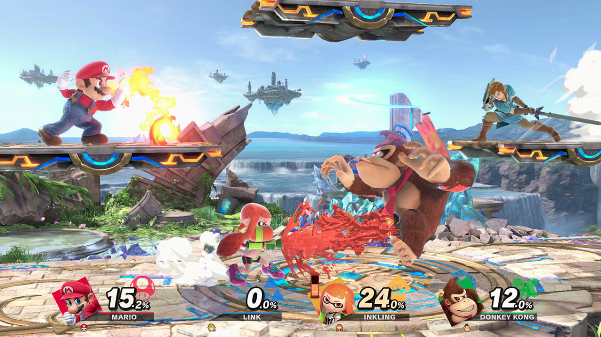

# Introducción a la Teoría de la Decisión

La Teoría de la Decisión es un área de estudio que combina elementos de la probabilidad, la estadística, la economía y la filosofía, con el objetivo de proporcionar un marco coherente para la toma de decisiones en situaciones de incertidumbre o riesgo. A grandes rasgos, la teoría responde a la pregunta: “¿Cómo debemos actuar cuando no estamos seguros de lo que va a pasar, pero aun así tenemos que elegir entre varias alternativas?”.

---

## 1. Componentes de un Problema de Decisión

### Conjunto de Acciones (o Decisiones) $A$
Son las opciones o estrategias que tiene el tomador de decisiones para elegir. Por ejemplo, si un inversor está decidiendo entre invertir en acciones, bonos o fondos, esas serían las distintas acciones posibles.

### Conjunto de Estados de la Naturaleza (o Escenarios) $\Omega$
Representan las circunstancias externas que no podemos controlar directamente. Podrían ser, por ejemplo, las condiciones del mercado, la aparición de un suceso climático extremo o la respuesta de la competencia en un entorno económico.

- Cada estado de la naturaleza $\omega \in \Omega$ es una realización o situación posible de lo que puede ocurrir en el entorno.

### Funciones de Probabilidad $P$
Asociada a los distintos estados de la naturaleza, existe una distribución de probabilidad $P(\omega)$. Esto captura la incertidumbre sobre cuál de los estados va a ocurrir.

- En problemas más simples, podemos asumir que disponemos de probabilidades “objetivas” (conocidas, derivadas de datos históricos).
- En casos más complejos, es posible que usemos probabilidades “subjetivas” (basadas en creencias o experiencias personales).

### Consecuencias u Outcomes $C$
Una consecuencia es el resultado de combinar una acción específica con un estado particular de la naturaleza. Por ejemplo, si decido invertir en acciones y el estado de la naturaleza es que el mercado crece un 10%, la consecuencia podría ser una ganancia específica. Si el mercado baja un 20%, la consecuencia es muy distinta.

- Notacionalmente, podemos representar la consecuencia como $c(a,\omega)$, donde $a$ es la acción y $\omega$ el estado de la naturaleza.

### Función de Utilidad (o Pérdida) $u(\cdot)$
La utilidad nos sirve para cuantificar “qué tan deseable” es una consecuencia. La forma de la utilidad puede variar según la preferencia o aversión al riesgo del tomador de decisiones.

- En problemas de minimización de costos, se habla de “función de pérdida” o “función de costos”.
- La utilidad es una forma de asignar un número real a cada consecuencia, reflejando su valor para la persona o la organización que toma la decisión.

---

## 2. Definición Abstracta del Problema de Decisión

Dados estos elementos, se puede definir un problema de decisión de manera matemática:

Dado $(A,\Omega,P,c(a,\omega),u(\cdot))$ encontrar la acción $a^* \in A$ que maximice $\mathbb{E}_\omega \big[u\big(c(a,\omega)\big)\big]$.

- $A$: conjunto de acciones.  
- $\Omega$: conjunto de estados posibles.  
- $P$: probabilidad sobre $\Omega$.  
- $c(a,\omega)$: consecuencia de la acción $a$ cuando ocurre $\omega$.  
- $u(\cdot)$: función de utilidad.  
- $\mathbb{E}$: la esperanza (valor medio) de la utilidad bajo la distribución de probabilidad.

En palabras: buscamos aquella acción $a^*$ que maximiza la utilidad esperada. Dependiendo del enfoque, también se puede plantear como la minimización de una pérdida esperada. En cualquier caso, el principio subyacente es el mismo: asignar un valor (utilidad o costo) a cada acción-estado y escoger la acción que optimice ese valor en promedio.

---

## 3. Intuición y Fundamentos

### Perspectiva clásica vs. subjetiva

- **Perspectiva Clásica (Frecuentista):** asume que las probabilidades de los estados de la naturaleza son conocidas y se basan en repeticiones de experimentos o grandes volúmenes de datos históricos.  
- **Perspectiva Subjetiva (Bayesiana):** cada agente puede tener creencias personales (probabilidades subjetivas) sobre la ocurrencia de cada estado, y estas creencias pueden actualizarse a medida que se obtiene nueva información.

### Utilidad y Preferencias
- La teoría de la utilidad esperada surge de axiomas que describen cómo las personas deberían comportarse racionalmente al tomar decisiones en condiciones de riesgo.
- El concepto clave: evitar el dilema de comparar directamente consecuencias complejas e introducir, en su lugar, la idea de la utilidad, un valor numérico que codifica la preferencia del agente.

### Aversión al Riesgo
- La forma de la función de utilidad a menudo refleja actitudes hacia el riesgo.
- Por ejemplo, una utilidad logarítmica $u(x)=\log(x)$ indica mayor aversión al riesgo que una utilidad lineal $u(x)=x$.
- Este aspecto es crucial en aplicaciones financieras, de seguros, etc.

### Manejo de Incertidumbre
- Cuando no se tienen probabilidades confiables, el problema se extiende al área de la teoría de la decisión bajo incertidumbre.
- Existen otros criterios de decisión, como el criterio de mini-max, mini-max regreto, maxi-min o maxi-max, dependiendo de la aversión al riesgo o la información limitada disponible.

---

## 4. Formalismo Matemático Esencial

En la práctica, un problema de teoría de la decisión se puede plantear como la maximización de la utilidad esperada en el caso discreto:

$
a^* = \arg\max_{a \in A} \sum_{\omega \in \Omega} u\big(c(a,\omega)\big)\, P(\omega).
$

O en forma de valor esperado integral si $\Omega$ es un espacio continuo:

$
a^* = \arg\max_{a \in A} \int_\Omega u\big(c(a,\omega)\big)\, dP(\omega).
$

Con conocimientos de probabilidad y estadística, es bastante directo interpretar la suma o la integral como el valor medio ponderado por la probabilidad de cada estado. El operador $\arg\max$ (o $\arg\min$ si se minimiza pérdida) indica la acción que maximiza (o minimiza) dicho valor.

---

## 5. Ejemplo Ilustrativo

Imaginemos que tienes que decidir entre dos acciones, invertir en **Bonos** $a_1$ o en **Acciones** $a_2$. Estimamos que el mercado puede tomar dos estados:

- Mercado “Bueno” ($\omega_1$) con probabilidad $P(\omega_1)=0.6$.  
- Mercado “Malo” ($\omega_2$) con probabilidad $P(\omega_2)=0.4$.

Las consecuencias (ganancias, por ejemplo) podrían ser:

- $c(a_1,\omega_1)=5\%$, $c(a_1,\omega_2)=2\%$.  
- $c(a_2,\omega_1)=10\%$, $c(a_2,\omega_2)=-5\%$.

Si tu función de utilidad fuera lineal, $u(c)=c$ (simplemente ganar más es mejor de forma proporcional), entonces la utilidad esperada sería:

- Para $a_1$:

$
\mathbb{E}\big[u(c(a_1,\omega))\big] = 0.6 \cdot 5 + 0.4 \cdot 2 = 3 + 0.8 = 3.8\%.
$

- Para $a_2$:

$
\mathbb{E}\big[u(c(a_2,\omega))\big] = 0.6 \cdot 10 + 0.4 \cdot (-5) = 6 - 2 = 4\%.
$

Aquí $a_2$ es la mejor decisión si solo miramos la utilidad lineal. Sin embargo, si tuvieras aversión al riesgo, podrías penalizar más la pérdida del -5%, y la decisión podría cambiar.

---

## 6. Conclusiones e Importancia

La teoría de la decisión ofrece:

- **Claridad formal:** Define con precisión qué es una “buena” decisión dada la información y preferencias de la persona o entidad que decide.  
- **Flexibilidad:** Permite incorporar diferentes actitudes frente al riesgo, distintas formas de estimar probabilidades y múltiples objetivos de optimización.  
- **Aplicaciones diversas:** Se utiliza en economía, finanzas, logística, salud pública y muchos otros campos donde la elección bajo incertidumbre es central.

Para estudiantes con base matemática y probabilística, la clave está en reconocer que la teoría de la decisión no solo implica “adivinar” o “suponer” qué pasará, sino que formaliza las elecciones considerando la estructura de las probabilidades y las preferencias del tomador de decisiones.

---

## Lecturas Recomendadas

- **“Theory of Games and Economic Behavior”** de von Neumann y Morgenstern, libro clásico que sienta bases de la utilidad y la toma de decisiones.  
- **“An Introduction to Decision Theory”** de Martin Peterson, con un enfoque más moderno y didáctico.  
- **“Decisiones Óptimas en Economía y Negocios”** (libros de texto que abordan aplicaciones prácticas y ejemplos específicos).

# Definición Completa del Problema de Decisión y Ejemplo con Ajedrez

A continuación, profundizaremos en la estructura de un problema de decisión, incluyendo una formulación matemática explícita. Posteriormente, mostraremos cómo podría modelarse (de manera estática y simplificada) el escenario de tomar una única decisión en ajedrez bajo la lente de la teoría de la decisión.

## 1. Definición Completa de un Problema de Decisión

Recordemos que los elementos principales de un problema de decisión son:

- **Conjunto de Acciones (o Decisiones) $A$**  
  Es el conjunto de todas las opciones entre las que puede elegir el decisor.

- **Conjunto de Estados de la Naturaleza $\Omega$**  
  Son las circunstancias o situaciones externas posibles, sobre las cuales generalmente no se tiene control.

- **Probabilidades $P(\omega)$**  
  Asignan a cada estado $\omega \in \Omega$ la probabilidad de ocurrencia. Estas pueden ser objetivas (frecuentistas) o subjetivas (basadas en creencias).

- **Función de Consecuencias $c(a,\omega)$**  
  Dado que cada acción $a$ y estado $\omega$ producen un resultado específico, la función $c$ mapea $(a,\omega)$ en el conjunto de consecuencias $C$.

- **Función de Utilidad $u(\cdot)$**  
  Convierte cada consecuencia en un valor numérico que representa la preferencia o valor para el decisor. Alternativamente, se puede hablar de “función de pérdida” o “costo” si se está minimizando.

El objetivo típico en teoría de la decisión es **maximizar la utilidad esperada** (o minimizar la pérdida esperada).

## 2. Formulación Matemática: El Problema como Optimización

### 2.1. Forma Directa

Podemos plantear el problema de decisión de forma directa así:
$
\max_{a \in A} E_{\omega \sim P}\Big[u\big(c(a,\omega)\big)\Big].
$

Si $\Omega$ es discreto, lo expresamos como:
$
\max_{a \in A} \sum_{\omega \in \Omega} P(\omega) \; u(c(a,\omega)).
$

Si $\Omega$ es continuo, se vuelve:
$
\max_{a \in A} \int_{\omega \in \Omega} u(c(a,\omega)) \, dP(\omega).
$

### 2.2. Forma Lagrangiana (sin restricciones)

Aunque generalmente en la teoría de la decisión no se introduce una formulación con Lagrangiano (porque con frecuencia no hay restricciones explícitas aparte de que $a \in A$), sí podemos escribirlo así:
$
L(a,\lambda) = \sum_{\omega \in \Omega} P(\omega) \; u(c(a,\omega)) - \lambda \, g(a),
$
donde:

- $\lambda$ sería el multiplicador de Lagrange asociado a alguna restricción $g(a) \le 0$.
- En este caso, no existen restricciones adicionales (aparte de $a \in A$), por lo que formalmente podríamos decir $g(a)=0$.
- Entonces, el término $\lambda \, g(a)$ no juega ningún papel, o equivalentemente, $\lambda = 0$.

Por lo tanto, sin restricciones, el Lagrangiano se reduce esencialmente a la propia función objetivo:
$
L(a) = \sum_{\omega \in \Omega} P(\omega) \; u(c(a,\omega)).
$

De modo que:
$
\max_{a \in A} L(a) \quad \Longleftrightarrow \quad \max_{a \in A} \sum_{\omega \in \Omega} P(\omega) \; u(c(a,\omega)).
$

### 2.3. Procedimiento de Resolución (Bosquejo)

1. **Enumerar o parametrizar** el conjunto de acciones $A$.
2. **Calcular** la utilidad esperada para cada acción (suma o integral sobre $\Omega$, ponderada por $P$).
3. **Escoger** la acción que maximice dicha utilidad esperada.

En problemas continuos o con cardinalidad alta de $A$, es común usar métodos de optimización numérica, gradientes, búsqueda en el espacio de acciones, etc.  
En problemas discretos y pequeños, se pueden evaluar todas las opciones y elegir la mejor.

## 3. Ejemplo: Tomar una Decisión Ajedrecística (Estática)

Para ilustrar la teoría con un ejemplo concreto, consideremos el ajedrez. Sin embargo, el ajedrez real es un juego dinámico: cada turno de un jugador afecta el estado del tablero, y el desenlace final (victoria, tablas o derrota) depende de múltiples movimientos futuros.

Aquí, ignoraremos la parte dinámica y supondremos que queremos tomar una **única decisión** (un único movimiento). Veamos cómo se mapearía a un problema de decisión estático:

- **Conjunto de Acciones $A$**  
  Cada posible movimiento legal que podemos realizar en el tablero actual constituye un elemento de $A$.  
  *Ejemplo:* Si tienes 5 movimientos legales, $A=\{a_1, a_2, a_3, a_4, a_5\}$.

- **Conjunto de Estados de la Naturaleza $\Omega$**  
  En un juego adversario (como el ajedrez), los “estados de la naturaleza” podrían interpretarse como la respuesta del rival (o las situaciones que derivan de tu movimiento).  
  Puesto que estamos modelándolo de forma simplificada y estadística (no un minimax de teoría de juegos), podríamos asumir que hay varias posibles reacciones del oponente, cada una con cierta probabilidad $P(\omega)$.  
  *Ejemplo simplista:* Suponemos que el rival “elige” entre 3 posibles contrajugadas $\omega_1, \omega_2, \omega_3$, con probabilidades $\{0.5, 0.3, 0.2\}$.

- **Función de Consecuencias $c(a,\omega)$**  
  La consecuencia de elegir un movimiento $a$ y que el oponente responda con $\omega$ se podría simplificar a un valor numérico (por ejemplo, basado en una evaluación heurística del tablero).  
  En ajedrez, se suele usar una “evaluación” de la posición, por ejemplo, un número positivo si se considera ventaja para el jugador que mueve, y negativo si está en desventaja.  
  *Ejemplo:* Si eliges $a_2$ y el oponente juega $\omega_1$, podrías obtener una evaluación de “+1.2”, indicando que tras esos dos movimientos la posición es favorable para ti en aproximadamente 1.2 peones de ventaja.

- **Función de Utilidad $u(\cdot)$**  
  Si la “consecuencia” (la evaluación) ya es un número real, a veces podemos tomar $u(c(a,\omega)) = c(a,\omega)$ directamente, asumiendo que la utilidad es lineal en la evaluación.  
  Otra posibilidad es definir una utilidad no lineal para capturar la aversión a posiciones muy inciertas o complejas.

- **Probabilidades $P(\omega)$**  
  Para cada posible reacción $\omega$ del oponente, asignamos una probabilidad $P(\omega)$.  
  En realidad, en ajedrez el oponente no escoge aleatoriamente, sino que intenta optimizar su jugada. Sin embargo, en este modelo de decisión individual (sin la parte competitiva) se trata como un “estado de la naturaleza” con cierta distribución.

### 3.1. Resolviendo el Problema (Estático y Simplificado)
El problema se reduce a:
$
\max_{a \in A} \sum_{\omega \in \Omega} P(\omega) \; u(c(a,\omega)).
$

- **Enumerar** cada movimiento legal.
- Para cada movimiento, **calcular** la evaluación resultante con cada respuesta $\omega_i$ del oponente, es decir, $c(a_j,\omega_i)$.
- **Aplicar** la función de utilidad $u(\cdot)$ si es necesario (en caso de no ser lineal).
- **Promediar** con las probabilidades $P(\omega_i)$.
- **Escoger** el movimiento con la mayor utilidad esperada.

**Ejemplo Numérico (Hipotético):**

Supongamos que hay 3 movimientos legales ($A=\{a_1, a_2, a_3\}$) y que el oponente tiene 2 respuestas principales ($\Omega=\{\omega_1, \omega_2\}$) con probabilidades $P(\omega_1)=0.7$ y $P(\omega_2)=0.3$.

- **Evaluaciones (consecuencias):**
  - $c(a_1,\omega_1)=+1.0,\quad c(a_1,\omega_2)=+0.1$
  - $c(a_2,\omega_1)=+0.8,\quad c(a_2,\omega_2)=+0.8$
  - $c(a_3,\omega_1)=+1.2,\quad c(a_3,\omega_2)=-0.5$

- **Cálculo de la utilidad esperada** (asumiendo $u(c)=c$):
  - Para $a_1$:  
    $E[u(c(a_1,\omega))] = 0.7 \cdot (+1.0) + 0.3 \cdot (+0.1) = 0.7 + 0.03 = 0.73.$
  - Para $a_2$:  
    $E[u(c(a_2,\omega))] = 0.7 \cdot (+0.8) + 0.3 \cdot (+0.8) = 0.56 + 0.24 = 0.80.$
  - Para $a_3$:  
    $E[u(c(a_3,\omega))] = 0.7 \cdot (+1.2) + 0.3 \cdot (-0.5) = 0.84 - 0.15 = 0.69.$

Con estos valores, la acción óptima sería **$a_2$**, ya que su utilidad esperada de **0.80** es la más alta.

#### Comentario sobre la Naturaleza Estática

- Se han tratado las jugadas del oponente como “estados de la naturaleza” con una distribución de probabilidades.
- En un análisis ajedrecístico real (teoría de juegos de adversarios) se utiliza un criterio de minimax (o algoritmos como Alpha-Beta), que difiere de este enfoque basado en incertidumbre estocástica.
- Este ejemplo ilustra cómo se traduce un escenario de acciones y posibles resultados en una formulación que maximiza un criterio esperado.

## 4. Conclusiones

- **Formalismo sin restricciones:**  
  En un problema de decisión típico, sin restricciones adicionales, la función objetivo es la utilidad esperada. El Lagrangiano coincide esencialmente con dicha función.

- **Proceso de resolución:**  
  Se basa en identificar acciones, modelar consecuencias, asignar probabilidades a los estados, definir (o estimar) la utilidad y escoger la acción con la mayor esperanza de utilidad.

- **Aplicación a escenarios diversos:**  
  Con un ejemplo tan distinto como el ajedrez (aunque se simplifique a un escenario estático y la respuesta del rival se trate como “azar”), se observa el mismo patrón: estados, probabilidades, consecuencias y un criterio de utilidad.

- **Importancia en la práctica:**  
  La Teoría de la Decisión ofrece un marco coherente para abordar problemas reales en campos que van desde la economía y las finanzas hasta la robótica y la inteligencia artificial.

En secciones futuras, un análisis más completo del ajedrez (u otros juegos) implicaría un modelo dinámico y adversario (por ejemplo, juegos de suma cero, minimax, etc.). Sin embargo, este ejemplo ilustra cómo, en un único “paso de decisión”, se puede mapear el entorno a una función objetivo con probabilidades y utilidades, resolviéndolo mediante la optimización de la utilidad esperada.

# Super Smash Bros. y Representación Visual de Estados

En esta nueva sección, mostraremos cómo podemos tomar el marco general de la **Teoría de la Decisión** que hemos descrito y aplicarlo a un videojuego de peleas como **Super Smash Bros.** (de forma muy simplificada). Luego, discutiremos la idea de representar el estado del juego (o de cualquier problema de decisión) a través de una imagen u otras características discretas; y finalmente haremos un paralelismo con el ajedrez, donde también sería suficiente una imagen del tablero más la indicación de quién mueve.

---

## 1. Modelado de un Turno (o Acción) en Smash Bros.

Super Smash Bros. es un juego de peleas en 2D (con escenarios en diferentes planos) donde cada personaje puede realizar diversas acciones: moverse, saltar, atacar, defenderse, etc. Para ilustrar cómo se encajaría en un problema de decisión, imaginemos un momento puntual en el tiempo donde el jugador tiene que tomar una sola decisión (al igual que hicimos con el ejemplo de ajedrez en la sección previa).

### 1.1. Conjunto de Acciones ($A$)

**Ejemplos de acciones:**
- Golpe básico (ataque A)
- Ataque especial (ataque B)
- Salto (y variantes en direcciones)
- Moverse hacia izquierda/derecha
- Cubrirse/defenderse

_Simplifiquemos y supongamos que:_

$$
A = \{\text{Atacar, Saltar, Defender, Moverse}\}
$$

### 1.2. Estados de la Naturaleza ($\Omega$)

En una versión muy simplificada de la teoría de la decisión, podemos considerar que la “respuesta del rival” se comporta como un estado aleatorio. Dichos estados podrían ser: “El rival ataca fuerte”, “El rival esquiva”, “El rival permanece quieto”, etc. A cada uno se le podría asignar una probabilidad $P(\omega)$ que refleja lo que esperamos que el oponente haga (en la práctica, en un juego real, el adversario no elige aleatoriamente, pero para un modelo de decisión con incertidumbre, podemos asumirlo).

### 1.3. Consecuencias $c(a,\omega)$

Una consecuencia en Smash Bros. puede plasmarse en forma de:
- **Cambios en los porcentajes de daño:** en Smash, mientras más alto el porcentaje, más lejos te lanzan.
- **Posiciones resultantes de los personajes.**
- **Ventaja o desventaja inmediata.**

_Por ejemplo:_

- Si decides “Atacar” y el rival “Se defiende”, quizás tu consecuencia sea un castigo leve y **+10% de daño** para tu personaje.
- Si decides “Atacar” y el rival “Ataca fuerte”, a lo mejor chocas con su ataque y ganas **+5% de daño**, mientras el rival gana **+8%**.

### 1.4. Función de Utilidad $u(\cdot)$

Podríamos definirla basándonos en cuánta ventaja ganas tras la interacción. Por ejemplo, la utilidad podría depender de:
- El porcentaje de daño que ocasionas al rival (positivo para ti).
- El porcentaje de daño que sufres (negativo para ti).
- La posición (control del escenario) tras la interacción.

La función se puede expresar como:

$$
u(c(a,\omega)) = \alpha \times (-\Delta \text{daño propio}) + \beta \times (\Delta \text{daño infligido}) + \gamma \times (\text{control de escenario})
$$

### 1.5. Probabilidades ($P(\omega)$)

Asignamos, por ejemplo:
- $P(\omega_1) = 0.4$ (rival ataca débil),
- $P(\omega_2) = 0.3$ (rival esquiva),
- $P(\omega_3) = 0.3$ (rival ataca fuerte).

Con esto modelamos la incertidumbre sobre la “respuesta” de nuestro adversario.

### 1.6. Formulación de la Decisión

Tal y como antes:

$$
\max_{a \in A} \sum_{\omega \in \Omega} P(\omega) \, u(c(a,\omega))
$$

**Interpretación:** De entre tus acciones disponibles, eliges la que te dé la mayor utilidad esperada, dada la probabilidad de cada respuesta rival y la utilidad de sus consecuencias.

---

## 2. Representación del Estado: Imagen vs. Parámetros Discretos

Para que este modelo funcione, necesitamos poder describir el estado del mundo. En un juego de peleas como Smash Bros., el estado podría incluir:

- **Posición exacta de cada jugador** en el escenario (coordenadas).
- **Porcentaje de daño** de cada jugador.
- **Inventario de vidas (stocks)** de cada jugador.
- **Velocidad o momentum** actual de los personajes, etc.

### 2.1. Usar una Imagen del Juego

Otra forma de representar el estado es directamente una imagen (un frame) de la pantalla:

- La imagen contiene toda la **información visual**: la ubicación de los personajes, el escenario, los marcadores de vida/daño, etc.
- En un enfoque de **aprendizaje automático** (por ejemplo, usando redes neuronales), muchas veces se toma la imagen en bruto y se procesa para inferir la mejor acción.
- En teoría, la imagen lleva “incrustada” toda la información relevante: solo habría que aprender a extraerla o interpretarla.

**Ventajas:**
- Representación completa y directa del entorno.
- Evita tener que programar manualmente la obtención de cada variable.

**Desventajas:**
- Procesar una imagen bruta puede ser mucho más complejo computacionalmente.
- Requiere métodos sofisticados (e.g., **CNNs**) para extraer la información de la imagen si queremos automatizar la toma de decisiones.

### 2.2. Representación Discreta o Paramétrica

En contraste, uno podría usar un vector de características como:

$$
(\text{PosXJugador1, PosYJugador1, DañoJugador1, …, PosXJugador2, …, EstadoEscenario, …})
$$

- Esto “resume” la imagen en variables discretas o continuas claras y fáciles de manejar.
- Es más fácil codificar en un modelo matemático, pues se trabaja con variables numéricas directas (posición, daño, etc.).
- Es menos flexible: si algo visual no está codificado (p.ej., objetos volando en pantalla, proyectiles, etc.), se pierde información en esa representación.

**Conclusión:**  
Tanto la imagen como la lista de variables son formas válidas de describir el estado para, luego, introducirlo en un problema de decisión. La diferencia es la manera de extraer la información relevante y la complejidad de procesamiento.

---

## 3. Paralelo con Ajedrez Usando la Misma Idea de la Imagen

En la sección anterior vimos un ejemplo de ajedrez usando estados discretos: posiciones de cada pieza, turno de quién es, etc. Sin embargo, también podríamos simplemente tomar una foto (imagen) del tablero y ver cuál es la posición.

### 3.1. Tablero de Ajedrez Como Imagen

- Una foto (o captura digital) del tablero con todas las piezas en sus ubicaciones.
- La imagen incluye también la **información de quién tiene el turno** (por ejemplo, una señal visual de “es turno de las blancas” podría mostrarse en la interfaz).

**¿Es suficiente la imagen para representar el estado?**

- Sí, porque si la foto está bien tomada (o es un “screen” del software de ajedrez), queda claro dónde están todas las piezas.
- Sabemos implícitamente el color que juega y podemos inferir el resto (posición, material, etc.).

En la práctica, de nuevo, si quisiéramos automatizar y entrenar un modelo de ajedrez basado en visión por computadora, podríamos dejar que un algoritmo de visión reconozca cada pieza y su ubicación. Sin embargo, en la mayoría de los motores de ajedrez, se codifica todo con variables lógicas y discretas: la pieza X está en la casilla “e4”, la otra en “f7”, etc. Esto es más directo para el cálculo y evita la complejidad de procesar una imagen.

### 3.2. El Mismo Proceso de Decisión

Una vez tenemos el estado (sea en imagen o en “lista de piezas”), definimos:

- **Acciones:** En ajedrez, todas las jugadas legales.
- **Estados de la Naturaleza:** Podríamos, en un modelo simplificado, asignar probabilidades a la respuesta del oponente, tal como hicimos en el ejemplo anterior (aunque en la práctica se usa **minimax**).
- **Consecuencias:** Resultado en el tablero después de ambas jugadas (la tuya y la del rival).
- **Función de Utilidad:** Una evaluación de la posición (por ejemplo, **+3** indica clara ventaja de material, **-2** indica desventaja).
- **Probabilidades:** La distribución sobre qué respuesta hace el oponente.

Y resolvemos el problema buscando la jugada con mayor utilidad esperada.

---

## 4. Conclusiones Generales

- **Varias representaciones de un mismo problema:**
  - Podemos describir el estado de Smash Bros. (o de cualquier otro juego) de manera altamente estructurada (variables discretas/continuas) o de forma visual (imágenes).
  - Ambas descripciones contienen la información necesaria, pero su procesamiento difiere en complejidad y en la forma de integrarlas en un modelo.

- **La lógica de la Teoría de la Decisión permanece:**
  - Independientemente de cómo representemos el estado, la formulación del problema como

    $$
    \max_{a} \mathbb{E}[u(c(a,\omega))]
    $$

    sigue siendo válida.
  - El tiempo y el método de cómputo para resolverlo pueden variar mucho.

- **De un problema cualquiera a un problema de decisión:**
  - **Identifica** qué decisiones (acciones) tiene el agente.
  - **Establece** qué factores del entorno no controla (estados de la naturaleza), y cómo se distribuyen probabilísticamente.
  - **Define** una medida de valor (utilidad) o costo para cada consecuencia.
  - **Calcula o estima** la utilidad esperada de cada acción y elige la que la maximice.

- **Siguiente paso:**  
  Si el problema es dinámico (varias rondas, turnos o pasos de tiempo), se extiende la teoría a **Procesos de Decisión de Markov (MDP)**, juegos secuenciales, etc. Pero la filosofía base es la misma.

---

## Reflexión Final

Ya sea para un juego de peleas como **Smash Bros.**, un juego de estrategia como el **ajedrez**, o cualquier entorno donde el agente deba actuar bajo incertidumbre, el marco de la **Teoría de la Decisión** ofrece un acercamiento formal para seleccionar la mejor opción disponible, dadas las preferencias y la información (ya sea en forma de imagen, variable discreta o cualquier otra representación).

