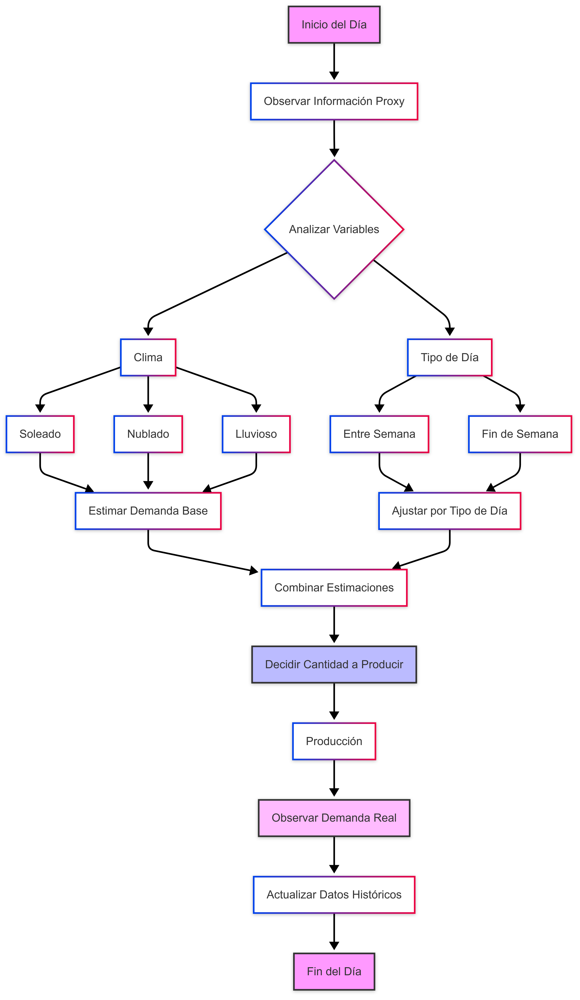
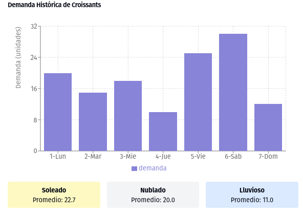
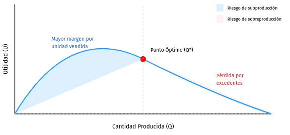

# Ejemplo sencillo: Decisión de producción diaria en una pequeña panadería

A continuación, presentamos un **ejemplo realista y sencillo** que ilustra el **proceso de decisión estática bajo incertidumbre** con **pocos datos** y **heurísticas** para la estimación probabilística. Este ejemplo retoma los conceptos del documento teórico anterior y los aplica paso a paso en un contexto práctico.

---

## 1. Contexto del problema

Imaginemos una **panadería artesanal** que elabora **pan dulce** (por ejemplo, croissants) cada mañana. Al comenzar el día, el dueño debe decidir **cuántos croissants** producir. Sin embargo:

1. **La demanda diaria** es **incierta** (el número de clientes que comprarán croissants varía)
2. La producción en exceso implica **pérdidas** (lo que no se vende en el día se pierde o se vende con descuento muy bajo al día siguiente)
3. La producción insuficiente implica perder **ventas potenciales** y **satisfacción del cliente**

Supongamos que el **decisor** (el dueño de la panadería) no dispone de un gran historial de ventas; apenas cuenta con **pocos datos** (digamos, de la última semana) y, además, tiene algunas **fuentes de información "proxy"** que podrían correlacionarse con la demanda:
- **Pronóstico del clima** (p.ej., "soleado", "nublado" o "lluvioso")
- **Día de la semana** (entre semana vs. fin de semana)

Con este panorama, el dueño quiere tomar la **decisión estática** de cuántos croissants hornear cada día **antes** de que ocurra la venta real, basándose en la información disponible (pronóstico del día, si es fin de semana, etc.) y en su **pequeña base de datos** del pasado.



---

## 2. Formulación inicial

1. **Espacio de decisiones** (D):
   ```
   D = {0, 1, 2, ..., Q_max}
   ```
   donde Q es el número de croissants a producir y Q_max es la capacidad máxima de producción diaria (por ejemplo, 50).

2. **Estados de la naturaleza** (Ω):
   Se refiere a la **demanda real** del día, denotémosla por ω, donde ω ∈ {0,1,...,D_max} o puede ser un rango continuo aproximado por una distribución discreta. Para ilustrar, consideraremos ω como demanda entera ≤ 50.

3. **Información proxy** (Z):
   - Z = (Clima, TipoDía), por ejemplo:
     - Clima ∈ {soleado, nublado, lluvioso}
     - TipoDía ∈ {entre semana, fin de semana}
   - El decisor observa Z=z (el pronóstico y si es fin de semana) antes de producir, pero **no** conoce la demanda real ω.

4. **Función de utilidad (o ganancia)** (U):
   La utilidad depende de:
   - **Precio de venta** p por croissant vendido
   - **Costo de producción** c por croissant (materia prima + mano de obra)
   - **Pérdida de excedentes**: lo no vendido se descarta o se revende a costo muy bajo

   Si se producen Q croissants y la demanda real es ω:
   - **Ventas reales**: min(Q, ω)
   - **Ganancia por ventas**: p · min(Q, ω)
   - **Costo total de producción**: c · Q
   - **Ganancia neta** (utilidad):
     ```
     U(ω, Q) = p · min(Q, ω) - c · Q
     ```

---

## 3. Incertidumbre y pocos datos

### 3.1 Datos históricos limitados

Supongamos que el dueño solo tiene **7 días de historial** (1 semana) con registros de:
- Demanda real ω^(d)
- Información proxy (Clima^(d), TipoDía^(d))

Por ejemplo, la tabla (hipotética) podría ser:

| Día | Clima    | TipoDía      | Demanda real (ω) |
|-----|----------|--------------|------------------|
| 1   | soleado  | entre semana | 20              |
| 2   | nublado  | entre semana | 15              |
| 3   | soleado  | entre semana | 18              |
| 4   | lluvioso | entre semana | 10              |
| 5   | nublado  | fin de semana| 25              |
| 6   | soleado  | fin de semana| 30              |
| 7   | lluvioso | fin de semana| 12              |

### 3.2 Estimación heurística de la demanda

1. **Correlación directa con clima**:
   - Observemos la **demanda promedio** en días soleados vs. nublados vs. lluviosos, independientemente de fin de semana o no
   - Por ejemplo, de la tabla:
     - Soleado: demanda en días 1, 3, 6 → (20 + 18 + 30)/3 = 22.7
     - Nublado: días 2, 5 → (15 + 25)/2 = 20
     - Lluvioso: días 4, 7 → (10 + 12)/2 = 11

2. **Ajuste según fin de semana**:
   - Observamos que, en fin de semana (días 5, 6, 7), la demanda tiende a ser mayor cuando el clima no es lluvioso (día 6 tuvo 30)
   - Podríamos definir un **factor de ajuste** de +5 croissants para fin de semana, basado en la media

De manera muy **rudimentaria** (regla de dedo), podríamos inferir:

- **Soleado, entre semana** → demanda esperada ≈ 22
- **Soleado, fin de semana** → demanda esperada ≈ 27
- **Nublado, entre semana** → demanda esperada ≈ 20
- **Nublado, fin de semana** → demanda esperada ≈ 25
- **Lluvioso, entre semana** → demanda esperada ≈ 11
- **Lluvioso, fin de semana** → demanda esperada ≈ 16



---

## 4. Decisión diaria y criterio de valor esperado

Cuando llega un nuevo día con pronóstico z = (Clima, TipoDía), el **dueño** escoge Q.
- **Ganancia esperada** si produce Q croissants y la demanda esperada es μ≈E[ω]:
  ```
  E[U(Q)] = Σ p(ω)(p · min(Q,ω) - c · Q)
  ```
  Donde p(ω) se aproxima con alguna distribución centrada en μ.

### 4.1 Heurística de "producción igual a la demanda promedio"

Como un atajo, una **regla de dedo** muy común en problemas sencillos de inventario es **producir la cantidad promedio** estimada de demanda (si es soleado y es fin de semana, "producimos 27").
- Ventaja: Minimiza en cierto sentido el **riesgo** de gran excedente o falta
- Desventaja: Puede no ser óptimo si la utilidad y el costo tienen una gran diferencia

### 4.2 Heurística de "newsboy problem" (simple idea)

En el clásico "newsboy problem" (o "modelo periódico de inventario"), existe una **fórmula** que equilibra el costo de sobrestock vs. el costo de substock. Si la probabilidad de vender un producto adicional es mayor que el **cociente** c/p, se produce una unidad extra.
```
P(ω ≤ Q*) = c/p
```

Ejemplo simplificado:
- p = $3 por croissant vendido
- c = $1 costo de producirlo
  ```
  c/p = 1/3 ≈ 0.33
  ```

---

## 5. Ejecución diaria

**Dinámica de la decisión** en la práctica:

1. **Observar** la información Z=z (por ejemplo, "soleado" y "fin de semana")
2. **Inferir** (con heurísticas) la distribución de la demanda ω
3. **Elegir** Q en base a la **regla** seleccionada
4. Al final del día, se **observa** la demanda real ω
5. Se **actualizan** (idealmente) las frecuencias o las correlaciones para refinar la heurística

---

## 6. Resumen y aprendizajes

Este ejemplo sencillo (decidir la cantidad de croissants a producir) **ilustra**:

1. **Mapeo de un problema real**:
   - **Decisión**: Q
   - **Incertidumbre**: la **demanda** (ω)
   - **Información proxy**: (clima, día de la semana)
   - **Utilidad**: ingresos de ventas menos costos de producción

2. **Pocos datos**:
   - Se dispone de registros de apenas 7 días
   - Hay que usar **heurísticas** o estimaciones empíricas simples para aproximar la demanda

3. **Heurísticas**:
   - **Regla de dedo** de producir según demanda promedio estimada
   - **Modelo newsboy** con percentiles (cuando se tienen costos y precios específicos)

4. **Proceso de inferencia**:
   - Se observa la variable Z
   - Se actualiza (o se asume) la demanda esperada μ
   - Se toma la **decisión estática** del día

---

### Nota final

Este caso de la panadería es extrapolable a múltiples entornos empresariales o de operación con incertidumbre (stock de productos, reservaciones, etc.). Lo esencial es reconocer:

- **Qué** se decide
- **Cuándo** y **cómo** se observa la información parcial (proxy)
- **Cómo** se modela la incertidumbre y la ganancia/pérdida
- **Qué** heurísticas o métodos sencillos se pueden aplicar con escasez de datos