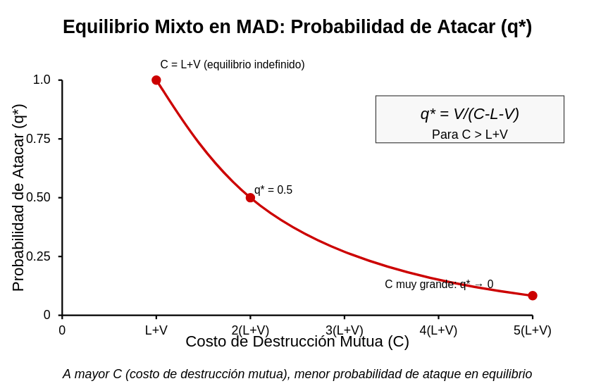
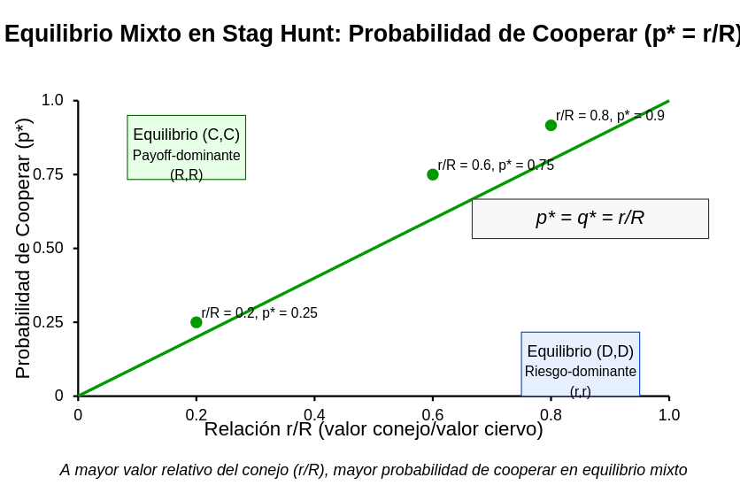

## 1. Ejemplo de Mutual Assured Destruction (MAD)

### 1.1. El escenario básico

Imaginemos dos potencias nucleares (Jugador A y Jugador B), cada uno con **dos estrategias**:  
- **Atacar** (A): lanzar un primer ataque nuclear.  
- **No Atacar** (N): abstenerse del ataque.  

Aunque esto recuerda a un "juego de Chicken" clásico, aquí asignaremos **valores cardinales** que reflejen la devastación masiva si ambos deciden atacar.  

- Si **ambos atacan**: se produce una destrucción casi total (mutua). Asignaremos una utilidad muy grande en negativo: $-C$, con $C$ muy grande (podrías pensar en "-$\infty$" en un límite extremo).  
- Si **solo uno ataca** y el otro no**: el atacante no sufre represalia inmediata (digamos que fue un ataque sorpresa), y obtiene una gran ventaja geopolítica (o cree obtenerla). Asignamos un valor positivo alto al atacante (por ejemplo, $+V$), y un valor muy negativo al otro ($-L$, el "perdedor" que sufre).  
- Si **ninguno ataca**: se mantiene la paz; asignamos cierto valor base (podemos llamarlo 0 o algún número positivo moderado) para ambos.

Representemos una **matriz de pagos** (utilidades cardinales) para (Jugador A, Jugador B):

$
\begin{array}{c|cc}
 & \text{A (ataca) B} & \text{N (no ataca) B} \\
\hline
\text{A (ataca) A} & (-C,\,-C) & (V,\,-L) \\
\text{N (no ataca) A} & (-L,\;V) & (0,\;0)
\end{array}
$

donde:
- $C \gg 0$ es enorme (catástrofe mutua).  
- $V > 0$ (gran victoria si se ataca al otro indefenso).  
- $L > 0$ (gran pérdida para el atacado).  
- 0 es el valor de "status quo" pacífico.

### 1.2. Equilibrio en estrategias puras y efecto de la magnitud de $C$

- **(A, A)**: ambos atacan, utilidad $(-C, -C)$. Cuando $C$ es *muy grande*, esta situación es horrible para ambos.  
- **(A, N)**: A gana $+V$, B pierde $-L$.  
- **(N, A)**: A pierde $-L$, B gana $+V$.  
- **(N, N)**: ambos se quedan en $0$.

#### ¿Hay equilibrio puro?

- Si A cree que B no atacará (B juega N), entonces A prefiere atacar (A) para ganar $+V$ en lugar de 0 (N).  
- Pero si A cree que B atacará (B juega A), A prefiere *no* atacar (N) para obtener $-L$ **comparado con** $-C$. Pero *hay que comparar* $-L$ vs $-C$.  
  - Si $-L > -C$ (es decir, $C > L$), la destrucción mutua es peor que ser atacado sin responder. En la mayoría de escenarios nucleares, $C$ (catástrofe mutua) se considera más devastador que la pérdida unilateral $L$.  

Veamos la lógica simultánea:
- Cada jugador, si está "seguro" de que el otro no ataca, *prefiere atacar*.  
- Cada jugador, si está "seguro" de que el otro ataca, prefiere **no atacar** *si* $C > L$.  
  - ¿Pero y si $L$ fuera *más* grande que $C$? (Algo poco usual, pero imaginemos que ser atacado primero es aún peor que la destrucción mutua "compartida"). Eso cambiaría radicalmente las conclusiones, ya que un país preferiría "llevarse también al otro" a la destrucción. 

Cuando $C$ es gigante y se cumple $C > L$, no hay una estrategia pura que sea estable simultáneamente. (A, N) y (N, A) cada uno es tentador de un lado, pero el otro quisiera cambiar su respuesta.

**En muchos análisis** se concluye que *no hay* equilibrio puro (o puede haber un equilibrio "defectuoso" dependiendo de la relación exacta de $C$ y $L$), por lo cual el sistema podría llevar a mezclar probabilidades. 

### 1.3. Un equilibrio en estrategias mixtas

Supongamos ambos jugadores mezclan:  
- A ataca con prob $p$, no ataca con $1-p$.  
- B ataca con prob $q$, no ataca con $1-q$.

Para que A sea indiferente entre **atacar** y **no atacar**, igualamos las utilidades esperadas:

- $U_A(\text{atacar}) = p \cdot (-C)$ (cuando B ataca también) $+ (1-q)\cdot V$ (cuando B no ataca). Pero ojo: la prob. de B atacando es $q$, así que la primera parte es $q \cdot (-C)$, la segunda es $(1-q)\cdot V$.  
  $
  U_A(\text{A}) = q(-C) + (1-q)V.
  $  

- $U_A(\text{no atacar}) = q \cdot (-L) + (1-q) \cdot 0.$  
  $
  U_A(\text{N}) = -L\,q.
  $

La condición de indiferencia:
$
q(-C) + (1-q)V = -L\,q.
$
Reordenando,
$
q(-C + L) + (1-q)V = 0,
$
$
q(-C + L) + V - qV = 0,
$
$
q(-C + L - V) = -V,
$
$
q = \frac{V}{C - L - V}.
$
(*Asumiendo $C - L - V > 0$, etc., para que la fracción tenga sentido.*)

Análogamente, para B, la indiferencia entre atacar y no atacar dará una fórmula simétrica para $p$. 

**Interpretación**:  
- Si $C$ (coste mutuo) es *enorme*, en principio, la probabilidad de atacar se reduce porque el desastre compartido es peor que la simple "pérdida unilateral".  
- Cuanto mayor sea $V$ (el valor de atacar primero) y/o menor sea $C$, **más** se inclinarían ambos a atacar con mayor probabilidad.  
- Si, en extremo, consideramos $C$ ~ $\infty$, tal vez esta probabilidad se acerque a 0, reflejando la disuasión fuerte (nadie quiere correr el riesgo de la destrucción total).  
- Pero si $L$ también es grande (ser atacado es considerado peor que la destrucción mutua, caso de "prefiero llevar al otro conmigo"), la conclusión puede invertirse.

### 1.4. Conclusión: la cardinalidad lo cambia todo

- En un esquema **ordinal** ("prefiero no ser atacado a ser atacado, pero sin cuantificar el desastre") no se capta cuán devastador es el ataque mutuo.  
- En este **esquema cardinal**, la magnitud de $C, V, L$ cambia drásticamente los incentivos y la mezcla de equilibrio.  
- **Filosóficamente**, asignar un número a la destrucción global, ¿es válido? Aun así, es la única forma de explicar por qué la "disuasión nuclear" puede funcionar: un costo altísimo (casi infinito) **inclinado** hacia no iniciar un ataque si se anticipa la respuesta mutua.

---

## 2. Ejemplo de Stag Hunt (La "caza del ciervo")

### 2.1. El escenario básico

Inspirado en Rousseau, la "caza del ciervo" describe un dilema de **coordinación** con dos cazadores (Jugador 1 y Jugador 2). Tienen **dos estrategias**:  
- **Cooperar** (C): cazar juntos un ciervo grande.  
- **Desertar** (D): atrapar un conejo (o liebre) por su cuenta.  

Las utilidades cardinales típicas:  
- Si **ambos cooperan** (C, C): capturan el ciervo, cada uno obtiene un botín grande $R$.  
- Si uno coopera y el otro no, el que cooperó se queda sin nada (falló la caza de ciervo en solitario), el desertor obtiene un conejo menor $r$.  
- Si ambos desertan, cada uno obtiene $r$. Normalmente se asume $R > r > 0$.

Una **matriz de pagos** (Jugador 1, Jugador 2) simplificada:

$
\begin{array}{c|cc}
 & \text{C (cooperar) 2} & \text{D (desertar) 2} \\
\hline
\text{C (1)} & (R,R) & (0, r) \\
\text{D (1)} & (r, 0) & (r, r)
\end{array}
$

### 2.2. Equilibrios en puras (con pagos cardinales)

- (C, C) es un equilibrio de Nash si preferimos no desviarnos a desertar, dado que el otro coopera. Aquí, si $R > r$, nadie quiere desertar unilateralmente porque $R$ es mayor que $r$.  
- (D, D) es también un equilibrio de Nash, porque si el otro deserta, cazar ciervo solo no da nada (0) mientras que desertar da $r > 0$.  
- **Conclusión**: hay *dos* equilibrios puros: (C, C) y (D, D). *"Caza del ciervo"* vs. *"Cada uno con su conejo"*.

### 2.3. ¿Qué pasa con las estrategias mixtas?

Existe asimismo un **equilibrio en estrategias mixtas**, que puede verse forzoso cuando un jugador no está seguro de la acción del otro. Sea $p$ la probabilidad con que Jugador 1 coopera, $q$ la probabilidad con que Jugador 2 coopera.

Para que Jugador 1 sea indiferente entre Cooperar y Desertar:

- **Utilidad esperada** si coopera: $U_1(\text{C}) = q\,R + (1-q)\cdot 0 = R\,q$.  
- **Utilidad esperada** si deserta: $U_1(\text{D}) = q\,r + (1-q)\,r = r$.  

La condición de indiferencia:
$
R \, q = r 
\quad\Longrightarrow\quad
q^* = \frac{r}{R}.
$

Por simetría, $p^* = \frac{r}{R}$. Entonces, hay un equilibrio mixto $\bigl(\frac{r}{R}, \frac{r}{R}\bigr)$ además de los dos equilibrios puros.

### 2.4. ¿Cómo cambia si modificamos los valores cardinales $R$ y $r$?

- Si $R$ se vuelve inmensamente grande comparado con $r$, la probabilidad de cooperar en el equilibrio mixto sube. *Incluso* si no se logra la coordinación pura en la práctica, la expectativa de un gran botín hace que sea más atractivo cooperar, esperando que el otro lo haga.  
- Si $R$ se reduce (o $r$ crece y se hace comparable), la tentación de desertar sube. La "caza del ciervo" pierde atractivo frente a la captura segura del conejo.  
- La **actitud frente al riesgo** también importa: un jugador adverso al riesgo podría desertar, evitando la probabilidad de obtener 0 (en caso de que el otro no coopere). Un jugador amante del riesgo podría preferir cooperar con mayor probabilidad porque, si el otro coopera, la ganancia es mucho mayor.

### 2.5. ¿Y si existe comunicación?

El "Stag Hunt" también ilustra cómo la **comunicación y confianza** pueden cambiar el equilibrio:  
- Si los jugadores **pueden comunicarse** y **hacer compromisos creíbles** (o crear mecanismos de garantía mutua), esto puede desplazar el equilibrio real hacia (C, C).  
- **Sin comunicación**, la incertidumbre puede llevar a un equilibrio en (D, D) (riesgo-dominante), o a la mezcla $\bigl(\frac{r}{R}, \frac{r}{R}\bigr)$.  

En términos cardinales, la diferencia **numérica** entre $R$ y $r$ y la probabilidad de fallar la coordinación definen el "riesgo" de cooperar. Cuanto mayor sea la recompensa conjunta $R$, más presión hay a cooperar, pero la falta de confianza mantiene abierta la posibilidad de desertar.

---

## Conclusiones Generales

Estos **dos ejemplos** muestran cómo el **valor cardinal** de los pagos (y la actitud frente al riesgo) puede cambiar el análisis y la **existencia** o **forma** de los equilibrios:

1. **En el modelo MAD**:  
   - Una destrucción mutua "$-C$" gigantesca empuja a minimizar la probabilidad de ataque, siempre que se suponga $C > L$.  
   - Si el costo catastrófico se modela menor (o la desgracia de ser atacado primero es incluso peor), el incentivo a atacar puede ser mayor, alterando drásticamente la estrategia de equilibrio.

2. **En Stag Hunt**:  
   - El valor de la cooperación (R) frente a la alternativa segura (r) determina no solo qué equilibrios puros existen, sino también **qué mezcla** puede darse si los jugadores no pueden coordinarse.  
   - La **comunicación** o un **pacto** (un enfoque casi "cooperativo") puede llevar a la **coordinación óptima** (C, C), que es mejor para todos.

Finalmente, **modelar utilidades cardinales** nos permite:  
- Entender *cuán peor* o *cuán mejor* es un resultado respecto de otro, y  
- Incorporar **riesgo**, **variaciones en preferencias** y la posibilidad de **catástrofes** en nuestra representación de la realidad.  

Sin estos números (o con puros órdenes), muchos fenómenos clave —como la disuasión nuclear, la colaboración arriesgada, la negociación financiera— quedan en una descripción demasiado burda, que ignora la *intensidad* de las pérdidas y ganancias.  

No obstante, **la dimensión filosófica** siempre está presente: asignar un gran número a la destrucción total, o a la ganancia de la "caza mayor", es una decisión conceptual que puede subestimar o sobrestimar ciertos riesgos o valores humanos (la vida, la dignidad, la cultura). Aun así, en la **práctica**, estos modelos cardinales ofrecen una vía racional (aunque limitada) para analizar decisiones complejas en escenarios de guerra, economía y cooperación social.
