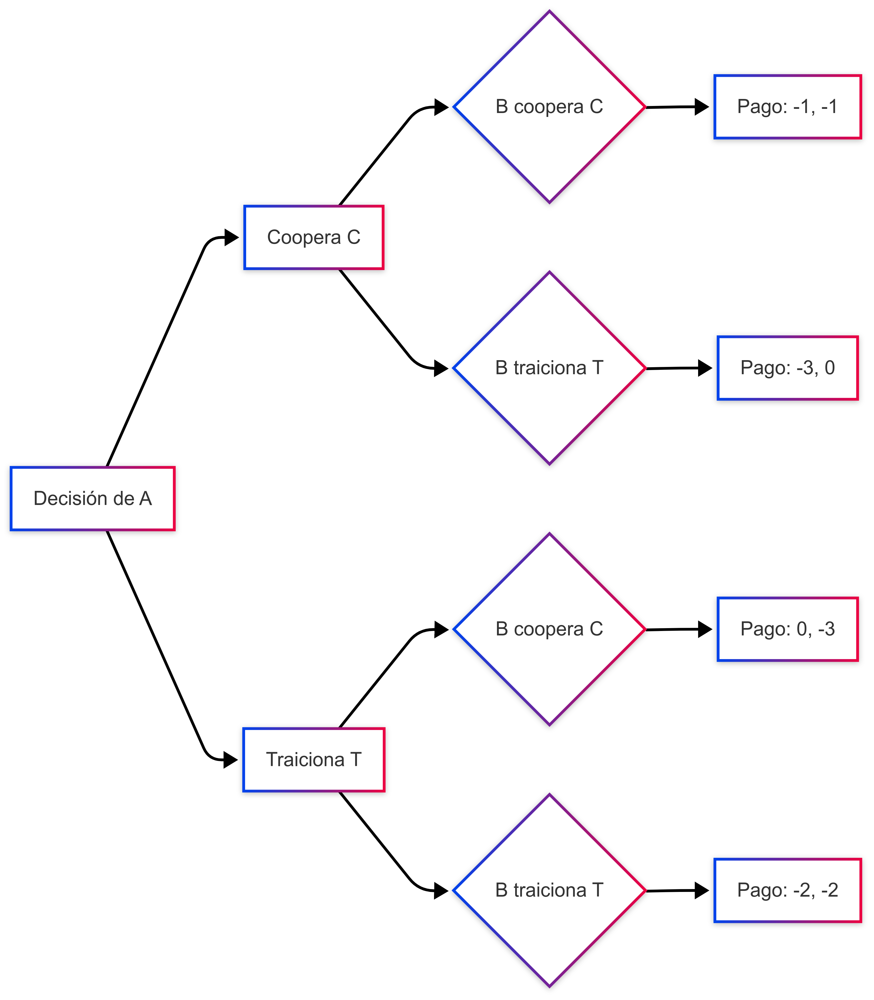

# Cómo leer e interpretar formalmente las matrices y decisiones de estrategias en Teoría de Juegos

Nos centraremos en la **presentación formal** y en la **visualización** de los elementos centrales de la teoría de juegos que ya vimos en el documento anterior. El objetivo es **entender con detalle** cómo funciona una matriz de pagos, cómo se leen las utilidades (o *payoffs*) en cada celda y cómo, a partir de esa información, **descubrir** cuáles son las estrategias óptimas y, en particular, cómo se encuentran los equilibrios.

---

## 1. Recordando la Estructura de un Juego en Forma Normal

En la representación **en forma normal** (o **forma estratégica**), un juego se describe con:  
1. Un conjunto de **jugadores** ($N = \{1, 2, \dots, n\}$).  
2. Para cada jugador $i$, un conjunto de **estrategias** posibles ($S_i$).  
3. Una **función de pagos** (o utilidades) $u_i : S_1 \times S_2 \times \dots \times S_n \to \mathbb{R}$, que indica el beneficio (o costo) que recibe cada jugador al final del juego, dependiendo de las estrategias combinadas de todos.

Cuando un juego involucra **dos jugadores** con un número pequeño de estrategias, podemos usar una **matriz** para describirlo. Cada **fila** representa una estrategia del jugador 1 (por convención) y cada **columna** una estrategia del jugador 2. En cada **celda** (intersección de una fila y una columna), se muestra el **pago** que recibe cada jugador.

---

## 2. Ejemplo de Matriz y su Lectura Paso a Paso

Tomemos, como ejemplo, la matriz del Dilema del Prisionero que usamos en el documento anterior. Imaginemos que la fila corresponde al jugador $A$ y la columna al jugador $B$. Cada uno tiene dos estrategias: **Cooperar** (C) o **Traicionar** (T). La matriz de pagos (usando valores de utilidad negativos para representar años de cárcel) se ve así:

|                   | **B Coopera (C)**  | **B Traiciona (T)** |
|-------------------|--------------------|---------------------|
| **A Coopera (C)** | $(-1, -1)$        | $(-3, 0)$          |
| **A Traiciona (T)** | $(0, -3)$       | $(-2, -2)$         |

### 2.1 Interpretación de la Notación $(u_A, u_B)$

- **Primera coordenada**: la utilidad (pago) de $A$.  
- **Segunda coordenada**: la utilidad (pago) de $B$.

Por ejemplo, en la celda superior izquierda $(-1, -1)$:  
- $A$ obtiene $-1$.  
- $B$ obtiene $-1$.  

Esto se lee: "Si **$A$ coopera** y **$B$ coopera**, sus utilidades respectivas son $-1$ y $-1$".  

### 2.2 Cómo se Lee la Matriz en Conjunto

1. **Identificar filas y columnas**:  
   - Filas: Estrategias de $A$.  
   - Columnas: Estrategias de $B$.  

2. **Localizar la celda**:  
   - Combinas la estrategia elegida por $A$ (una fila) con la estrategia elegida por $B$ (una columna).  
   - El resultado es el par de pagos $(u_A, u_B)$.

3. **Comparar celdas**:  
   - Cada jugador, para elegir su estrategia, **compara** las utilidades que recibiría en cada celda, **teniendo en cuenta** las posibles respuestas del otro jugador.

---

## 3. Visualización con Mermaid (Representación Sencilla)

Para ayudarte a **visualizar** cómo se obtienen los pagos según cada decisión, puedes usar un diagrama de flujo. Aunque el Dilema del Prisionero es simultáneo, el diagrama ayuda a **ver** las cuatro celdas resultantes.

- Lee el diagrama de **izquierda a derecha**:
  - Primero, $A$ escoge entre **Cooperar (C)** o **Traicionar (T)**.  
  - Luego, en cada caso, $B$ elige entre **Cooperar (C)** o **Traicionar (T)**.  
  - Al final (en las burbujas circulares de la derecha), encuentras el par de pagos.

Aunque el juego es simultáneo (no hay turnos reales), este tipo de diagrama se usa solo para **ilustrar** la formación de cada celda de la matriz.

---

## 4. Análisis Formal de las Celdas y Equilibrio

### 4.1 Estrategia Dominante

Se dice que una estrategia $s_i^*$ es **dominante** para el jugador $i$ si **en todas** las celdas (sin importar lo que el otro haga), $s_i^*$ le da al jugador $i$ una utilidad al menos tan buena como cualquier otra estrategia posible.

En el Dilema del Prisionero:  
- Para $A$:  
  - Si $B$ coopera (columna C): $-1$ (cooperar) vs. $0$ (traicionar). Mejor traicionar.  
  - Si $B$ traiciona (columna T): $-3$ (cooperar) vs. $-2$ (traicionar). Mejor traicionar.  
  - **Conclusión**: Traicionar **domina** a Cooperar para $A$.  
- Para $B$: (razonamiento análogo) traicionar también domina a cooperar.

### 4.2 Búsqueda del Equilibrio de Nash

El **Equilibrio de Nash** ocurre cuando, dado lo que hacen los demás, nadie gana más cambiando **sólo** su estrategia. El método para encontrarlo en una **matriz** de 2x2 es:

1. **Fijar** la estrategia de uno de los jugadores y ver cuál es la **mejor respuesta** del otro.
2. **Marcar** esa celda.
3. **Cambiar** a la otra estrategia del primer jugador y repetir.
4. Quedarse con aquellas celdas en las que **ambos** jugadores estén usando su mejor respuesta simultáneamente.

En la práctica, con la matriz de ejemplo:

- **Si $B$ coopera (columna C)**, la mejor respuesta de $A$ es traicionar (paga 0 en vez de -1).  
- **Si $B$ traiciona (columna T)**, la mejor respuesta de $A$ es traicionar (paga -2 en vez de -3).  
  - Por tanto, la mejor respuesta de $A$ (ante C o T de $B$) es siempre Traicionar.

- **Si $A$ coopera (fila C)**, la mejor respuesta de $B$ es traicionar (paga 0 en vez de -1).  
- **Si $A$ traiciona (fila T)**, la mejor respuesta de $B$ es traicionar (paga -2 en vez de -3).  
  - Por tanto, la mejor respuesta de $B$ (ante C o T de $A$) es siempre Traicionar.

Como las **mejores respuestas** de ambos se cruzan en la celda (T, T) con pago $(-2, -2)$, ahí se encuentra el **Equilibrio de Nash**.

---

## 5. Subrayando la Matriz Paso a Paso

A la hora de estudiarla en papel o en un editor de texto, solemos **subrayar** de la siguiente manera cada **mejor respuesta**:

- Para cada columna (estrategia de $B$):  
  - Compara los valores de $A$ y **subraya** el mayor (o mayores, si hay empate).  
- Para cada fila (estrategia de $A$):  
  - Compara los valores de $B$ y **subraya** el mayor (o mayores).  

Cuando **una celda** tiene **ambos** valores subrayados, significa que es **la mejor respuesta mutua** y, por lo tanto, un **Equilibrio de Nash**.

**Ejemplo visual en la misma tabla:**  

|                        | **B C**               | **B T**                |
|------------------------|-----------------------|------------------------|
| **A C**                | $(-1,-1)$ | $(-3, 0)$            |
| **A T**                | $(0, -3)$          | $_{\underline{-2}}, _{\underline{-2}}$ |

- Verás que al comparar los resultados:  
  - Fila A C, Columna B C: entre $-1$ (A) y $-1$ (B) y los valores de la otra fila en la misma columna ($0$ para A, $-3$ para B), etc. Al final, se comprueba que la única celda donde **ambos** están subrayados como mejor respuesta es (A T, B T).  

(En el Dilema del Prisionero, la comparación paso a paso revela que traicionar siempre es la mejor opción para cada uno, independientemente de la decisión del otro.)

---

## 6. Conclusión: Visualizar para Comprender

- **La matriz** es la forma más común y práctica de ver qué pasa en un juego de dos jugadores con pocas estrategias.  
- **Leyendo fila por fila y columna por columna**, puedes descubrir las **mejores respuestas** y, con ello, hallar los **equilibrios**.  
- Apoyarte en **diagramas** como los que se pueden generar con Mermaid te facilita la **visualización** de cómo se combinan las elecciones de los jugadores, aunque sea un juego simultáneo.  
- El **énfasis** está en entender la **estructura** y la **lógica** de la toma de decisiones:  
  1. Localizar la estrategia de cada jugador.  
  2. Ver los pagos correspondientes.  
  3. Comparar para determinar la mejor jugada de cada uno.  

