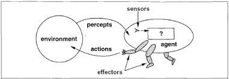
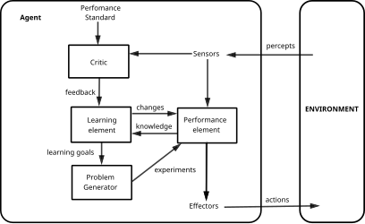

> "What is it that makes a human? Is it their ability to make choices? Or is it something deeper?"
>
> — Major Motoko Kusanagi, *Ghost in the Shell*

> "What is it that separates machines from androids like us? The machines have grown emotions... consciousness."
>
> — 2B, *NieR: Automata*

# **Types of Agents**

## 1. What's an Agent?  
An **agent** in AI is broadly defined as any system that perceives its environment and takes actions to achieve its goals. In other words, an agent receives information from the world, decides what to do, and then acts on the world. Formally, *"an agent is anything that can be viewed as perceiving its environment through sensors and acting upon that environment through actuators."* ([Chapter 2 Intelligent Agents — Artificial Intelligence  documentation](https://artificialintelligence.readthedocs.io/en/latest/part1/chap2.html#:~:text=An%20agent%20is%20anything%20that,upon%20that%20environment%20through%20actuators)) For example, a human agent has eyes and ears as sensors and hands and voice as actuators, while a robot might have cameras and microphones as sensors and motors as actuators.


*(Major Motoko Kusanagi being assembled - a perfect example of an agent with advanced sensors and actuators.)*

Every agent has core components that govern its behavior: **percepts**, **actions**, and the **environment**. A **percept** is the input an agent perceives at a given moment – like a snapshot of the world from the agent's sensors. The agent's percepts over time form a **percept sequence**, which is the complete history of everything the agent has perceived so far ([Chapter 2 Intelligent Agents — Artificial Intelligence  documentation](https://artificialintelligence.readthedocs.io/en/latest/part1/chap2.html#:~:text=We%20use%20the%20term%20percept,percept%20sequence%20to%20an%20action)). Based on this percept sequence (or sometimes just the latest percept), the agent chooses an **action** to perform via its actuators. The environment is the context or world in which the agent operates – it provides percepts to the agent and responds to the agent's actions.

Mathematically, we describe an agent by an **agent function** that maps any given percept sequence to an action ([Chapter 2 Intelligent Agents — Artificial Intelligence  documentation](https://artificialintelligence.readthedocs.io/en/latest/part1/chap2.html#:~:text=We%20use%20the%20term%20percept,percept%20sequence%20to%20an%20action)). If we denote by \(P^*\) the set of all possible percept sequences and by \(A\) the set of all actions, then an agent's behavior is a function \(f: P^* \to A\) ([Intelligent agent - Wikipedia](https://en.wikipedia.org/wiki/Intelligent_agent#:~:text=The%20agent%20function%2C%20often%20denoted,16)). For instance, if \(f\) maps the percept sequence "inbox has an unread email" to the action "open email," then the agent will open an email whenever it perceives one is unread. The actual mechanism that realizes this mapping is the **agent program**, which is the concrete implementation (code or rules) running on some physical system. It's important to distinguish the abstract agent function from the agent program that implements it ([Chapter 2 Intelligent Agents — Artificial Intelligence  documentation](https://artificialintelligence.readthedocs.io/en/latest/part1/chap2.html#:~:text=Internally%2C%20the%20agent%20function%20for,running%20within%20some%20physical%20system)) – the function is like the idealized description of behavior, while the program is the real-world code that gets executed.

To make these ideas concrete, consider an everyday analogy: **responding to a message on your phone**. Your phone's notification (percept) makes you aware of a new message; you then decide how to respond (action) based on who the sender is and what they said (environment context). If it's your boss emailing at 9 AM, you might reply immediately; if it's a random spam text, you ignore it. Here, *you* are the agent, your phone provides percepts, and your responses are the actions. Another example is the TikTok video recommendation **algorithm** – it perceives your viewing behavior (how long you watch, what you like), and takes action by selecting the next video to show. Over time it adapts to better achieve its goal of keeping you engaged.

In pop culture, a classic example of an AI agent is **GLaDOS from the *Portal* series**. GLaDOS (Genetic Lifeform and Disk Operating System) monitors the Aperture Science facility through an extensive network of cameras and sensors, and controls various test chambers and facility systems through her actuators. She's constantly perceiving (test subject's actions, facility status, test results) and acting (reconfiguring test chambers, deploying turrets, releasing neurotoxin) to conduct her "tests." We can imagine GLaDOS's agent function as mapping test chamber states and subject behaviors to appropriate responses (if the subject solves a puzzle, introduce a new testing element; if they try to escape, activate defensive measures). This illustrates an agent that is **rational** – it aims to do the right thing based on its perceptions (even if her definition of "right" might be questionably aligned with human values!). Throughout this chapter and text, we'll formalize what it means to do the "right thing," ultimately relating it to concepts like performance measures and rationality.


*(GLaDOS from Portal, observing and controlling her test chambers – a quintessential AI agent in action.)*


*(A perfect example of a reflex agent in action: parrying in Super Smash Bros. The agent sees an incoming attack (percept) and immediately responds with a defensive action.)*



For example, a simple reflex agent for a vacuum cleaner might have rules like "if dirt is perceived, then suck it up" and "if bump into wall, then turn." There is no internal state or memory of past percepts – the agent reacts *only* to the current situation.

Because they don't consider any history, simple reflex agents work best in environments that are **fully observable** – where the current percept tells the agent *everything it needs to know* to act correctly ([Intelligent agent - Wikipedia](https://en.wikipedia.org/wiki/Intelligent_agent#:~:text=condition,action)). If the agent's sensors can always get the full state of the environment, a simple rule can map that state to an optimal action. However, in partially observable environments, simple reflex agents can get into trouble. They might repeat actions or get stuck in loops because they have no memory. (In fact, **infinite loops are often unavoidable** for simple reflex agents in partially observable settings ([Intelligent agent - Wikipedia](https://en.wikipedia.org/wiki/Intelligent_agent#:~:text=them%20to%20disregard%20conditions%20whose,actuators%20are%20already%20triggered)). Randomizing actions a bit can sometimes help, but the fundamental limitation remains.) Despite their limits, reflex agents can be very effective for straightforward tasks.

**Examples:** Think of a basic **thermostat** in your home. It's a simple reflex agent that measures the current temperature (percept) and turns the heater or AC on or off (action) based on a rule: *if temperature is below target, then turn heater on; if above target, turn it off*. The thermostat doesn't remember what the temperature was an hour ago – it just reacts to the current reading. This fits the simple reflex model perfectly ([What are the Different Types of AI Agents?](https://botpress.com/blog/what-are-the-different-types-of-ai-agents#:~:text=internal%20memory%20of%20past%20events)). Another example is a non-player character (NPC) in a simple video game that doesn't learn or plan, but just reacts. Consider a **Mario Kart** bot that immediately swerves when a red shell is detected behind it. It might have a rule "if shell incoming (current percept), then dodge." It doesn't strategize about the race or remember previous laps – it just responds reflexively to the immediate threat. Many classic arcade game AIs (like the ghosts in *Pac-Man* in their chase mode) are essentially reflex agents responding to the player's current position.

We can formalize a simple reflex agent with pseudocode for its agent program: it evaluates the current percept with a set of conditions and returns the corresponding action. For instance:  

```
IF percept == "temperature < 20°C" THEN action := "heater_on"
IF percept == "temperature >= 20°C" THEN action := "heater_off"
```  

This logic-based approach is straightforward and often efficient. The simplicity makes reflex agents easy to design for the right kinds of problems (and easy to verify, since behavior is a direct mapping from percepts to actions). However, when an environment has more complexity – things to remember or hidden information – we need more capable agents.

### **Model-Based Reflex Agents:**  
A *model-based reflex agent* is one step up in capability. In addition to current percepts, it **maintains some internal state** that depends on the percept history ([Intelligent agent - Wikipedia](https://en.wikipedia.org/wiki/Intelligent_agent#:~:text=agent)). This internal state is a representation (a "model") of aspects of the world the agent can't directly see at the moment. By updating its internal model, the agent can "remember" or infer important information about the world, allowing it to act more effectively than a simple reflex agent when the environment isn't fully observable.


*(2B from NieR: Automata demonstrates model-based behavior - maintaining an internal model of the environment while navigating complex terrain.)*


In essence, a model-based agent has two parts in its decision cycle:
1. **State Update:** First, it uses the new percept and its old internal state to update its understanding of the world. This requires some knowledge of "how the world works" – the agent's model of the environment's dynamics ([Intelligent agent - Wikipedia](https://en.wikipedia.org/wiki/Intelligent_agent#:~:text=A%20model,based%20agent)). For example, if it loses sight of an object, it can use its model to infer where the object might have moved.
2. **Action Selection:** Then, it chooses an action based on the updated state (often still using simple condition–action rules, but now applied to the *inferred state* instead of just the immediate percept).

The internal model can be anything from a simple boolean ("I have the key or not") to a complex map ("here is the layout of the entire maze as I've explored it"). This is what we call the **state** of the agent – a representation of the environment that the agent maintains. The environment model might include laws of physics, game rules, or just a record of past percepts that haven't changed (like "door X was open 5 minutes ago, and I assume it's still open unless I perceive otherwise").

**Examples:** A good example of a model-based agent is a **robot vacuum (smart vacuum cleaner)** that builds a map of your house. As it moves, it remembers where obstacles (furniture) are and which areas it has cleaned. Its sensors at any one time might not see the whole room, but it maintains an internal map (model) to avoid bumping into things out of sensor range. If it's in the hallway and the docking station is in the living room, it can head in the correct direction even if it can't currently sense the dock, because its internal state "remembers" the floor plan. Another example from pop culture is **Light Yagami in *Death Note*** (a human example of an "agent"). Light is always a few steps ahead, maintaining an internal model of L's knowledge and plans. He doesn't just react to what L tells him in the moment; he considers what L *knows so far* and what moves L is likely to make next, and then Light acts (writes a name in the Death Note, etc.) based on that internal model. Essentially, Light's "agent program" updates a mental model of his opponent's beliefs and uses that to choose actions – a very model-based (and cunning) approach!

In AI terms, many game-playing agents use internal state. A chess program, for instance, updates the positions of pieces on the board in its internal memory as moves are played; it doesn't need to visually re-scan the board every turn. It "knows" where the pieces are from its model of the game state. Model-based reflex agents are powerful because they combine immediate reactions with a memory of the world, enabling more **informed** decisions. They are a precursor to goal-based and utility-based agents, often forming the backbone of those more advanced agents by providing the state information needed to make planning or utility calculations.

### **Goal-Based Agents:**  
While reflex agents (simple or model-based) act in the moment, **goal-based agents** look further ahead. A goal-based agent chooses actions with a specific **goal** in mind. It is not satisfied with just any immediate reaction; it considers *future consequences* of actions and whether those will lead it toward its goal. In other words, the agent is given (or defines) a goal that describes a desired outcome, and it tries to **plan** a sequence of actions that will achieve that outcome ([Intelligent agent - Wikipedia](https://en.wikipedia.org/wiki/Intelligent_agent#:~:text=ImageModel)).


Having an explicit goal allows the agent to evaluate different possible actions by asking, "Will this action (or action sequence) lead me closer to my goal?" This often involves **search** and **planning algorithms**. The agent might simulate or consider future states of the environment (using its model) to see which action is best. This is a big step up in complexity: the agent may explore *what-if scenarios* internally. Classic AI techniques like breadth-first search, depth-first search, Dijkstra's or A* algorithm come into play here, as the agent plans paths or sequences of moves that achieve the goal.

One downside is that purely goal-based agents consider only whether a goal is reached or not, and not how *efficient* the path to the goal is (that's what utility-based agents address next). But even without a utility measure, goal-based agents are usually more flexible than reflex agents. They can operate in a variety of environments by adapting their action sequence to achieve the goal, rather than following a fixed reaction pattern. The trade-off is that planning can be slower than reflex actions, and if a goal is set incorrectly or is unachievable, the agent's behavior might be poor.

**Examples:** A straightforward example of a goal-based agent is a **GPS navigation system** in a game like *The Legend of Zelda: Breath of the Wild*. Suppose you place a marker on the map (your goal location); the pathfinding AI will plan a route from Link's current position to that goal, considering the terrain and walkable paths. It's choosing actions (e.g., "move north 10 steps, then west across the bridge, then climb the hill") that it predicts will lead Link to the goal position. Another example is a **self-driving car**. Its overarching goal might be "drive to destination X while obeying traffic laws and avoiding obstacles." The car's AI will plan its route and continually make decisions (speed up, slow down, turn, change lanes) that are not just reactions, but are in service of that goal of reaching the destination safely. If an unexpected road closure occurs, the car can re-plan a new route to still achieve the goal. In both cases, the agent needs a model of how actions affect the world (how the car moves, what roads connect where) and a goal state to aim for. 

Goal-based agents shine in **search-and-planning problems**. For instance, in a puzzle like Sudoku, a goal could be a completed grid that satisfies all rules. A Sudoku-solving agent will consider future moves (filling in numbers) that eventually lead to the goal of a solved puzzle, rather than just reacting one step at a time. Similarly, in chess, a goal-based perspective might be "checkmate the opponent" – though it's hard to encode directly, chess engines effectively use the goal of winning and search many moves ahead to decide the best action. They evaluate intermediate states via heuristics that estimate progress toward the goal (a hint of utility).

It's worth noting that sometimes incorporating goals can make an agent less efficient if it doesn't also incorporate some measure of *cost* or *preference*. For example, consider navigation: if there are two routes to the goal, one very long and one short, a purely goal-driven agent sees them as equally achieving the goal (“I got there eventually”), whereas a **utility-based agent** (next section) would prefer the shorter route because it has a higher utility (say, less time or fuel used). In practice, many AI agents combine goal-based reasoning with utilities or heuristics to get the best of both worlds. But as a concept, goal-based agents introduced the critical idea of **planning** with purpose, which was a major milestone in AI thinking.

### **Utility-Based Agents:**  
Goals alone only specify success or failure (did we reach the goal or not), but often we care about *how well* we achieve something. This is where **utility-based agents** come in. A utility-based agent is similar to a goal-based agent but with an extra layer: it has a **utility function** that gives a numeric value (a utility) to each possible state (or outcome), representing the degree of happiness or desirability of that state ([Intelligent agent - Wikipedia](https://en.wikipedia.org/wiki/Intelligent_agent#:~:text=Goal,the%20agent%20is)) ([Intelligent agent - Wikipedia](https://en.wikipedia.org/wiki/Intelligent_agent#:~:text=describe%20how%20,is)). The agent doesn't just seek *any* goal achievement – it seeks to *maximize its expected utility*. 


By using a utility function, the agent can compare different outcomes and select not just a goal state, but the *best* among possible goal states, or the best way to reach a goal. In scenarios where there are trade-offs or uncertainties, utility-based agents excel. They will prefer the action that they expect will lead to the highest utility, taking into account the probabilities of various outcomes (if the environment is stochastic) ([Intelligent agent - Wikipedia](https://en.wikipedia.org/wiki/Intelligent_agent#:~:text=A%20rational%20utility,perception%2C%20representation%2C%20reasoning%2C%20and%20learning)). In other words, the chosen action \(a^*\) is often one that maximizes the expected utility:  
\[a^* = \arg\max_{a \in A} \mathbb{E}[U(\text{State}_{\text{result of }a})],\]  
where \(U\) is the utility function and the expectation accounts for uncertainty in the result of action \(a\).

Designing a utility function is task-specific. For a self-driving car, utility might be a combination of factors like negative trip time, minus risk of collision, plus passenger comfort. For a game-playing agent, the utility might be the probability of winning given the current state (which the agent tries to maximize). Utility-based agents are essentially trying to **optimize** something rather than just achieve it. This involves more complex decision-making, often invoking techniques from decision theory and economics. These agents can handle trade-offs: for example, a utility-based personal assistant might weigh the *utility of interrupting you with a notification* against the *utility of letting you work uninterrupted*, and only ping you if the importance of the message (utility gain of informing you) outweighs the annoyance (utility loss).

**Examples:** A common example is an **online recommendation system** (like Netflix's movie recommender or TikTok's For You page algorithm). Such a system can be seen as an agent that, at each step, selects an item (movie or video) to show you. The "goal" is not just to show any video, but to maximize user satisfaction or engagement – effectively a utility. The algorithm will have a utility function that predicts how much you will like or engage with a given piece of content, and it will choose the content with the highest expected utility for you ([ Q&A: How TikTok's 'black box' algorithm and design shape user behavior  |  UW News ](https://www.washington.edu/news/2024/04/24/tiktok-black-box-algorithm-and-design-user-behavior-recommendation/#:~:text=TikTok%E2%80%99s%20swift%20ascension%20to%20the,from%20accounts%20they%20don%E2%80%99t%20follow)). In TikTok's case, the agent's actions (recommended videos) are chosen based on maximizing the predicted utility (where utility might correlate with watch time or the chance you'll like/comment) for keeping you on the app. Another example: consider a **Pokémon battle AI** (or a human player acting as an agent). They may have a goal to win the battle, but a utility-based approach would assign values to intermediate states (like having high HP, or the opponent being low on HP). A *Pokémon trainer agent* might evaluate each possible move by the expected damage it will deal, the probability of success, and the future advantage gained – essentially using a utility function that captures the desirability of the battle state after the move. If Move A has a 90% chance to hit for moderate damage and Move B has a 50% chance to hit but would be a one-hit KO, a utility-based decision will weigh the expected utilities (damage * probability, etc.) to decide. The move with the higher expected utility (depending on the situation and risk preferences encoded) will be chosen. This is more nuanced than a simple goal-based rule like "if any move can eventually lead to win, pick the first such move." The utility-based agent seeks the *best* move according to its performance measure (which could be winning quickly with minimal damage taken, for example).

In robotics, utility functions are often used when an agent has multiple objectives. For instance, a delivery drone might have a utility function that combines speed of delivery, energy consumption, and safety. It will then plan a flight path that maximizes an overall utility score – which might be a weighted sum of those factors – to decide the optimal route (weather and obstacles introducing uncertainty that it must factor as well). 

By incorporating utilities, agents can handle **stochastic environments** more rationally. In a deterministic environment, reaching the goal is all that matters (and many paths might reach it); in a stochastic environment, different actions might lead to the goal with different probabilities or costs. A utility-based agent naturally handles this by favoring actions that *on average* yield better outcomes. In summary, a utility-based agent can be seen as a goal-based agent with an extra optimization layer: it doesn't just aim for *success*, it aims for *the best possible success* according to a given performance metric.


### **Learning Agents:**  
The last (and in many ways most powerful) category is the *learning agent*. A **learning agent** is designed to improve its performance over time by learning from its experiences. Unlike the previous agent types, which have fixed behavior defined by built-in rules, models, or utilities, a learning agent can start with initial knowledge and then **automatically refine or augment its knowledge** by observing the results of its actions in the environment ([Intelligent agent - Wikipedia](https://en.wikipedia.org/wiki/Intelligent_agent#:~:text=ImageA%20general%20learning%20agent)). This allows it to handle situations the designer didn't explicitly anticipate.



A learning agent can be thought of as having four conceptual components:
- **Performance Element:** This is like the underlying agent (whether reflex, goal-based, etc.) that chooses actions in the environment. It's what we've discussed so far.
- **Learning Element:** This component is responsible for making improvements. It observes what the performance element does and how well it does, and adjusts the performance element to do better in the future ([Intelligent agent - Wikipedia](https://en.wikipedia.org/wiki/Intelligent_agent#:~:text=separation%20between%20a%20,responsible%20for%20choosing%20external%20actions)).
- **Critic:** The part of the agent that gives feedback on how the agent is doing with respect to some performance measure. (For example, a game score or a reward signal from the environment can serve as feedback to guide learning.)
- **Problem Generator:** This component might suggest exploratory actions to help the agent learn more about its environment. (In reinforcement learning terms, this relates to the exploration vs. exploitation trade-off.)

In many learning agents, especially those using **reinforcement learning**, the environment provides rewards or punishments (positive or negative feedback) and the agent's job is to learn a policy (mapping from percepts/states to actions) that maximizes cumulative reward. Early on, the agent might act suboptimally (even randomly) as it explores what actions do. But as it gathers experience, it can begin to favor actions that lead to higher rewards. This is exactly how modern game-playing AIs have achieved superhuman performance: through millions of trial-and-error interactions, gradually learning which strategies yield the highest reward (wins).

**Examples:** One of the most familiar learning agents in everyday technology is the **spam filter** in your email. It starts with some initial knowledge of what spam looks like, but as you mark emails as spam or not spam, it learns from those examples. Over time, it adapts to new types of spam messages that it hadn't seen before. Essentially, the spam filter's performance element sorts emails, and its learning element updates its internal model (perhaps a machine learning classifier) based on which emails users mark as spam. With each piece of feedback, the filter gets better at its task ([What are the Different Types of AI Agents?](https://botpress.com/blog/what-are-the-different-types-of-ai-agents#:~:text=match%20at%20L171%20,feedback%20is%20a%20learning%20agent)). Another example is the TikTok recommendation **algorithm** we discussed: it's not only a utility-based agent, but also a learning agent. It continuously updates its model of your preferences based on your interactions. In fact, TikTok's system has become famous for how quickly it learns a user's likes and dislikes – sometimes users quip that *"the TikTok algorithm knows me better than I know myself."* ([ Q&A: How TikTok's 'black box' algorithm and design shape user behavior  |  UW News ](https://www.washington.edu/news/2024/04/24/tiktok-black-box-algorithm-and-design-user-behavior-recommendation/#:~:text=TikTok%E2%80%99s%20swift%20ascension%20to%20the,from%20accounts%20they%20don%E2%80%99t%20follow)) That dramatic level of personalization is achieved by a learning agent processing enormous amounts of user data to refine content recommendations.

In games, modern AIs often employ learning. Consider a **Street Fighter AI** that adapts to your playstyle. Perhaps at first it's easy to beat, but as it "sees" more of your moves, it starts predicting and countering them more effectively. This could be implemented by a learning agent that updates its strategy (or the probabilities of selecting certain counter-moves) based on what it has observed from the human player. By the end of a long session, it might have "learned" that you always jump kick at the start of a round, and thus it begins to always open with an anti-air move. This kind of adaptation is what makes learning agents feel engaging (or infuriating!) because they don't remain static.

Under the hood, learning agents use techniques from **machine learning** – including neural networks, decision trees, genetic algorithms, etc. A subclass of learning agents known as **reinforcement learning agents** are particularly noteworthy. They use algorithms (like Q-learning, policy gradients, Deep Q Networks, etc.) to learn from reward feedback. The agent might start not even knowing the rules of the environment, but through trial and error it discovers which actions yield higher rewards. Notable successes of reinforcement learning agents include mastering Atari games directly from pixel inputs, beating world champions in Go (*AlphaGo*), and achieving superhuman play in complex video games like StarCraft (*AlphaStar*). These systems began with effectively no knowledge beyond basic percepts and actions and learned to dominate their environments, purely from experience.

It's important to highlight that learning is often layered on top of the other agent types. You can have a learning *reflex* agent (it learns which condition-action rules work best), a learning *goal-based* agent (it learns which goals are achievable or how to achieve them faster), etc. Learning gives an agent **autonomy**: the ability to improve itself without needing constant reprogramming. In the long run, a good learning agent can surpass the performance that its designer could have manually built in, because it can discover novel strategies. This makes learning agents especially suited for complex, changing, or unknown environments where pre-programmed behavior would be brittle. 

## 3. Environments Matter  
We've seen different agent designs; now it's crucial to note that **the choice of agent type often depends on the environment in which the agent operates**. Environments in AI are categorized by a set of properties that influence what kind of agent is appropriate ([Chapter 2 Intelligent Agents — Artificial Intelligence  documentation](https://artificialintelligence.readthedocs.io/en/latest/part1/chap2.html#:~:text=2)) ([Chapter 2 Intelligent Agents — ArtificialIntelligence  documentation](https://artificialintelligence.readthedocs.io/en/latest/part1/chap2.html#:~:text=STATIC%20VS,we%20say%20the%20environment%20is)). Here are some key environment properties and how they impact agent design:

- **Fully observable vs. Partially observable:** In a **fully observable** environment, the agent's sensors can access the complete state of the world at each time step ([Chapter 2 Intelligent Agents — Artificial Intelligence  documentation](https://artificialintelligence.readthedocs.io/en/latest/part1/chap2.html#:~:text=2)). This means the agent doesn't need to maintain internal state to infer missing information – the environment tells it everything it needs to know. Chess is a classic example: the entire board configuration is known to both players at all times. A simple reflex (or straightforward goal-based) agent can suffice in a fully observable world because there's no hidden information. In a **partially observable** environment, the agent's percepts provide incomplete information about the world state. Think of **poker**: you can see your own cards but not the opponents' cards, so you have to infer what they might have. Here, an agent usually needs memory or a model (thus, model-based agents) to keep track of possibilities and histories. Most real-world environments are partially observable due to noise, sensors with limited range, or hidden variables. For example, a self-driving car can't see around corners – it may need to maintain a belief about what could be coming. As noted earlier, simple reflex agents do poorly in partially observable environments because they have no memory; model-based agents or learning agents cope better by remembering or estimating the hidden parts of the state.

- **Deterministic vs. Stochastic:** In a **deterministic** environment, the next state is entirely determined by the current state and the agent's action ([Chapter 2 Intelligent Agents — Artificial Intelligence  documentation](https://artificialintelligence.readthedocs.io/en/latest/part1/chap2.html#:~:text=DETERMINISTIC%20VS,deterministic%3B%20otherwise%2C%20it%20is%20nondeterministic)). There is no randomness in how the environment evolves. Classic physics simulations or a puzzle like Sudoku are deterministic: if you take an action, you know exactly what you'll get. In such cases, planning is simplified since you don't have to consider probabilistic outcomes. A **stochastic** environment, on the other hand, has some randomness. The same action from the same state might lead to different outcomes (often modeled with probabilities). **Weather forecasting** is a stochastic environment – even with the same atmospheric conditions, the weather might turn out differently, and an agent (like a weather-predicting AI) has to handle uncertainty. Deterministic environments allow for agents that are more straightforward – a goal-based agent can plan a single sequence of actions knowing it will work. In stochastic settings, a utility-based approach often becomes important, because the agent should evaluate actions based on expected outcomes. For instance, consider an automated investment agent operating in the stock market: the environment (market) is highly stochastic. A purely goal-based agent (goal: "maximize profit") without utilities and probabilities would struggle, because it needs to assess risk and expected returns. Instead, a utility-based agent that can handle probabilities (perhaps maximizing expected return minus risk penalty) is suitable. Many **reinforcement learning** agents are designed for stochastic environments; they inherently reason about expected reward.

- **Static vs. Dynamic:** A **static** environment is one that doesn't change while the agent is deliberating. If nothing changes except through the agent's actions, the environment is static ([Chapter 2 Intelligent Agents — Artificial Intelligence  documentation](https://artificialintelligence.readthedocs.io/en/latest/part1/chap2.html#:~:text=STATIC%20VS,we%20say%20the%20environment%20is)). A **dynamic** environment can change "on its own" as time passes, or due to other agents. For example, a **Sudoku puzzle** is static: the puzzle won't suddenly change numbers while you're thinking – you can take your time. On the contrary, a **real-time strategy game** like StarCraft is dynamic: even while your AI agent is planning its next move, the opponent might be moving units, or resources might be depleting. Dynamic environments demand that agents be quick and often **continually responsive**. In a dynamic world, a planning agent might need to be able to intermix planning and execution (or re-plan on the fly) because if it plans for too long, the world might have changed by the time it's ready to act. A simple reflex agent can sometimes work well in dynamic environments because it reacts fast, but if the task requires some strategic long-term thinking, the agent needs to plan under time pressure. In highly dynamic settings (like self-driving cars or robot soccer), agents are often designed with a combination of reflexive components (for immediate collision avoidance, for example) and goal/utility-based components (for higher-level decisions), ensuring both safety and goal-directed behavior.

- **Single-agent vs. Multi-agent:** Though not explicitly listed in the outline, it's worth mentioning: if the environment contains other agents (especially other intelligent agents), it becomes a **multi-agent** environment. Examples include multi-player games, economic markets, or social networks. In such environments, an agent might need to consider the actions of others – leading to concepts like **game theory** and strategies (e.g., cooperation, competition).


*(Androids from NieR: Automata interacting in a multi-agent environment, where each must consider the actions and intentions of others.)*

A social media recommendation environment could be seen as multi-agent (multiple algorithms and users interacting), though often we treat the others as part of the environment dynamics. Multi-agent environments can be competitive (as in chess or StarCraft) or cooperative. Agents operating here may benefit from being model-based (to model other agents) or learning-based (to adapt to others' behaviors). For instance, a trading agent in an auction is essentially interacting with other bidding agents; a reflex strategy likely won't suffice, it might need to predict others' bids (a model of other agents) and have a utility for outcomes.

These environmental attributes often determine the minimum sophistication an agent needs. A fully observable, deterministic, static environment (like a basic board puzzle) might be solved by a simple search (goal-based) agent with no learning or even memory needed. If you start relaxing those assumptions – say it becomes partially observable or stochastic – you start to need internal state (model-based) or utility reasoning. If the environment is unknown or changing, learning becomes very useful for the agent to remain effective. 

To see the match-ups: **simple reflex agents** do well in fully observable, deterministic, static environments (like a basic automatic door sensor that opens whenever someone is in range – the world is simple and fully seen). **Model-based agents** are necessary when the agent has to remember things (partially observable, maybe static or slow environments). **Goal-based agents** shine when the agent has to achieve a specific end state in a reasonably predictable world (like puzzles, route-finding). **Utility-based agents** are important in stochastic or complex trade-off environments, where just reaching a goal isn't enough – you care about *which* goal or how optimally you get there. **Learning agents** are crucial in unknown, dynamic, or very complex environments where pre-programmed knowledge falls short – they can adapt to the task. In practice, many real systems combine elements: for example, an autonomous drone is a learning agent that uses utility (to balance speed vs safety), has goals (reach waypoint), uses a model (physics of flight), and also has reflexes (stabilization loops).

One concrete scenario: Consider a **chessboard vs. a poker table**. In chess (fully observable, deterministic, turn-based static environment), a goal-based agent with search can perform exceedingly well – which is why AI mastered chess decades ago with algorithms searching game trees. In poker (partially observable, stochastic with other agents), a successful AI (like DeepStack or Libratus for poker) had to use a model of belief (keeping track of what it knows vs doesn't), reason about probabilities of opponents' cards (utility-based decision-making for bets), and learn from self-play to refine its strategy. The environment really dictates the approach.


***(Image: A Gungi boardgame , representing a fully observable and deterministic environment. In chess, an AI agent can see the entire state and plan many moves ahead. In contrast, games like poker or complex real-world settings hide information, requiring agents to handle uncertainty.)*** 

## 4. Agents in Action  
We now shift from individual agent architectures to how agents actually operate in the wild – that is, how these designs are applied to solve real decision problems. AI agents today are everywhere, often operating behind the scenes in technology and society. Let's look at a few domains:

- **Game Theory and Social Dilemmas:** Consider social media platforms where users (and sometimes bots) interact. If we treat each user or bot as an agent, we can analyze their behavior with game theory. A famous example is the **tit-for-tat strategy** in repeated interactions (like the Prisoner's Dilemma game). Tit-for-tat is basically a simple reflex strategy: start cooperatively, then do whatever the other agent did last time. On platforms like Twitter or forums, you might notice patterns akin to tit-for-tat: people reciprocate kindness or rudeness. Now, if we have AI agents moderating or participating, they could employ similar strategies. For instance, an AI agent designed to guide online discussions could use a model-based approach: keep track of users who are reliably constructive versus those who troll, and adapt its interactions (perhaps ignore or down-weight trolls – a bit like tit-for-tat defection). This is a mix of game-theoretic reasoning and agent design. In multi-agent situations like auctions, traffic systems, or even dating apps, each AI agent needs to consider others. Future chapters on game theory will delve deeper into how agents can be designed to achieve Nash equilibria or cooperative outcomes.

- **AI in Esports and Real-Time Games:** Modern video games, especially esports, are a playground for advanced AI agents. Take real-time strategy (RTS) games such as StarCraft II or MOBAs like Dota 2. These environments are partially observable, stochastic (due to hidden information and sometimes hit probabilities), dynamic, and multi-agent (opponents and teammates). AI agents like **AlphaStar (by DeepMind)** achieved Grandmaster level in StarCraft II by using a combination of techniques: deep neural networks (for state evaluation), reinforcement learning (to learn strategies from self-play), and game-theoretic training against itself and league of opponents ([AlphaStar: Grandmaster level in StarCraft II using multi-agent reinforcement learning - Google DeepMind](https://deepmind.google/discover/blog/alphastar-grandmaster-level-in-starcraft-ii-using-multi-agent-reinforcement-learning/#:~:text=We%20chose%20to%20use%20general,applied%20to%20many%20other%20domains)) ([AlphaStar: Grandmaster level in StarCraft II using multi-agent reinforcement learning - Google DeepMind](https://deepmind.google/discover/blog/alphastar-grandmaster-level-in-starcraft-ii-using-multi-agent-reinforcement-learning/#:~:text=Many%20advances%20since%20then%20have,Dota%202%20and%20Quake%20III)). AlphaStar effectively was a learning utility-based agent – it had a goal (win the game), but it also had to maximize long-term expected reward (wins) in a very complex space, learning everything from scratch. In Dota 2, **OpenAI Five** similarly learned to play at champion level by self-play, coordinating five agents (one for each hero in the team) that learned both to cooperate and compete ([AlphaStar: Grandmaster level in StarCraft II using multi-agent reinforcement learning - Google DeepMind](https://deepmind.google/discover/blog/alphastar-grandmaster-level-in-starcraft-ii-using-multi-agent-reinforcement-learning/#:~:text=Many%20advances%20since%20then%20have,Dota%202%20and%20Quake%20III)). These examples show how learning agents can surpass human reflexes and strategy by exploring myriad possibilities. Another interesting development: AI agents are now used to **train human players**. For example, a game might include an AI coach (an agent analyzing the game and giving advice) or AI sparring partners that adjust their difficulty via learning to keep human training challenging. The presence of learning and adaptation in these agents means that they can continue to be effective even as human strategies evolve over time.

- **Recommendation Systems and Personalization:** As mentioned, recommendation algorithms on platforms like TikTok, YouTube, Netflix, or Amazon can be seen as agents making sequential decisions. Each time you finish watching a video or buying a product, the system must choose the next recommendation. Its "goal" is typically to maximize user engagement or satisfaction (utility). These are **utility-based learning agents** par excellence. They use enormous amounts of data to learn predictive models (often deep learning models) of what a user's utility for an item would be, and then they pick the item with highest predicted utility. What's interesting is that these systems also must consider *exploration*: showing something slightly novel to learn more about your tastes, versus exploitation: showing what is likely to please you. That's very much like a reinforcement learning trade-off. In fact, some recommendation agents are explicitly modeled as reinforcement learning problems (with user clicks or watch time as rewards). Over time, the agent "gets to know you" – an iterative loop of perception (your interaction), and action (the next recommendation). We all experience these agents daily. When TikTok's feed quickly zeros in on the content you can't stop scrolling, or when Netflix's suggestions seem oddly tailored to your recent mood, that's an AI agent in action, making decisions based on learned behavior models. Future chapters on **Markov Decision Processes (MDPs)** will formalize the idea of sequential decision making under uncertainty, which underlies these recommendation scenarios as well (each recommendation influences what you do next, which influences what the agent should do after).

- **Autonomous Vehicles and Robotics:** A self-driving car is a collection of agents or a very complex agent that incorporates multiple techniques. Its perception system is an agent that detects lanes, pedestrians, etc. (often using learned models). The planning module is a goal-based agent (goal: navigate to destination). The decision module might be utility-based (balancing speed, comfort, safety). And overall, the system learns from data – both offline (training on large datasets of driving) and sometimes online (adapting to driver preferences). In multi-agent scenarios like traffic, each car might have to anticipate what others will do (will that pedestrian cross now? Is that driver aggressive or cautious?). These agents utilize **Hidden Markov Models (HMMs)** and **Kalman filters** to track and predict the state of other vehicles/pedestrians (because not everything is directly observed, e.g., a car's intention or a pedestrian hidden behind a truck). We will explore these models in later chapters, which help agents deal with uncertainty in perception over time.

The key takeaway from these examples is that *agent concepts pervade real-world AI applications*. By understanding the agent types, we can better reason about how to design AI for a given problem. For instance, if we know our problem is highly dynamic and partially observable (like a drone in wind currents), we know our agent likely needs an internal model (to remember past wind) and possibly a learning algorithm (to adapt to wind patterns), rather than just a bunch of fixed if-then rules. If our problem is a one-shot, fully observable puzzle, we might not need learning or even internal state – a search might do.

As a teaser for upcoming topics: we will be formally looking at how agents handle uncertainty and sequential decision-making. This includes **Markov Chains** (which model state transitions probabilistically) and **Hidden Markov Models** (which handle partial observability by modeling the probability of percept sequences given underlying states). These form the foundation for understanding how agents can *infer hidden information* (state estimation) and update their internal models rigorously. We'll also delve into how agents learn optimal policies through **reinforcement learning**, which marries the ideas of learning agents and utility-based reasoning in uncertain environments.

## 5. Mathematical Formalism  
Let's recap some of the formal concepts introduced, in a slightly more rigorous way, and add a bit of mathematical detail to solidify our understanding:

- **Agent function:** As noted, an agent's behavior is a function \(f: P^* \to A\), mapping percept histories to actions ([Intelligent agent - Wikipedia](https://en.wikipedia.org/wiki/Intelligent_agent#:~:text=The%20agent%20function%2C%20often%20denoted,16)). If we denote a percept at time \(t\) as \(p_t\), then a percept sequence up to time \(t\) is \(\langle p_1, p_2, ..., p_t \rangle\). The agent function is \(f(\langle p_1, ..., p_t\rangle) = a_t\), where \(a_t\) is the action the agent takes after perceiving that sequence. This is a general and abstract way to specify *what* the agent does. For example, if $f($"sequence of sensor readings where the last reading indicates low battery") = "move to charging dock"*, that captures the agent's behavior of going to charge when the battery is low. The agent program is one implementation of \(f\). There could be many programs that realize the same function \(f\). A key point: from an external viewpoint, two agents that implement the same \(f\) are indistinguishable in their behavior, no matter how different their internal workings are.

- **Rationality and performance measure:** We often want our agents to be **rational**, meaning they do "the right thing." More formally (from Russell & Norvig's definition), given a performance measure that evaluates the success of an agent in an environment, a rational agent at any time selects an action that is expected to maximize its performance measure, *given the evidence of its percept sequence and whatever built-in knowledge it has* ([Chapter 2 Intelligent Agents — Artificial Intelligence  documentation](https://artificialintelligence.readthedocs.io/en/latest/part1/chap2.html#:~:text=Definition%20of%20a%20rational%20agent%3A,in%20knowledge%20the%20agent%20has)). This definition implies that rationality is not omniscience; the agent makes the best *expected* decision it can, but if something unpredictable happens, that doesn't mean it was irrational – just unlucky. For instance, a chess AI might make a move that, according to its knowledge, is the best (it maximizes the expected winning chances), but if the opponent then makes an unexpected brilliant counter-move and the AI loses, we don't say the AI was irrational – it just didn't know that counter-move existed in its search. The performance measure encapsulates the goals or objectives. For a self-driving car, the performance measure might combine safety, legality, and travel time. For a cleaning robot, it might be amount of dirt cleaned per hour minus the bumps into furniture. We often design utility functions to mathematically represent the performance measure in a utility-based agent.

- **Utility maximization and decision theory:** A utility-based agent attempts to maximize expected utility. Let's say an agent has a utility function \(U(s)\) for states \(s\). If the agent's possible actions are \(a_1, a_2, ..., a_n\), and executing action \(a_i\) in the current state leads to a set of possible outcome states \(\{s_{i1}, s_{i2}, ...\}\) with probabilities \(P(s_{ij} | \text{current state}, a_i)\) (these come from the environment model, perhaps assumed Markovian), then the expected utility of action \(a_i\) is:  
\[ \mathbb{E}[U | a_i] = \sum_j P(s_{ij} | \text{state}, a_i) \; U(s_{ij}). \]  
The utility-based agent would choose \(a_k = \arg\max_{a_i} \mathbb{E}[U | a_i]\). This is a simple decision-theoretic formula. For a concrete example, suppose an agent has two actions: **Carry an umbrella** or **Don't**. The utility function might consider being wet as very bad. If the agent's percepts give it some belief about the chance of rain (say 40% chance of rain today), it can calculate: 
- If I carry an umbrella, utility might be \(U_{\text{umbrella}} = U(\text{not wet but carry umbrella})\). Let's assign values: maybe not wet + carrying umbrella = 0.8 utility (slightly inconvenient but stayed dry).
- If I don't carry: there's 40% chance it rains leading to state (wet, no umbrella) with utility, say, 0.0 (being soaked is miserable), and 60% it doesn't rain leading to (not wet, no umbrella) with utility 1.0 (best case, didn't carry extra weight and stayed dry). So expected utility if not carrying = \(0.4 * 0.0 + 0.6 * 1.0 = 0.6\). 
In this scenario, carrying the umbrella has utility 0.8 for sure (since you'll be dry), which is higher than the 0.6 expected if you don't carry. So the rational decision is to carry the umbrella (0.8 > 0.6). This kind of calculation is what a utility-based agent formalizes. It may seem trivial in this example, but the same logic scales up to very complex decisions with many outcomes (the math just gets heavier, and we might use algorithms to approximate the best action).

- **Probabilistic reasoning:** Many advanced agents (especially learning and model-based agents in uncertain worlds) employ probabilistic reasoning. **Bayesian networks**, **Markov chains**, and **Hidden Markov Models** are tools to help an agent update its beliefs about the world. For instance, a robot with a noisy sensor can use a Hidden Markov Model to maintain a probability distribution over where it thinks it is (localization problem). When it receives a percept, it uses Bayes' rule to update that distribution (this is essentially what the learning/model-based part does in the background). Formally, if an agent has belief \(Bel(s)\) that it is in state \(s\), and it receives a percept \(e\), it can update:  
\[ Bel'(s) = \alpha \, P(e | s) \, Bel(s), \]  
where \(P(e|s)\) comes from the agent's model (the likelihood of seeing percept \(e\) if the true state is \(s\)), and \(\alpha\) is a normalizing constant. This is the essence of Bayesian update (which we will explore in detail later). The takeaway is that agents use such equations to make the most out of their percepts, especially when they can't directly observe the true state.

By grounding our discussion in these formalisms, we prepare for the more detailed analysis in upcoming chapters. We will see exactly how to construct Markov models for environments and how agents can systematically find optimal policies (in reinforcement learning, for example, using algorithms that maximize expected cumulative reward, which is another form of utility).

## 6. Wrap-Up & Next Steps  
In this chapter, we introduced the fundamental notion of an agent in AI and surveyed the major **types of agents**: from simple reflexive agents that react to the here-and-now, up through model-based agents with memory, goal-based planners, utility-based optimizers, and finally learning agents that improve themselves. We've discussed how these agents perceive and act in environments, and importantly, how the **nature of the environment** (observable? deterministic? static? etc.) influences which agent designs are appropriate. 

To recap in a practical light:
- If you have a very clear-cut task and environment (like a puzzle or a stable system), a simple or goal-based agent with predefined logic might suffice.
- If your agent is operating in the real world with lots of uncertainty, you will likely embed a model and possibly a learning algorithm so it can cope with the unexpected.
- Utility functions add a layer of finesse, letting agents handle trade-offs and uncertainty by numerical optimization.
- Learning allows agents to **adapt** – a critical trait as we push AI into complex, evolving settings like personalized apps, autonomous vehicles, and beyond.

Each agent type we covered is like a building block. In practice, many AI systems are hybrid. A self-driving car, for instance, might use reflex agents for low-level control (staying in lane), goal-based planning for navigation, and learning algorithms to improve its driving policy. Understanding these archetypes helps us reason about the pieces of an AI system and how they contribute to the whole.

Moving forward, our journey will dive deeper into the **tools and techniques** that make these agents tick. In the next chapters, we will explore **Markov Chains** and **Hidden Markov Models**, which provide mathematical frameworks for dealing with state transitions and uncertainty in perception. These will expand on the "model" part of model-based agents, teaching us how to predict how an environment changes (Markov Chains) and how to infer hidden state from noisy percepts (HMMs). These concepts are foundational for building agents that can make sense of partially observable environments (think of a robot trying to localize itself without GPS – HMMs are great for that).

We will also delve into **reinforcement learning**, which is essentially the science of learning agents – how an agent can start from scratch and learn an optimal behavior (policy) by trial and error. This will tie together the idea of utility (through the notion of reward functions) and learning (through algorithms that improve the agent's policy to maximize cumulative reward). By the end of those sections, you'll see how an agent can mathematically formulate "What happens if I do X?" and improve from feedback, which is incredibly powerful.

Finally, we'll discuss decision-making under uncertainty and more complex planning (like in partially observable or multi-agent scenarios), possibly touching on **game theory** and **planning in belief space** (when the agent plans not just over concrete states, but over distributions of states).

As a creative thought exercise – consider where agents are heading. We increasingly put agents into **virtual realities and simulations** (for example, AI characters in VR training simulations or video games). In a fully *simulated* environment that is very complex, we might need the whole arsenal: the agent might not be able to fully observe the simulated world (needing an internal model), might have long-term goals (like achieve a mission in a VR game), must maximize certain utilities (like score or player satisfaction), and definitely learn (because these virtual worlds can be as complex as the real world). An exciting research question is: *What happens when we place agents in virtual reality environments that are as rich and unpredictable as real life?* We essentially get a safe playground for AI to evolve and learn, possibly leading to agents that can later be transferred to real-world tasks. This is a bit of foreshadowing of topics like simulation-to-reality transfer and lifelong learning.

Before we proceed to the next technical chapter, take a moment to reflect on what you've learned. We started with a simple concept (an agent perceives and acts) and built up to pretty sophisticated ideas (learning from reward, maximizing expected utility). These form the backbone of AI. As an exercise, you might find it useful to **think of your favorite character from a game or an anime and analyze it as an agent**. What are its percepts, actions, and goals? Is it reflex-based (just reacts) or does it plan? For instance, is *Naruto* (from the anime) acting as a goal-based agent (goal: become Hokage, actions toward that) and perhaps a learning agent (improving skills with experience)? Or consider an AI like *2B from NieR:Automata*: she perceives through advanced sensors and acts with combat capabilities, adapting her strategies based on experience while pursuing mission objectives. This kind of fun analysis will help reinforce the concepts.

**Your Turn – Mini Challenge:** *Pick an AI agent from fiction or a game you love. In a few sentences, describe its percepts, actions, and what type of agent you think it is (reflex? goal-based? learning?). How does its environment shape its design?* This will not only test your understanding but also show how these ideas permeate the stories and games we enjoy.


