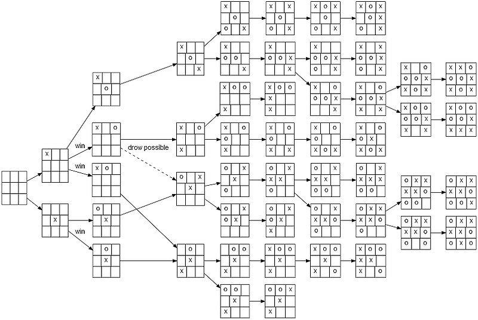

# Árboles de Juego

> "Un matemáticou, como un pintor o poeta, es un creador de patrones." — G. H. Hardy
Los árboles de juego son los patrones que subyacen al juego estratégico.

Los árboles de juego forman el sustrato común para el razonamiento estratégico en inteligencia artificial, investigación operativa y ciencias de la computación teórica. Ya sea que un algoritmo tome muestras de partidas aleatorias (MCTS), propague valores de forma determinista (minimax), o aprenda políticas con redes neuronales, **el árbol de juego** es el entorno por el que debe navegar.

## 1. Juegos como Procesos de Decisión Secuencial (Forma Canonica)

Un juego determinista de información perfecta con un conjunto finito de jugadores $\mathrm{Pl} = \{1,2,\dots,k\}$ se especifica mediante la tupla
$\mathcal{G} = (S, s_0, A, T, P, Z, u)$

| Símbolo | Significado |
| :- | :- |
| $S$ | **Espacio de estados** — cada configuración legal que importa para la legalidad futura. |
| $s_0 \in S$ | **Estado inicial**. |
| $A : S \to 2^{M}$ | **Función de acción** — asigna a un estado un conjunto finito de movimientos legales extraídos de algún universo $M$. |
| $T : S \times M \to S$ | **Transición** — relación sucesora determinista (estado, movimiento) → estado. |
| $P : S \to \mathrm{Pl}$ | **Función de jugador en turno** — indica de quién es el turno. |
| $Z \subseteq S$ | **Estados terminales** — no se permiten más acciones legales. |
| $u : Z \to \mathbb R^{k}$ | **Vector de utilidad/recompensa** — un número real por jugador. Los casos de suma cero y otros casos especiales surgen por restricciones en $u$. |

> **Flexibilidad.** Los juegos de suma cero de dos jugadores se recuperan estableciendo $k=2$ y exigiendo $u_1(s) + u_2(s) = 0$ para todo $s\in Z$. Los juegos cooperativos establecen todos los componentes iguales; los juegos competitivos multiagente relajan ambas condiciones.

> **Universo de movimientos M.** En el mapeo **A : S → 2^M**, el conjunto **M** comprende *todos los movimientos primitivos* reconocidos por las reglas del juego—por ejemplo, las nueve coordenadas del tablero en el tic-tac-toe o las 361 intersecciones en el Go 19×19. Para cualquier estado *s*, la función de acción devuelve el **subconjunto finito** *A(s) ⊆ M* que consiste en movimientos legales en *s*. Asumimos que *M* es finito para la clase de juegos de mesa deterministas discutidos aquí.

### 1.1 Universo de Movimientos $M$

Antes de descomponer la tupla formal, es útil aclarar el marcador $M$ en el mapeo de acción $A:S\to 2^{M}$. **$M$ es el *alfabeto de movimientos primitivos*** —el conjunto más pequeño de símbolos que identifican de manera única cualquier movimiento legal sin referencia a *cuál* estado se toma. Algunos ejemplos:

| Juego | Contenido típico de $M$ | $\|M\|$ |
|-------|--------------------------|---------|
| Tic-tac-toe | Nueve coordenadas del tablero (p.ej. "arriba-izquierda", "centro") | 9 |
| Ajedrez | Todas las tripletas de tipo de pieza × casilla de origen × casilla de destino † | ≈20 000 |
| Conecta Cuatro | Siete índices de columna 0–6 | 7 |
| Go (19×19) | 361 índices de intersección más "pasar" | 362 |

† Los tamaños exactos dependen de si las promociones, en passant, enroque, etc. se tratan como símbolos de movimiento separados.

**Propiedades de $M$**
* $M$ es **finito** para cada juego de mesa considerado en este capítulo (juegos de turnos aleatorios con dados pueden extender $M$ para incluir movimientos de azar, pero el conjunto sigue siendo finito por movimiento).
* $M$ es **agnóstico de estado**: la prueba de legalidad ocurre cuando formamos el subconjunto $A(s)\subseteq M$ para un estado particular $s$.
* $M$ a menudo lleva estructura adicional—coordenadas espaciales, tipos de piezas—explotada por funciones heurísticas y redes neuronales, pero la *definición del árbol en sí* necesita solo la noción teórica de conjuntos de pertenencia.

Con $M$ en mente, ahora podemos presentar formalmente la tupla completa del juego.

---

#### Ejemplo tic-tac-toe

Para un tablero $3\times3$ fijamos un sistema de coordenadas **fila–columna** cuyo origen está en la esquina superior izquierda.  
Sea  

$\text{Filas } r\in\{0,1,2\}, \qquad \text{Columnas } c\in\{0,1,2\}.$

Definimos el **universo de movimientos**

$M_{\text{tic-tac-toe}} =\bigl\{\,m_{r,c}\;\bigl|\;r\in\{0,1,2\},\;c\in\{0,1,2\}\bigr\}, \qquad |M_{\text{tic-tac-toe}}|=9.$

Cada símbolo $m_{r,c}$ denota la acción «colocar la marca propia en la casilla $(r,c)$».  
La legalidad se decide más adelante al filtrar las casillas ya ocupadas en el estado $s$.

* **Finitud.** La cardinalidad de $M$ es $9$; todo el árbol de juego entra en unas pocas páginas.  
* **Agnosticismo de estado.** Los nueve símbolos existen sin importar si la casilla está vacía; el subconjunto legal es $A(s)\subseteq M$.  
* **Simetrías.** Rotaciones y reflexiones permutan los $m_{r,c}$; aprovecharlas reduce el número de nodos distintos que explora un algoritmo.

#### Enumeración completa de $M_{\text{tic-tac-toe}}$

$M_{\text{tic-tac-toe}} =\Bigl\{ m_{0,0},\; m_{0,1},\; m_{0,2},\; m_{1,0},\; m_{1,1},\; m_{1,2},\; m_{2,0},\; m_{2,1},\; m_{2,2} \Bigr\}.$

| Símbolo | Coordenada $(r,c)$ | Notación "ajedrez" |
|---------|----------------------|--------------------|
| $m_{0,0}$ | (0, 0) | a3 |
| $m_{0,1}$ | (0, 1) | b3 |
| $m_{0,2}$ | (0, 2) | c3 |
| $m_{1,0}$ | (1, 0) | a2 |
| $m_{1,1}$ | (1, 1) | b2 |
| $m_{1,2}$ | (1, 2) | c2 |
| $m_{2,0}$ | (2, 0) | a1 |
| $m_{2,1}$ | (2, 1) | b1 |
| $m_{2,2}$ | (2, 2) | c1 |

---

#### Bosquejo del universo $M$ para **Ajedrez**

Enumerar todos los movimientos primitivos de ajedrez excede las 20 000 entradas; en lugar de listar, describimos la **factorización** que los genera:

$M_{\text{Ajedrez}} =\bigl\{\,(\pi,\,o,\,d,\,\sigma)\;\bigl|\; \pi\in\Pi,\; o,d\in\mathcal S_{64},\; \sigma\in\Sigma(\pi,o,d) \bigr\}.$

* $\Pi=\{P,N,B,R,Q,K\}$ — tipos de pieza (peón, caballo, alfil, torre, dama, rey).  
* $\mathcal S_{64}$ — 64 casillas ("a1" – "h8").  
* $\Sigma$ — **etiquetas de modo** que dependen de $(\pi,o,d)$:
  * Promociones: $=Q, =N, =R, =B$.
  * Enroques O‑O y O‑O‑O (sustituyen a la pareja origen‑destino).
  * Marcador de captura en passant.
  * Símbolos "x", "+", "#" opcionales para captura, jaque y mate (relevantes en notación, pero pueden omitirse en una codificación mínima).

Sin filtrar, la cota gruesa es  

$|\Pi|\cdot|\mathcal S_{64}|^2\;=\;6\times64\times64=24\,576.$

Al descartar casillas de origen vacías, destinos fuera del tablero y violaciones de las reglas de movimiento o jaque, el total efectivo ronda las **$\sim 20\,000$** etiquetas, la cifra empleada en la literatura de motores de ajedrez.

* **Modularidad.** Separar pieza, origen y destino facilita generalizar a tableros $n\times n$.  
* **Extensibilidad.** Variantes como Chess 960 alteran solo la sub‑gramática de enroques dentro de $\Sigma$.  
* **Comparación con tic-tac-toe.** Mientras que $M_{\text{tic-tac-toe}}$ es un simple producto cartesiano, $M_{\text{Ajedrez}}$ necesita información adicional ($\Sigma$) para codificar trasformaciones de estado que no se capturan con pares "de – a".

#### Ejemplos concretos dentro de $M_{\text{Ajedrez}}$  

Cada tupla se anota $(\pi,\,o,\,d,\,\sigma)$:

| # | Tupla en $M_{\text{Ajedrez}}$ | Descripción humana |
|---|------------------------------|--------------------|
| 1 | $(P,\;\text{e2},\;\text{e4},\;\varnothing)$ | Avance doble de peón blanco |
| 2 | $(N,\;\text{g1},\;\text{f3},\;\varnothing)$ | Caballo blanco a f3 |
| 3 | $(P,\;\text{d4},\;\text{c3},\;\text{en passant})$ | Captura al paso de un peón negro |
| 4 | $(P,\;\text{h7},\;\text{h8},\;=Q)$ | Promoción de peón blanco a dama |
| 5 | $(K,\;\text{e1},\;\text{g1},\;\text{O‑O})$ | Enroque corto de las blancas |
| 6 | $(K,\;\text{e8},\;\text{c8},\;\text{O‑O‑O})$ | Enroque largo de las negras |
| 7 | $(B,\;\text{f4},\;\text{c3},\;x+)$ | Alfil negro captura en c3 dando jaque |

Estos ejemplos muestran cómo las marcas de modo $\sigma$ complementan la tripleta pieza‑origen‑destino para abarcar todas las particularidades reglamentarias del ajedrez.

---

### 1.2 Utilidad, Recompensa y Valor—¿Qué Calculamos Exactamente?

Los lectores a menudo se preguntan: *¿Es el número que asignamos a una hoja una puntuación inmediata, un total acumulado o un valor esperado?* La respuesta depende de la elección de modelado, pero se puede unificar de la siguiente manera.

- **Recompensa (paso a paso).** Supongamos que cada par estado-acción produce una recompensa de valor real $r(s,a)$. Una *jugada* (historial) de longitud $H$ produce entonces la recompensa acumulada
  $R = \sum_{t=0}^{H-1} r\bigl(s_t, a_t\bigr)\qquad (\text{sin descuento})$
  o, con descuento geométrico donde las recompensas futuras valen menos que las inmediatas,
  $R_{\gamma} = \sum_{t=0}^{H-1} \gamma^{t}\, r\bigl(s_t,a_t\bigr), \qquad 0<\gamma\le 1.$
  *Los juegos en la teoría de juegos clásica típicamente establecen $r(s,a)=0$ para movimientos no terminales y dan toda la puntuación al final.*

- **Utilidad (pago terminal).** Para juegos deterministas normalmente definimos la utilidad directamente en estados terminales: $u(s_H) = R$. Es decir, el proceso acumulativo se *colapsa* en un solo mapeo $u : Z \to \mathbb R^{k}$.

- **Utilidad esperada (azar o estrategias mixtas).** Si algunos movimientos son aleatorios (dados, cartas barajadas) o si los jugadores aleatorizan, el pago terminal se convierte en una *variable aleatoria*. Entonces hablamos de **utilidad esperada**:
  $\mathbb E\,[u\mid \text{perfil de política}]$
  donde la expectativa es sobre todos los eventos de azar y elecciones estocásticas.

- **Valor (perspectiva de Bellman).** Fije un perfil de política $\pi$. Para *cada* jugador $i$ defina la **función de valor de estado**

  $V^{\pi}_i(s)=\mathbb{E}_{\pi}\Bigl[\,\sum_{t=0}^{H-1}\gamma^{t}\,r_i(s_t,a_t)\;\Bigm|\;s_0=s\Bigr].$

  Este es el retorno esperado (posiblemente descontado) desde el estado $s$. Satisface la **ecuación de Bellman**

  $V^{\pi}_i(s)=
  \begin{cases}
  u_i(s), & s\in Z,\\[6pt]
  r_i\bigl(s,\pi(s)\bigr)+\gamma\,V^{\pi}_i\bigl(T(s,\pi(s))\bigr), & s\notin Z.
  \end{cases}$

  Apilar los componentes da el vector $V^{\pi}(s)=(V^{\pi}_1(s),\dots,V^{\pi}_k(s))$. Los métodos de programación dinámica y aprendizaje por refuerzo giran en torno a estimar $V^{\pi}$ a través de esta recursión.

- **Puntuación acumulada vs final en la práctica.** Muchos juegos de mesa suman puntos durante el juego pero los congelan al final (p.ej. Go). Puede (i) registrar recompensas incrementales y sumarlas, o (ii) definir $u$ para que produzca el vector de puntuación final directamente—ambos conducen a utilidades de hoja idénticas; la única diferencia es la contabilidad.

### 1.3 Ejemplo tic-tac-toe

- **Esquema de recompensa A (solo terminal).** $r(s,a)=0$ para todos los movimientos no terminales, y $u$ en la hoja es $(+1,-1)$, $(-1,+1)$, o $(0,0)$. Entonces $R=u(s_H)$.
- **Esquema de recompensa B (incremental).** Da +1 al jugador que acaba de formar tic-tac-toe y 0 en caso contrario; termina el juego inmediatamente. *Sumar recompensas a lo largo del camino* nuevamente produce la misma utilidad terminal que el esquema A.
- Ambos esquemas definen el mismo árbol de juego y estrategias de equilibrio idénticas.

> **¿Tienen utilidad los nodos internos?** No. Cuando un juego especifica **utilidades terminales únicamente**, la función de utilidad $u$ no está definida para estados no terminales. Los algoritmos son libres de *adjuntar* estimaciones numéricas (puntuaciones heurísticas, retornos esperados, etc.) a esos nodos, pero tales valores son *derivados*, no intrínsecos a la descripción del juego. **Cómo calcular depende de la conveniencia; lo que importa es que las utilidades en las hojas codifiquen las preferencias finales.**

---

## 2 Definicion a Arbol

Presentamos tres puntos de vista complementarios.

1. **Algebraico** — Todo está codificado en $\mathcal G$.
2. **Teoría de grafos** — Expandir explícitamente los estados en un *grafo acíclico dirigido* con raíz en $s_0$. En juegos deterministas sin estados repetidos, este DAG es un **árbol**.
3. **Lógico** — Una cadena de declaraciones "si … entonces …" familiar del análisis verbal de juegos.

> **Definición (Árbol de Juego).** El *árbol de juego* $\mathcal T = (V,E)$ asociado con $\mathcal G$ es el árbol con raíz más pequeño que satisface:
>
> - **Raíz** — $s_0 \in V$.
> - **Expansión** — Para cada no terminal $s \in V \setminus Z$ y cada acción legal $a \in A(s)$, agregue $T(s,a)$ a $V$ y el borde $(s,T(s,a)) \in E$ etiquetado $a$.
> - **Terminación** — Los nodos etiquetados con estados en $Z$ no tienen hijos y llevan el vector de utilidad $u(s)$.

**Propiedades clave**

- **Aciclicidad** — Las acciones avanzan el reloj del juego; no pueden surgir ciclos.
- **Ramificación finita** — Cada nodo tiene una cantidad finita de hijos porque $A(s)$ es finito.
- **Finitud** — Se mantiene cuando el juego tiene un horizonte limitado; de lo contrario, el árbol es infinito pero localmente finito.

### 2.1 Pliegue, Profundidad y Horizonte

En árboles de juego, un *borde* representa un único movimiento legal, mientras que un *pliegue* corresponde a una capa completa del árbol (el conjunto de todos los movimientos posibles en un turno). Cada vez que un jugador realiza una acción, descendemos un nivel en el árbol, aumentando la profundidad.  
La **profundidad de un nodo** se mide por el número de movimientos (bordes) desde la raíz hasta ese nodo. Por ejemplo, después de tres movimientos en un juego de tic-tac-toe, el estado actual tendría profundidad 3. El **horizonte** define la profundidad máxima posible del árbol, que es finita en juegos como el tic-tac-toe (máximo 9 pliegues) pero potencialmente enorme en juegos como ajedrez o Go. El horizonte delimita el límite teórico de búsqueda y planificación en un juego.  

- *Borde* ↔ movimiento; *pliegue* ↔ una capa del árbol.
- Profundidad de un nodo = número de bordes desde la raíz.
- **Horizonte** = profundidad máxima (finita en el tres en raya).

---

## 3 Componentes en Profundidad

| Componente | Objeto formal | Atributos clave | Ejemplo tic-tac-toe |
| --------- | ------------- | -------------- | ------------------- |
| **Nodo raíz** | $s_0$ | Profundidad $0$; jugador $P(s_0)$ | Tablero vacío; $P(s_0)=X$ |
| **Nodo interno** | $s \in S\setminus Z$ | Jugador $P(s)$; ramificación $\|A(s)\|$ | Tablero después de 4 pliegues; $\|A(s)\| = 5$ |
| **Nodo terminal** | $s \in Z$ | Sin movimientos legales; utilidad $u(s)$ | Posición de empate o victoria de X |
| **Borde (acción)** | $(s,T(s,a))$ | Movimiento $a$; estado sucesor determinista | "Colocar O en el centro" |
| **Camino / historial** | $(s_0,a_0,\dots,s_d)$ | Secuencia de $d$ movimientos desde la raíz | X-centro → O-arriba-izquierda → … |
| **Factor de ramificación** | $\|A(s)\|$ | Promedio y máximo determinan el crecimiento | Primer pliegue $=9$; promedio $\approx4$ |
| **Clase de simetría** | Órbita bajo grupo de simetría $G$ | Fusión de estados equivalentes | 8 rotaciones/reflexiones del tablero vacío |

---

## 4 Receta para Convertir Reglas en un Árbol (Paso 5 Actualizado)

**Paso 0 — Aclarar suposiciones.** ¿Determinismo? ¿Azar? ¿Horizonte finito? ¿Factor de descuento?

**Paso 1 — Definir el espacio de estados $S$.** Codificar exactamente lo que se necesita para la legalidad.

**Paso 2 — Especificar acciones legales $A(s)$.** Mostrar $A(s)=\emptyset$ si y solo si $s\in Z$.

**Paso 3 — Definir transición $T(s,a)$.** Debe ser determinista y producir un estado legal.

**Paso 4 — Identificar predicado terminal y recompensa por paso (opcional).** Aclarar si las recompensas ocurren solo en terminal o a lo largo del camino.

**Paso 5 — Asignar utilidades $u$ o recompensa por paso $r$.** Opciones:

- (a) Utilidad directa: especificar $u : Z \to \mathbb R^{k}$.
- (b) Recompensa incremental: especificar $r$ y definir $u$ implícitamente a través de suma acumulativa (con descuento $\gamma$).
- (c) Recompensas estocásticas: definir utilidad esperada dadas las distribuciones de probabilidad.

**Paso 6 — Expandir conceptualmente.** Amplitud-primero o profundidad-primero; registrar conteos para obtener perspectiva incluso si nunca materializa el árbol completo.

---

## 5 Ejemplo Desarrollado: tic-tac-toe

Aunque sigue siendo para dos jugadores, el tic-tac-toe ilustra cada concepto.

### 5.1 Codificación de Estado

- Configuración del tablero: $\{\texttt{X},\texttt{O},□\}^{3\times3}$.
- Indicador de jugador: {X,O}.
- Por lo tanto $|S| \le 3^9 \times 2$. 3 valores posibles para cada casilla, 9 casillas, 2 posibles turnos para el jugador. Inlcuye configuraciones que puede que jamas aparezcan en un juego real, pero nos da una cota superior.

### 5.2 Vector de Utilidad y Vistas Alternativas de Recompensa

| Esquema | Definición | Comentario |
| ------ | ---------- | ------- |
| Solo terminal | $u = (+1,-1), (-1,+1), (0,0)$ | Pago teórico de juego clásico. |
| Incremental | $r(s,a)=1$ si el movimiento forma tic-tac-toe en raya para el jugador en turno, si no 0; $u = \sum r$ | Utilidades equivalentes. |
| Descontado | Igual que incremental pero descontado por $\gamma=0.9$ | Control más fino para algoritmos de RL; las utilidades difieren por un factor constante pero preservan las preferencias. |

[Visualizacion tic-tac-toe](https://claude.site/artifacts/d1560f2e-3ef9-40c7-915d-4eb2ccfd3e6f)
---

## 6 Explosión Combinatoria 
| Juego | Jugadores $k$ | Pliegues máx | Ramificación media $b$ | Tamaño aproximado $b^{\text{pliegues}}$ |
| ---- | ----------- | --------- | ------------------ | ------------------------------ |
| tic-tac-toe | 2 | 9 | 4 | 2.6 × 10³ |
| Cuatro en línea | 2 | 42 | 7 | 10³⁵ |
| Hex para tres jugadores | 3 | ≈60 | ~6 | ~10⁴⁷ |
| Go (19×19) | 2 | 300 | 250 | 10⁷⁰⁰ |

La escalada subraya por qué los métodos de exploración *parcial* son esenciales.

---

## 7 Algoritmos de Búsqueda en el Árbol

Cualquier procedimiento de búsqueda es una disciplina para elegir *qué nodo visitar a continuación* y *cómo retropropagar información*.

- **Minimax** interpreta las utilidades como pagos y asume que los jugadores alternan maximización; aplicable cuando $k=2$ y los pagos suman cero.
- **Búsqueda en Árbol de Monte Carlo** muestrea jugadas independientemente de si el juego es cooperativo, competitivo o mixto; estima la **utilidad esperada** bajo despliegues aleatorios.
- **Programación dinámica / RL** utiliza la ecuación de Bellman para estimar $V^{\pi}(s)$ dados $r$ y $\gamma$.

El *árbol mismo* permanece igual en todos estos paradigmas; lo que cambia es *cómo agregamos recompensas a lo largo de caminos*.

---

## 8 Errores Comunes

1. **Definición ambigua de pago** — Especificar claramente si las utilidades residen solo en nodos terminales o son recompensas acumuladas.
2. **Desajuste de descuento** — Si los algoritmos asumen $\gamma<1$ pero el diseño del juego usa $\gamma=1$, pueden ocurrir problemas de escala.
3. **Falta de indicador de jugador** — Un estado debe registrar quién mueve a continuación; de lo contrario, la legalidad es ambigua.
4. **Movimientos ilegales en $A(s)$** — Verificar formalmente la legalidad de la acción.
5. **Ciclos** — Algunas reglas permiten repetición; incorporar historial en el estado o imponer reglas de empate por repetición.
6. **Fusiones de simetría que afectan la identidad del jugador** — Asegurar que la acción de grupo por la que se fusiona deje $P(s)$ bien definido.

