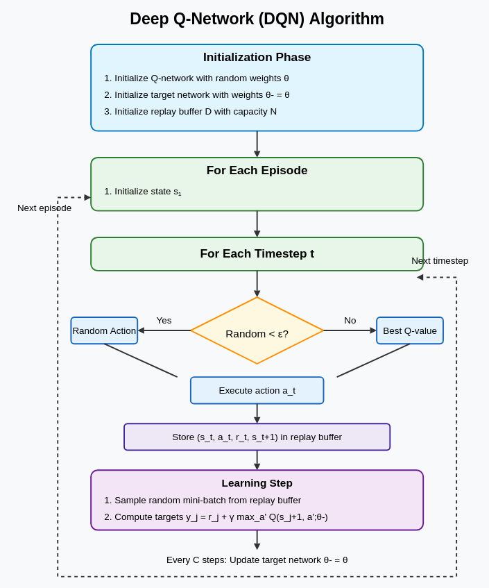

# Deep Q-Networks (DQN): Del Q-Learning Clásico al Reinforcement Learning Moderno

## Introducción

Reinforcement learning (RL) es un campo del machine learning donde un agente aprende a tomar decisiones interactuando con un entorno. El objetivo del agente es aprender una policy (una estrategia para elegir acciones) que maximice las recompensas acumulativas a lo largo del tiempo.

Los métodos tradicionales de RL como Q-learning funcionan bien para problemas simples con espacios de estados y acciones pequeños y discretos. Sin embargo, tienen dificultades con entornos complejos como videojuegos o tareas de robótica. **Deep Q-Networks (DQN)** representan un avance que combina el Q-learning clásico con redes neuronales profundas, permitiendo que el RL aborde problemas previamente intratables.

En su esencia, el algoritmo Q-learning aprende una función Q(s,a) que estima la recompensa futura esperada por tomar la acción a en el estado s. En el Q-learning tradicional, esta función se representa como una tabla con una entrada para cada par estado-acción. DQN reemplaza esta tabla con una red neuronal, permitiéndole generalizar a través de estados similares y manejar enormes espacios de estados como los que se encuentran en los videojuegos.

Este documento explica los conceptos fundamentales de DQN, enfocándose en las innovaciones clave que lo hacen funcionar y por qué son importantes. Haremos especial énfasis en el replay buffer - un mecanismo aparentemente simple pero poderoso que transforma cómo el agente aprende de sus experiencias.

## Prerrequisitos

Para entender DQN, deberías estar familiarizado con:
- Conceptos básicos de reinforcement learning (estados, acciones, recompensas, policies)
- El algoritmo Q-learning
- Fundamentos de redes neuronales

## La Evolución: Del Q-Learning al DQN

Exploremos cómo DQN transforma el Q-learning tradicional:

### 1. De Tablas a Aproximación de Funciones

| Aspecto              | Tabular Q-Learning               | Deep Q-Network (DQN)                               |
|----------------------|----------------------------------|----------------------------------------------------|
| **Q-representation** | Una tabla de búsqueda $Q[s,a]$   | Una función parametrizada $Q(s,a;\theta)$ mediante una red neuronal |
| **State/action space** | Debe ser discreto y pequeño    | Puede manejar estados de alta dimensionalidad o continuos (ej., píxeles crudos) y conjuntos grandes de acciones |

**Idea clave:** En lugar de almacenar un valor Q separado para cada posible par estado-acción (lo que se vuelve imposible a medida que crece el espacio de estados), DQN usa una red neuronal para aproximar la Q-function. La red toma un estado como entrada y produce valores Q estimados para todas las acciones posibles.

**Ejemplo:** En juegos de Atari, el estado a menudo se representa mediante los píxeles crudos en pantalla. Una tabla necesitaría almacenar un valor Q para cada posible disposición de píxeles combinada con cada posible acción—¡claramente imposible! DQN utiliza redes neuronales convolucionales para procesar estas imágenes y estimar valores Q.

### 2. De Actualizaciones Individuales a Gradient Descent por Mini-Batch

| Aspecto                  | Tabular Q-Learning                            | DQN                                               |
|-------------------------|-----------------------------------------------|---------------------------------------------------|
| **Update rule**         | $Q(s,a)\leftarrow Q(s,a)+\alpha[r+\gamma\max_{a'}Q(s',a')-Q(s,a)]$ | Minimizar $L(\theta)=[y - Q(s,a;\theta)]^2$ mediante SGD |
| **Sample usage**        | Una transición a la vez                       | Mini-batch aleatorio de transiciones              |
| **Correlation handling**| Muestras secuenciales, altamente correlacionadas | El muestreo aleatorio rompe las correlaciones   |

**Idea clave:** En lugar de actualizar una sola entrada estado-acción en una tabla, DQN trata el aprendizaje como un problema de regresión supervisada: predice los valores Q objetivo utilizando una red neuronal y actualiza los parámetros de la red mediante gradient descent.

**Ejemplo:** Al jugar un juego de carreras, los frames consecutivos son muy similares y las acciones están correlacionadas. Aprender de datos tan correlacionados puede hacer que la red neuronal sobreajuste a experiencias recientes. DQN aborda esto entrenando con lotes aleatorios de experiencias diversas.

### 3. De Objetivos Móviles a una "Target Network" Fija

| Aspecto                      | Tabular Q-Learning                                  | DQN                                                  |
|-----------------------------|-----------------------------------------------------|------------------------------------------------------|
| **Target computation**      | Usa la misma tabla $Q$ que se está actualizando    | Usa una target network separada $Q(·;\theta^-)$ mantenida fija durante muchos pasos |
| **Stability**               | Naturalmente estable con pequeñas actualizaciones locales | Requiere cuidado—los targets fijos previenen bucles de retroalimentación dañinos |

**Idea clave:** Cuando actualizamos nuestra Q-network, cambiamos tanto las predicciones como los objetivos hacia los que apuntamos. Esto crea un problema de "objetivo móvil" que puede desestabilizar el aprendizaje. DQN utiliza una "target network" separada que se mantiene fija durante muchos pasos, proporcionando objetivos estables.

**Ejemplo:** Imagina intentar escalar una montaña mientras la montaña misma sigue cambiando de forma. Al mantener fija la target network, DQN esencialmente toma una instantánea de la montaña, sube hacia esa instantánea durante un tiempo, luego toma una nueva instantánea y repite.

### 4. El Replay Buffer: Un Cambio de Juego para la Estabilidad y Eficiencia

El replay buffer es quizás la innovación más crucial de DQN. Entendamos cómo funciona y por qué es tan importante:

#### Cómo Funciona el Replay Buffer:

1. **Recolección y Almacenamiento**  
   - A medida que el agente juega o interactúa con su entorno, cada tupla de experiencia $(s_t,a_t,r_t,s_{t+1})$ se guarda en el replay buffer $\mathcal{D}$.
   - El buffer tiene una capacidad fija (típicamente 1 millón de transiciones); una vez lleno, las experiencias antiguas se descartan en un orden primero en entrar, primero en salir (FIFO).
   - Cada tupla representa una transición completa: el estado actual, la acción tomada, la recompensa recibida y el estado siguiente resultante.

2. **Proceso de Entrenamiento**  
   - En cada paso de entrenamiento, el algoritmo muestrea aleatoriamente un mini-batch (p. ej., 32 o 64 experiencias) del buffer.
   - Estas experiencias aleatorias se utilizan para calcular la pérdida y actualizar la Q-network mediante gradient descent.
   - La idea clave es que las transiciones se muestrean uniformemente al azar, independientemente de cuándo fueron experimentadas.

#### Por Qué el Replay Buffer es Esencial:

1. **Rompe Correlaciones Temporales**
   - **Problema:** En el juego secuencial, los estados consecutivos son muy similares y las acciones están correlacionadas. Las redes neuronales pueden tener dificultades con tales datos correlacionados, potencialmente reaccionando de forma exagerada a patrones recientes.
   - **Solución:** El muestreo aleatorio del buffer rompe estas correlaciones, proporcionando datos más independientes e idénticamente distribuidos (i.i.d.), que son más adecuados para el stochastic gradient descent.
   - **Análisis profundo:** Sin un replay buffer, la red podría obsesionarse con los estados de juego más recientes, olvidando escenarios raros importantes u oscilando entre diferentes estrategias.

2. **Eficiencia de Datos**
   - **Problema:** Recopilar experiencia mediante la interacción con el entorno puede ser costoso computacionalmente o llevar mucho tiempo.
   - **Solución:** Cada experiencia puede utilizarse múltiples veces para el aprendizaje, haciendo que DQN sea mucho más eficiente en cuanto a datos.
   - **Análisis profundo:** Una sola experiencia podría contribuir a cientos de actualizaciones de gradiente, extrayendo el máximo valor de aprendizaje de cada interacción con el entorno.

3. **Distribución de Aprendizaje Estable**
   - **Problema:** A medida que la policy del agente mejora, la distribución de estados que encuentra cambia (conocido como no-estacionariedad), potencialmente causando inestabilidad.
   - **Solución:** El buffer contiene una mezcla de experiencias de diferentes versiones de la policy, proporcionando una distribución de aprendizaje más estable.
   - **Análisis profundo:** Esto crea un efecto de "suavizado", previniendo oscilaciones salvajes en la policy aprendida y ayudando a la convergencia.

4. **Señales de Aprendizaje Diversas**
   - **Problema:** El agente podría quedarse estancado en una parte del entorno, recibiendo retroalimentación limitada.
   - **Solución:** El buffer retiene experiencias diversas de diferentes partes del entorno, asegurando una señal de aprendizaje más amplia.
   - **Análisis profundo:** Esta diversidad ayuda al agente a mantener una comprensión integral del entorno en lugar de especializarse solo en estados visitados recientemente.

#### Ejemplo Ilustrativo: Grid World con Replay Buffer

Ilustremos el concepto con un ejemplo simple de un mundo de cuadrícula 4×4:

```
+---+---+---+---+
| S |   |   |   |
+---+---+---+---+
|   | # |   |   |
+---+---+---+---+
|   |   |   |   |
+---+---+---+---+
|   |   |   | G |
+---+---+---+---+
```

S = Posición inicial, G = Meta (recompensa +10), # = Muro (no se puede mover aquí)
Acciones: Arriba, Abajo, Izquierda, Derecha (pequeña penalización de -0.1 por cada paso)

**Sin Replay Buffer:**
1. El agente toma la secuencia de acciones: [Derecha, Derecha, Abajo, Abajo, Abajo, Derecha] para alcanzar la meta
2. Inmediatamente actualiza sus valores Q usando solo esta secuencia
3. Como no ha explorado otros caminos, podría creer que este es óptimo
4. Si el agente encuentra posteriormente un atajo, podría tener dificultades para actualizar sus creencias

**Con Replay Buffer:**
1. Las tuplas de experiencia del agente se almacenan: [(S, Derecha, -0.1, S+1), (S+1, Derecha, -0.1, S+2), ...]
2. Al entrenar, muestrea aleatoriamente del buffer, lo que podría incluir:
   - Un camino reciente exitoso hacia la meta
   - Intentos anteriores fallidos que golpearon el muro
   - Exploraciones de diferentes esquinas de la cuadrícula
3. Esta experiencia diversa ayuda al agente a aprender una policy integral más rápidamente

**Visualizando el Efecto del Buffer:**
Imagina que después de muchos episodios, el buffer contiene 1000 transiciones. Al muestrear un mini-batch de 32:
- Alrededor de 20 podrían ser de posiciones "promedio" de la cuadrícula
- 5 podrían involucrar golpear el muro (importante para aprender de los errores)
- 5 podrían ser de alcanzar la meta (eventos críticamente importantes pero raros)
- 2 podrían ser de situaciones inusuales o caminos raros

Este enfoque de aprendizaje equilibrado es muy superior a simplemente aprender del episodio más reciente, que podría ser no representativo o incompleto.

El replay buffer esencialmente transforma el problema secuencial y no estacionario de reinforcement learning en algo más parecido al supervised learning en un conjunto de datos fijo, con el que las redes neuronales están bien equipadas para manejar.

**Analogía:** Imagina aprender a cocinar probando una receta una vez, y luego olvidando inmediatamente la experiencia y siguiendo adelante. Con un replay buffer, es como mantener un diario de todos tus intentos de cocina y revisar regularmente entradas aleatorias para extraer patrones sobre lo que funciona y lo que no. Podrías revisitar tanto tus éxitos como tus fracasos, aprendiendo diferentes lecciones de cada uno.

### 5. Poniendo Todo Junto: El Algoritmo DQN




Aquí está el algoritmo DQN básico en pasos simples:

1. **Inicializar**:
   - Crear Q-network $Q(s,a;\theta)$ con pesos aleatorios $\theta$
   - Crear target network $Q(s,a;\theta^-)$ con pesos $\theta^- = \theta$
   - Inicializar replay buffer $\mathcal{D}$ con capacidad N

2. **Para cada episodio**:
   - Inicializar estado $s_1$
   - Para cada paso de tiempo $t$:
     - Con probabilidad $\epsilon$, seleccionar una acción aleatoria $a_t$
     - De lo contrario, seleccionar $a_t = \arg\max_a Q(s_t,a;\theta)$
     - Ejecutar acción $a_t$, observar recompensa $r_t$ y siguiente estado $s_{t+1}$
     - Almacenar transición $(s_t, a_t, r_t, s_{t+1})$ en $\mathcal{D}$
     
     - Muestrear mini-batch aleatorio de transiciones $(s_j, a_j, r_j, s_{j+1})$ de $\mathcal{D}$
     - Establecer objetivo $y_j = r_j + \gamma \max_{a'} Q(s_{j+1}, a';\theta^-)$
     - Actualizar $\theta$ minimizando $(y_j - Q(s_j, a_j;\theta))^2$
     
     - Cada C pasos, actualizar $\theta^- = \theta$

### 6. Consideraciones Prácticas y Mejoras

1. **Preprocesamiento**:
   - Para entornos basados en imágenes, convertir a escala de grises y redimensionar imágenes
   - Apilar varios frames consecutivos como entrada para capturar movimiento
   - Normalizar valores de entrada (típicamente al rango [0,1])

2. **Estrategias de Exploración**:
   - Comenzar con un $\epsilon$ alto (p. ej., 1.0) y disminuirlo gradualmente
   - Implementar estrategias de exploración más sofisticadas como noisy networks o parameter space noise

3. **Extensiones Comunes**:
   - **Double DQN**: Reduce el sesgo de sobreestimación desacoplando la selección y evaluación de acciones
   - **Prioritized Experience Replay**: Muestrea transiciones más importantes con mayor frecuencia
   - **Dueling DQN**: Separa la estimación del valor del estado y la ventaja
   - **Rainbow**: Combina múltiples mejoras de DQN para un rendimiento de vanguardia

## Visualizando DQN

A continuación se muestra una visualización simplificada de la arquitectura DQN:

```
Environment
    ↓ (state) ↑ (action)
Agent
    ↓ (state) ↑ (Q-values)
+----------------+
| CNN layers     |   ← Procesa estado (p. ej., pantalla de juego)
+----------------+
| Fully connected|   ← Extrae características
+----------------+
| Output layer   |   ← Estima el Q-value para cada acción
+----------------+
        ↓
Experience Replay Buffer  ← Almacena (state, action, reward, next_state)
        ↓           ↑    
    Random sampling
        ↓
+----------------+
| Target Network |   ← Proporciona objetivos estables para el aprendizaje
+----------------+
```

## Ejemplo de Aplicación: Juegos de Atari

En su artículo revolucionario, DeepMind demostró que DQN aprendía a jugar juegos de Atari a partir de píxeles crudos. Esto es lo que sucede:

1. La entrada son 4 pantallas de juego consecutivas (84×84 píxeles, escala de grises)
2. Una red neuronal convolucional procesa estas imágenes
3. La red produce Q-values para cada acción posible (p. ej., mover izquierda, derecha, disparar)
4. El agente elige la acción con el Q-value más alto (con algo de exploración)
5. Las experiencias se almacenan en el replay buffer y se utilizan para el aprendizaje

**Análisis Profundo:** Para un juego como Breakout, el agente DQN inicialmente mueve la pala aleatoriamente. Con el tiempo, aprende a conectar los movimientos de la pala con la trayectoria de la pelota y las colisiones con los ladrillos. El replay buffer ayuda inmensamente aquí - eventos raros pero cruciales (como golpear el último ladrillo o perder una pelota) pueden ser reproducidos muchas veces, aunque ocurran con poca frecuencia durante el juego real.

DQN logró un rendimiento a nivel humano en muchos juegos sin ningún conocimiento específico del juego—demostrando el poder del deep reinforcement learning. Por ejemplo, en Breakout, el agente incluso descubrió una estrategia avanzada de perforar un túnel a través de un lado de la pared de ladrillos para que la pelota pasara por detrás - una técnica utilizada por expertos humanos pero nunca programada explícitamente en el sistema.

## Desafíos Comunes y Soluciones

| Desafío | Descripción | Solución |
|-----------|-------------|----------|
| **Instability** | Las redes neuronales pueden divergir durante el entrenamiento | Target network + replay buffer + gradient clipping |
| **Sample inefficiency** | Necesita millones de frames para aprender | Replay buffer + prioritization + métodos basados en modelos |
| **Exploration** | Quedarse atrapado en comportamientos subóptimos | Epsilon-greedy + motivación intrínseca + curiosidad |
| **Catastrophic forgetting** | Olvidar cómo manejar situaciones raras | Diversidad del replay buffer + distillation |
| **Hyperparameter sensitivity** | El rendimiento varía con los hiperparámetros | Implementaciones estandarizadas + ajuste automático |

## Conclusión

Deep Q-Networks representan un enfoque transformador para el reinforcement learning, combinando la simplicidad del Q-learning con el poder de las redes neuronales profundas. Al introducir innovaciones como el experience replay y las target networks, DQN supera muchos de los desafíos que previamente limitaban el RL a dominios simples.

A medida que continúas tu viaje en el reinforcement learning, recuerda que DQN es solo el comienzo. Enfoques modernos como Proximal Policy Optimization (PPO), Soft Actor-Critic (SAC) y modelos basados en transformers están empujando las fronteras aún más lejos.

## Lecturas Adicionales y Recursos

1. El artículo original de DQN: "Human-level control through deep reinforcement learning" (Mnih et al., 2015)
2. "Playing Atari with Deep Reinforcement Learning" (Mnih et al., 2013)
3. "Deep Reinforcement Learning with Double Q-learning" (van Hasselt et al., 2015)
4. "Prioritized Experience Replay" (Schaul et al., 2015)
5. "Rainbow: Combining Improvements in Deep Reinforcement Learning" (Hessel et al., 2017)

## Ejercicios Prácticos

1. **Implementar un DQN simple** para el entorno CartPole usando un framework como TensorFlow o PyTorch.
2. **Experimentar con diferentes tamaños de replay buffer** y observar cómo afectan al aprendizaje.
3. **Comparar DQN con y sin target network** para entender su efecto estabilizador.
4. **Visualizar los Q-values** aprendidos por tu red durante el entrenamiento.
5. **Implementar una extensión de DQN** (p. ej., Double DQN o Prioritized Experience Replay) y comparar su rendimiento con el DQN básico.
