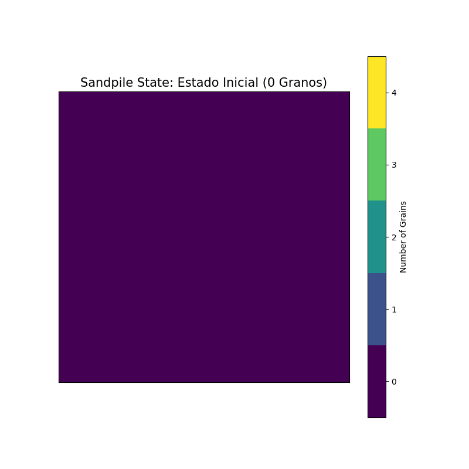
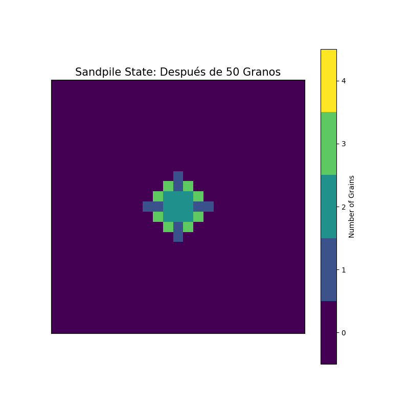
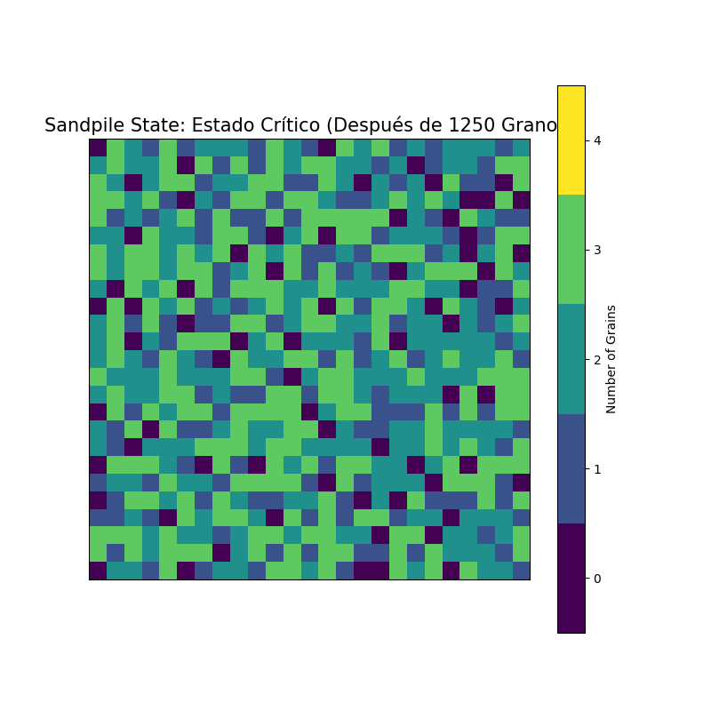
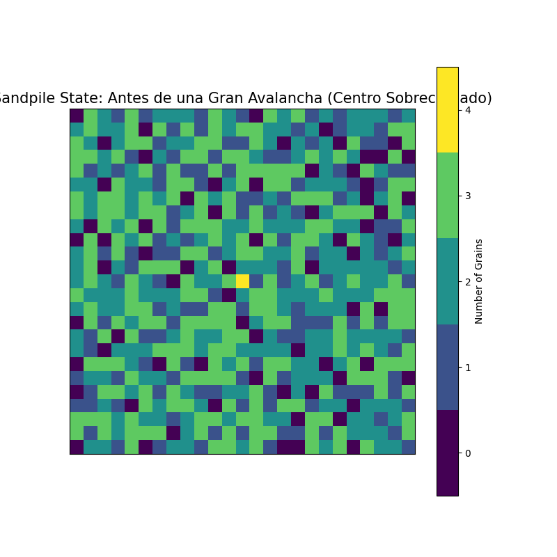
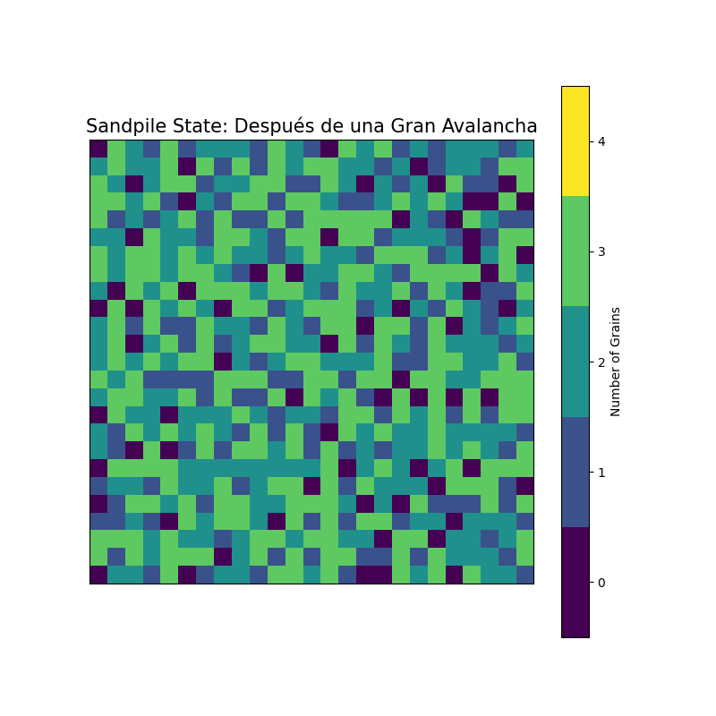

# El Modelo de Sandpile: Explorando la Criticalidad Auto-Organizada

Este informe explora el modelo de sandpile, un ejemplo paradigmático de un sistema que exhibe **criticalidad auto-organizada (SOC)**. Estos sistemas evolucionan espontáneamente hacia un estado crítico, donde pequeñas perturbaciones pueden desencadenar eventos de todos los tamaños, conocidos como "avalanchas". El modelo de sandpile, aunque simple, captura la esencia de muchos fenómenos naturales complejos, desde terremotos y deslizamientos de tierra hasta la dinámica de los mercados financieros y las extinciones biológicas.

## El Modelo de Bak-Tang-Wiesenfeld (BTW)

El modelo de sandpile más estudiado fue propuesto por Per Bak, Chao Tang y Kurt Wiesenfeld en 1987. Se define sobre una rejilla (grid) bidimensional, donde cada celda puede acumular "granos de arena". Las reglas son las siguientes:

1.  **Rejilla:** Un sistema de celdas, por ejemplo, una matriz de $N \times M$ celdas.
2.  **Adición de Arena:** Se añaden granos de arena uno por uno a celdas seleccionadas aleatoriamente o a una celda específica (como el centro).
3.  **Umbral de Estabilidad ($K$):** Cada celda tiene una altura $z_i$ (número de granos). Si la altura de una celda alcanza o supera un umbral crítico $K$ (típicamente $K=4$ para una rejilla 2D con 4 vecinos cardinales), la celda se vuelve inestable.
4.  **Desmoronamiento (Toppling):** Una celda inestable ($z_i \ge K$) se desmorona: distribuye $K$ de sus granos, pasando un grano a cada uno de sus vecinos directos (norte, sur, este, oeste). Su propia altura disminuye en $K$. En nuestro modelo, $z_i \leftarrow z_i - 4$.
5.  **Límites Abiertos:** Los granos que caen fuera de los bordes de la rejilla se pierden del sistema.
6.  **Avalanchas:** Un solo desmoronamiento puede hacer que las celdas vecinas se vuelvan inestables, provocando una cascada de desmoronamientos. Esta secuencia de eventos se conoce como una avalancha. La avalancha continúa hasta que todas las celdas de la rejilla vuelvan a ser estables ($z_i < K$ para todas las $i$).

A medida que se añaden granos al sistema, este evoluciona espontáneamente hacia un **estado crítico**. En este estado, la rejilla está llena de estructuras complejas y fractales, y la adición de un solo grano más tiene una probabilidad no despreciable de causar una avalancha de cualquier tamaño, desde muy pequeña hasta afectar a todo el sistema. Es esta falta de una escala característica para las avalanchas lo que define la criticalidad auto-organizada.

## Visualizando la Dinámica del Sandpile

Las siguientes visualizaciones, generadas por nuestro script `sandpile_model.py`, nos ayudarán a entender cómo evoluciona el sistema.

### 1. Estado Inicial

Comenzamos con una rejilla vacía, donde todas las celdas tienen cero granos.

### 2. Después de Pocos Granos

Tras añadir una pequeña cantidad de granos (por ejemplo, 50) al centro, vemos cómo se acumulan localmente. En esta etapa, es poco probable que se produzcan grandes avalanchas, ya que la mayoría de las celdas están muy por debajo del umbral de estabilidad.

### 3. Hacia un Estado Crítico

Después de añadir una gran cantidad de granos (en este caso, se añadieron granos aleatoriamente hasta llenar significativamente la rejilla), el sistema se aproxima a su estado crítico. Observamos la formación de estructuras complejas y patrones recurrentes. En este estado, la adición de un solo grano más puede, con cierta probabilidad, desencadenar avalanchas de diversos tamaños.

### 4. Observando una Avalancha

Para ilustrar una avalancha, primero llevamos el sistema a un estado cercano al crítico o ya crítico. Luego, sobrecargamos deliberadamente una celda (por ejemplo, el centro) para inducir una inestabilidad significativa.

**Antes de la avalancha (centro sobrecargado):**

**Después de que la avalancha se ha propagado y el sistema se ha estabilizado:**

La diferencia entre estas dos imágenes muestra el alcance de la avalancha. El sistema ha redistribuido una cantidad significativa de arena, y la configuración final puede ser muy diferente de la inmediatamente anterior a la gran perturbación.

## Conclusión (Preliminar)

El modelo de sandpile, a pesar de sus reglas simples, demuestra cómo sistemas complejos pueden auto-organizarse en un estado crítico sin necesidad de ajustar finamente ningún parámetro externo. Este estado se caracteriza por una susceptibilidad a perturbaciones que pueden generar respuestas (avalanchas) en todas las escalas. Las visualizaciones generadas nos dan una idea intuitiva de esta dinámica y de la emergencia de patrones complejos a partir de interacciones locales.

Exploraciones futuras podrían incluir el análisis estadístico de los tamaños y duraciones de las avalanchas para verificar la presencia de distribuciones de ley de potencias, una firma matemática de la criticalidad auto-organizada.
