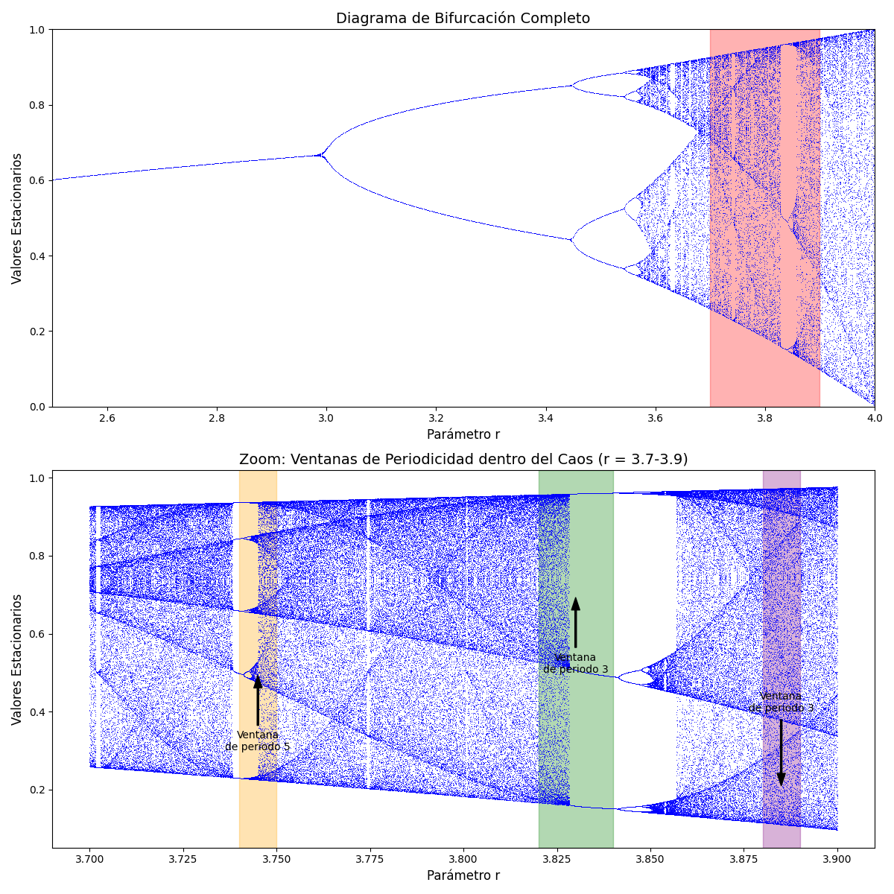
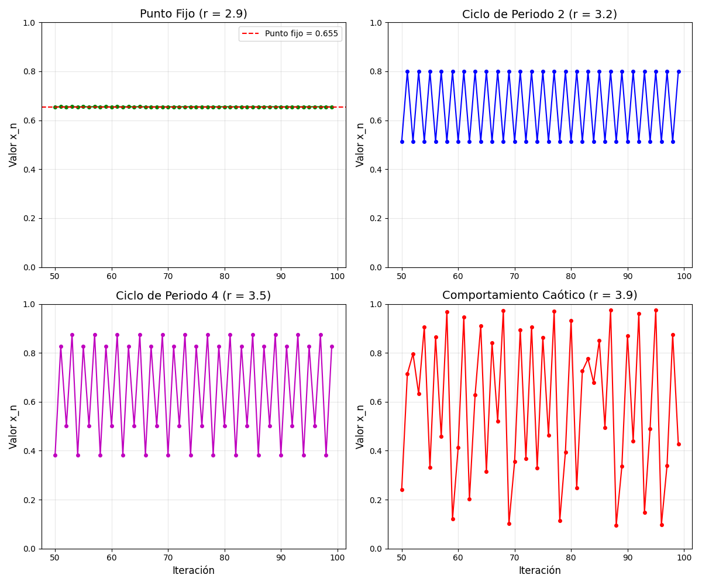
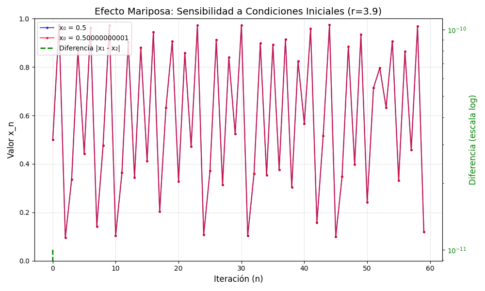

# La Ecuación Logística: Puerta de Entrada al Caos Determinista

## 11. La Ecuación Logística como Caso Paradigmático

Habiendo explorado los fundamentos conceptuales de los sistemas complejos, nos adentramos ahora en uno de los ejemplos más reveladores y accesibles de la teoría del caos: la ecuación logística. Este modelo simple pero profundo nos servirá como puente concreto entre los principios teóricos y su manifestación matemática.

### 11.1 Origen y Significado Biológico

La ecuación logística fue propuesta inicialmente por Pierre François Verhulst en 1838 como un modelo para describir la dinámica de poblaciones. Frente a las limitaciones del modelo de crecimiento exponencial de Malthus (que predecía un crecimiento ilimitado), Verhulst introdujo un término correctivo que representaba las restricciones impuestas por recursos limitados:

$\frac{dx}{dt} = rx(1-x)$

Donde:
- $x$ representa la población como fracción de la capacidad máxima del ecosistema (entre 0 y 1)
- $r$ es la tasa de crecimiento intrínseca de la población

En esta formulación continua, la ecuación describe un crecimiento poblacional que se frena a medida que se acerca a la capacidad de carga del ecosistema. Sin embargo, es su versión discreta (en tiempo discreto) la que revela comportamientos sorprendentemente complejos:

$x_{n+1} = rx_n(1-x_n)$

Esta ecuación, engañosamente simple, representa el mapa logístico: una función que determina la población en la siguiente generación ($x_{n+1}$) a partir de la población actual ($x_n$).

#### Profundizando en el Modelo Poblacional: El Caso de los Conejos

Para entender mejor el significado de $x_n$ y $r$, imaginemos que estamos modelando una población de conejos en una isla con recursos limitados. 

- **$x_n$ (Población Normalizada):** Representa la población de conejos en la generación $n$, pero no en número absoluto, sino como una fracción de la máxima población que la isla puede sostener (su *capacidad de carga*). Así, $x_n=0$ significa que no hay conejos, $x_n=1$ significa que la población ha alcanzado el máximo sostenible, y $x_n=0.5$ indica que la población está a la mitad de su capacidad de carga.

- **$r$ (Tasa de Crecimiento y Fertilidad):** Este parámetro es crucial y encapsula la tasa reproductiva neta de los conejos. Un valor de $r$ más alto implica que los conejos son más fértiles o tienen una mayor tasa de supervivencia. 
  - Si $r$ es muy bajo (entre 0 y 1), la población no es sostenible y se extinguirá ($x_n \to 0$). Por ejemplo, si $r=0.5$, cada conejo en promedio no logra reemplazarse a sí mismo antes de morir.
  - Si $r$ está entre 1 y 3, la población tiende a estabilizarse en un valor de equilibrio. Por ejemplo, con $r=2$, la población podría estabilizarse al 50% de la capacidad de carga ($x^* = (2-1)/2 = 0.5$).
  - Es cuando $r$ supera el valor de 3 que comenzamos a ver comportamientos más complejos: la población ya no se estabiliza, sino que empieza a oscilar, y eventualmente, para valores de $r$ aún mayores (cercanos a 4), estas oscilaciones se vuelven caóticas, haciendo imposible predecir la población a largo plazo a pesar de la simplicidad de la ecuación.

El término $(1-x_n)$ es el factor de *limitación ambiental*. A medida que la población $x_n$ se acerca a la capacidad máxima (1), $(1-x_n)$ se acerca a 0, frenando el crecimiento.

### 11.2 Descifrando la Ecuación

Para comprender intuitivamente la ecuación, podemos descomponerla:

1. El término $rx_n$ representa el crecimiento: cuanto mayor es la población actual, mayor será su incremento.
2. El término $(1-x_n)$ representa la restricción por recursos limitados: cuanto más cerca está la población de su capacidad máxima (1), menor es la tasa de crecimiento.
3. El parámetro $r$ controla la intensidad de la dinámica: valores bajos generan comportamiento estable, mientras que valores altos producen dinámicas cada vez más complejas.

Es importante notar que aunque esta ecuación fue desarrollada para modelar poblaciones biológicas, su relevancia trasciende ese dominio específico. El mapa logístico ha emergido como un modelo arquetípico para estudiar sistemas dinámicos no lineales en campos tan diversos como la economía, la epidemiología, la química y la física.

## 12. Análisis Matemático del Mapa Logístico

### Comprendiendo los Puntos Fijos

Antes de adentrarnos en la complejidad, es fundamental entender los **puntos fijos** del sistema. Un punto fijo, $x^*$, es un valor de la población que, una vez alcanzado, permanece constante en las siguientes generaciones. Es decir, si $x_n = x^*$, entonces $x_{n+1} = x^*$. Matemáticamente, satisfacen la ecuación $x^* = rx^*(1-x^*)$.

Los puntos fijos son cruciales porque representan los **estados de equilibrio** del sistema. Indican hacia dónde podría tender la población a largo plazo bajo ciertas condiciones. Analizar su existencia y estabilidad (si una pequeña perturbación aleja al sistema del punto fijo, ¿regresa a él o se aleja más?) es el primer paso para caracterizar la dinámica del mapa logístico.

### 12.1 Puntos Fijos y su Estabilidad

Un punto fijo es un valor $x^*$ tal que $x_{n+1} = x_n = x^*$, es decir, un estado en el que el sistema permanece invariante. Para el mapa logístico, estos puntos fijos satisfacen:

$x^* = rx^*(1-x^*)$

Resolviendo esta ecuación, obtenemos dos puntos fijos:
- $x^* = 0$: Extinción (población cero)
- $x^* = \frac{r-1}{r}$: Equilibrio no trivial (para $r > 1$)

La estabilidad de estos puntos fijos depende del valor absoluto de la derivada del mapa evaluada en el punto fijo:

$|f'(x^*)| = |r(1-2x^*)|$

- Si $|f'(x^*)| < 1$, el punto fijo es estable (atractor)
- Si $|f'(x^*)| > 1$, el punto fijo es inestable (repulsor)

Para el punto fijo $x^* = 0$:
- $|f'(0)| = |r|$
- Estable si $r < 1$, inestable si $r > 1$

Para el punto fijo $x^* = \frac{r-1}{r}$:
- $|f'(\frac{r-1}{r})| = |2-r|$
- Estable si $1 < r < 3$, inestable si $r > 3$

### 12.2 Bifurcaciones y Duplicación de Periodo

Cuando $r > 3$, el punto fijo se vuelve inestable, pero el sistema no se comporta caóticamente de inmediato. En cambio, experimenta una serie de bifurcaciones de duplicación de periodo:

- Para $3 < r < 3.45$ (aproximadamente), el sistema oscila entre dos valores (ciclo de periodo 2)
- Para $3.45 < r < 3.54$ (aproximadamente), el sistema oscila entre cuatro valores (ciclo de periodo 4)
- Este proceso continúa, con ciclos de periodo 8, 16, 32, etc.

El fenómeno más notable es que estas bifurcaciones ocurren a un ritmo que sigue una ley universal: la constante de Feigenbaum (aproximadamente 4.669). Si definimos $r_n$ como el valor de $r$ donde ocurre la bifurcación al ciclo de periodo $2^n$, entonces:

$\lim_{n \to \infty} \frac{r_n - r_{n-1}}{r_{n+1} - r_n} \approx 4.669...$

Esta constante aparece no solo en el mapa logístico, sino en una amplia clase de sistemas dinámicos, revelando un principio universal en la transición al caos.

#### Visualización de las Bifurcaciones: El Diagrama de Bifurcación

El diagrama de bifurcación es una herramienta visual poderosa que ilustra cómo cambia el comportamiento a largo plazo de la población ($x_n$) a medida que varía el parámetro de crecimiento $r$. Cada valor de $r$ en el eje horizontal tiene asociados en el eje vertical los valores de $x_n$ a los que el sistema tiende tras un período transitorio.

Este diagrama revela claramente la "ruta hacia el caos":
- Para $1 < r < 3$, la población se estabiliza en un único valor (un punto fijo estable).
- En $r=3$, este punto fijo pierde estabilidad y da lugar a un ciclo de período 2: la población comienza a oscilar entre dos valores.
- A medida que $r$ aumenta, este ciclo de período 2 se bifurca en un ciclo de período 4, luego 8, y así sucesivamente, en una cascada de duplicaciones de período. Esta secuencia es universal para muchos sistemas que transitan al caos y está relacionada con las constantes de Feigenbaum.
- Para $r \gtrsim 3.57$, el sistema entra en un régimen mayoritariamente caótico, donde la población ya no sigue un patrón periódico simple y los valores de $x_n$ pueden llenar densas regiones del espacio de estados.

#### Un Vistazo Más Cercano: Ventanas de Periodicidad en el Caos

Dentro del aparente desorden del régimen caótico, existen "ventanas de periodicidad" – regiones estrechas de $r$ donde el sistema retorna sorpresivamente a un comportamiento periódico (por ejemplo, ciclos de período 3, 5, etc.). Estas ventanas también experimentan sus propias cascadas de bifurcaciones hacia el caos.

La imagen superior magnifica una porción del diagrama de bifurcación en la zona caótica, revelando estas islas de orden. La más prominente es la ventana de período 3 alrededor de $r \approx 3.83$. Esto subraya la compleja estructura fractal subyacente al comportamiento caótico.
### 12.3 Régimen Caótico y Ventanas de Periodicidad

Para valores de $r$ superiores a aproximadamente 3.57, el sistema entra en un régimen mayoritariamente caótico, donde:

1. Las trayectorias exhiben sensibilidad extrema a las condiciones iniciales
2. El comportamiento aparenta ser aleatorio a pesar de ser completamente determinista
3. Las órbitas llenan densamente ciertos intervalos del espacio de estados

Sin embargo, incluso dentro del régimen caótico existen "islas de estabilidad" o "ventanas de periodicidad". Por ejemplo, cerca de $r \approx 3.83$, el sistema retorna súbitamente a un comportamiento de ciclo de periodo 3, que luego experimenta su propia cascada de bifurcaciones hacia el caos.

La existencia de estas ventanas periódicas dentro del caos ilustra la compleja estructura entrelazada de orden y desorden que caracteriza a los sistemas caóticos.

## 13. Visualizaciones Clave para Comprender el Caos Logístico

Para capturar las dinámicas fascinantes de la ecuación logística, utilizaremos varias representaciones gráficas complementarias:

### 13.1 El Diagrama de Bifurcación
### 13.2 Series Temporales y sus Patrones

Las series temporales (gráficos de $x_n$ versus $n$) proporcionan una perspectiva complementaria, mostrando la evolución del sistema en el tiempo para valores fijos de $r$:

- Para $r < 3$: Convergencia monotónica o oscilatoria hacia un valor fijo
- Para $3 < r < 3.45$: Oscilación estable entre dos valores
- Para $3.45 < r < 3.57$: Oscilaciones de periodo $2^n$
- Para $r > 3.57$: Patrones aparentemente erráticos sin periodicidad visible (excepto en las ventanas periódicas)

Estas series temporales son particularmente útiles para observar la aparición de comportamientos complejos a partir de reglas simples, ilustrando el principio de emergencia.

#### Evolución Temporal: Series de Tiempo para Diferentes Regímenes

Las series temporales nos permiten observar directamente cómo evoluciona la población $x_n$ a lo largo de las generaciones $n$ para valores específicos de $r$. La siguiente gráfica muestra ejemplos de los distintos comportamientos dinámicos:

Interpretación de las series:
- **Punto Fijo Estable (e.g., $r=2.9$):** La población converge a un valor constante.
- **Ciclo de Período 2 (e.g., $r=3.2$):** La población oscila entre dos valores.
- **Ciclo de Período 4 (e.g., $r=3.5$):** La oscilación se repite cada cuatro generaciones.
- **Comportamiento Caótico (e.g., $r=3.9$):** La población fluctúa de manera irregular y no periódica, exhibiendo la impredictibilidad característica del caos.
### 13.3 El Diagrama de Telaraña

El diagrama de telaraña proporciona una visualización intuitiva del proceso iterativo que genera la serie temporal:

1. Se grafica la función $f(x) = rx(1-x)$ junto con la línea diagonal $y = x$
2. Partiendo de un valor inicial $x_0$, se traza una línea vertical hasta la curva para encontrar $x_1 = f(x_0)$
3. Luego se traza una línea horizontal hasta la diagonal para representar este valor como entrada para la siguiente iteración
4. Se repite el proceso, generando un patrón que revela la dinámica del sistema

Este método gráfico permite observar visualmente cómo evolucionan las iteraciones y cómo se comportan cerca de los puntos fijos, facilitando la comprensión de la estabilidad y las bifurcaciones.

### 13.4 Visualización de la Sensibilidad a Condiciones Iniciales

Para ilustrar la esencia del caos determinista, representaremos la evolución de dos trayectorias inicialmente muy cercanas:

- Dos valores iniciales separados por una diferencia minúscula (por ejemplo, $10^{-10}$)
- Seguimiento de ambas trayectorias a lo largo del tiempo
- Gráfico de la diferencia entre trayectorias en escala logarítmica

Esta visualización demuestra dramáticamente el "efecto mariposa": en el régimen caótico, la distancia entre trayectorias inicialmente casi idénticas crece exponencialmente, mientras que en regímenes regulares las trayectorias permanecen cercanas o convergen.

#### El Efecto Mariposa: Sensibilidad Extrema a las Condiciones Iniciales

Una característica definitoria del caos determinista es la sensibilidad extrema a las condiciones iniciales, popularmente conocida como el "efecto mariposa". Esto significa que dos trayectorias que comienzan con valores iniciales de población ($x_0$) infinitesimalmente cercanos divergirán exponencialmente con el tiempo si el sistema está en un régimen caótico.

En la gráfica, dos poblaciones iniciales, $x_0$ (azul) y $x_0'$ (rojo), difieren en una cantidad minúscula. Inicialmente, sus trayectorias son casi indistinguibles. Sin embargo, después de unas pocas generaciones, las trayectorias divergen drásticamente. La línea verde (en escala logarítmica en el eje Y derecho) muestra cómo la diferencia absoluta entre las dos poblaciones crece exponencialmente, haciendo imposible la predicción a largo plazo a pesar de conocer perfectamente la ecuación que las rige.
## 14. Conexiones con Conceptos Fundamentales de Sistemas Complejos

La ecuación logística, a pesar de su simplicidad formal, encapsula muchos de los conceptos fundamentales discutidos previamente:

### 14.1 No Linealidad y sus Consecuencias

La no linealidad, representada por el término cuadrático $(1-x_n)$, es la fuente de toda la complejidad en este sistema. Sin este término, la ecuación sería lineal ($x_{n+1} = rx_n$) y exhibiría solo comportamiento trivial (crecimiento o decrecimiento exponencial).

Esta observación ilustra un principio general: la no linealidad es condición necesaria (aunque no suficiente) para la emergencia de comportamientos complejos y caóticos.

### 14.2 Determinismo vs. Predictibilidad

El mapa logístico es completamente determinista: dada una condición inicial $x_0$ y un parámetro $r$, la evolución futura está unívocamente determinada. Sin embargo, en el régimen caótico, esta determinación teórica no se traduce en predictibilidad práctica.

Esta distinción ejemplifica la brecha entre determinismo ontológico (el sistema está determinado) y determinismo epistemológico (nuestra capacidad para conocer o predecir), un tema central en la filosofía de la ciencia.

### 14.3 El Borde del Caos

La región cercana a $r \approx 3.57$, donde el sistema transita del comportamiento regular al caótico, ejemplifica el concepto del "borde del caos". En esta región, el sistema exhibe propiedades particularmente interesantes:

- Alta sensibilidad a perturbaciones, pero no completamente impredecible
- Capacidad para transmitir y procesar información de manera óptima
- Balance entre estabilidad y adaptabilidad

Estas propiedades han llevado a algunos investigadores a sugerir que los sistemas complejos adaptativos, como la vida o la cognición, tienden naturalmente a operar cerca de este borde.

### 14.4 Universalidad y Patrones Compartidos

La constante de Feigenbaum (4.669...) representa un ejemplo notable de universalidad: sistemas dinámicos aparentemente distintos exhiben exactamente el mismo patrón cuantitativo en su ruta al caos. Esta universalidad sugiere que, bajo ciertas condiciones, los detalles específicos de un sistema son menos importantes que su estructura cualitativa.

Este fenómeno resalta la posibilidad de identificar principios generales que transciendan dominios específicos, un objetivo central del estudio de los sistemas complejos.

## 15. La Ecuación Logística como Puente Conceptual

El estudio del mapa logístico ofrece múltiples puentes conceptuales:

### 15.1 De lo Simple a lo Complejo

La ecuación logística ejemplifica cómo reglas extremadamente simples pueden generar comportamientos arbitrariamente complejos, una lección central en el estudio de sistemas complejos. Esta transición no es gradual sino que ocurre a través de bifurcaciones bien definidas, sugiriendo un paisaje de complejidad estructurado por puntos críticos.

### 15.2 De lo Cuantitativo a lo Cualitativo

Aunque el mapa logístico se define mediante una ecuación cuantitativa precisa, su comportamiento revela transiciones cualitativas distintivas. Pequeños cambios cuantitativos en el parámetro $r$ pueden provocar reorganizaciones cualitativas drásticas en el comportamiento del sistema, como la transición de un punto fijo a un ciclo o al caos.

### 15.3 De lo Particular a lo Universal

A pesar de su origen específico como modelo de dinámica poblacional, el mapa logístico ha emergido como una herramienta conceptual universal para entender fenómenos dinámicos en diversos campos. Los patrones que exhibe -bifurcaciones, duplicación de periodo, caos, ventanas de periodicidad- aparecen en sistemas tan diversos como circuitos electrónicos, reacciones químicas, la dinámica de fluidos y mercados financieros.

## 16. Implementación Computacional y Exploración Experimental

Para explorar efectivamente la riqueza del mapa logístico, utilizaremos implementaciones computacionales que nos permitirán visualizar y experimentar con las dinámicas descritas anteriormente.

### 16.1 Construcción del Diagrama de Bifurcación

El diagrama de bifurcación se construye mediante el siguiente algoritmo:

1. Para cada valor de $r$ en un rango definido (típicamente entre 2.5 y 4.0):
   - Inicializar el sistema con una condición inicial arbitraria $x_0$
   - Iterar el mapa logístico un número suficiente de veces para superar el transitorio inicial
   - Registrar los valores subsiguientes, que representan el comportamiento asintótico del sistema
   - Graficar estos valores en el eje vertical contra el valor de $r$ en el horizontal

2. Parámetros clave para una visualización efectiva:
   - Densidad suficiente de valores de $r$ (típicamente más de 500 puntos)
   - Tiempo transitorio adecuado (al menos 100 iteraciones)
   - Registro suficiente de valores post-transitorio (al menos 50-100 puntos por valor de $r$)

### 16.2 Exploración Interactiva con Parámetros Ajustables

Para facilitar la comprensión intuitiva, implementaremos controles interactivos que permitan:

- Ajustar el rango de $r$ para enfocar regiones específicas del diagrama de bifurcación
- Ampliar zonas de interés, como la primera bifurcación (cerca de $r = 3$)
- Examinar ventanas de periodicidad dentro del caos (como la región cerca de $r = 3.83$)
- Comparar trayectorias con diferentes condiciones iniciales para un mismo valor de $r$

### 16.3 Visualización de Regímenes Específicos

Para cada régimen dinámico característico, presentaremos visualizaciones específicas:

- **Régimen de punto fijo** ($1 < r < 3$):
  - Convergencia de diferentes condiciones iniciales al mismo punto fijo
  - Tasa de convergencia como función de $r$

- **Régimen de ciclos** ($3 < r < 3.57$):
  - Ciclos de periodo 2, 4, 8...
  - Diagrama de telaraña mostrando la estructura del atractor

- **Régimen caótico** ($r > 3.57$):
  - Sensibilidad a condiciones iniciales (efecto mariposa)
  - Ventanas de periodicidad dentro del caos
  - Estructura fractal del atractor

### 16.4 Cuantificación del Caos: El Exponente de Lyapunov

Para caracterizar cuantitativamente la presencia y la intensidad del caos, calcularemos el exponente de Lyapunov, que mide la tasa de divergencia exponencial de órbitas inicialmente cercanas:

$\lambda = \lim_{n \to \infty} \frac{1}{n} \sum_{i=0}^{n-1} \ln|f'(x_i)|$

Donde:
- $\lambda > 0$ indica comportamiento caótico
- $\lambda < 0$ indica comportamiento regular (punto fijo o ciclo)
- $\lambda = 0$ ocurre en los puntos de bifurcación

El gráfico del exponente de Lyapunov versus $r$ proporciona una medida objetiva de la transición entre comportamiento regular y caótico, complementando las visualizaciones cualitativas.

## 17. Conclusión: La Ecuación Logística como Microcosmos de Complejidad

La ecuación logística, a pesar de su apariencia modesta, nos ofrece un microcosmos de los fenómenos centrales de los sistemas complejos. Al igual que un holograma, donde cada fragmento contiene información sobre la totalidad de la imagen, este sistema simple captura esencias fundamentales de la complejidad:

1. **Emergencia**: La aparición de patrones complejos y comportamiento caótico a partir de una regla matemática extremadamente simple
2. **No linealidad**: La amplificación de pequeñas perturbaciones que genera efectos desproporcionados
3. **Determinismo y caos**: La compatibilidad entre reglas deterministas y comportamiento prácticamente impredecible
4. **Universalidad**: La presencia de patrones cuantitativos (como la constante de Feigenbaum) que trascienden sistemas específicos
5. **Auto-organización**: La aparición espontánea de estructura compleja sin coordinación externa

Como señaló el matemático James Yorke, uno de los pioneros en la teoría del caos: "La ecuación logística es para el caos lo que el péndulo es para la física clásica: el ejemplo más simple que captura la esencia del fenómeno."

Nuestro estudio de la ecuación logística no es meramente un ejercicio matemático, sino una ventana hacia un paradigma científico más amplio que reconoce la importancia de la complejidad, la emergencia y los límites fundamentales de la predicción. Al igual que un microscopio revela un universo de complejidad en una gota de agua, esta ecuación simple nos revela la riqueza sorprendente que puede surgir incluso de los sistemas matemáticos más elementales.

---

*"La simplicidad es prerrequisito para la confiabilidad. Los sistemas complejos son, por definición, más sujetos a vulnerabilidades ocultas... La ecuación logística nos recuerda que incluso lo simple puede comportarse de maneras complejas."* — Alan Turing