# Autómatas Celulares: Introducción

## 1. Introducción Histórica y Conceptual

Los autómatas celulares son sistemas matemáticos discretos que han fascinado a científicos y matemáticos desde su concepción. Su historia se remonta a los trabajos pioneros de John von Neumann en la década de 1940, quien los concibió como un modelo para estudiar la auto-replicación en sistemas biológicos.

### 1.1 Orígenes y Desarrollo

- **John von Neumann (1940s)**: Propuso el primer autómata celular como un modelo de auto-replicación.
- **John Conway (1970)**: Desarrolló el famoso "Juego de la Vida", demostrando que reglas simples pueden generar comportamientos complejos.
- **Stephen Wolfram (1980s)**: Clasificó los autómatas celulares en cuatro categorías y estudió sus propiedades computacionales.

### 1.2 Concepto Básico

Un autómata celular consiste en:
- Una cuadrícula de células
- Cada célula tiene un estado (típicamente 0 o 1)
- Reglas de evolución que determinan cómo cambia el estado de cada célula
- Vecindarios que definen qué células influyen en cada célula

## 2. Fundamentos Matemáticos

### 2.1 Definición Formal

Un autómata celular se define como una tupla (L, S, N, f) donde:
- L es la cuadrícula (lattice)
- S es el conjunto de estados posibles
- N es la función de vecindario
- f es la función de transición

### 2.2 Tipos de Vecindarios

Los vecindarios más comunes son:

1. **Vecindario de Moore** (8 células):
   - Incluye las 8 células adyacentes
   - Diagonal y ortogonal
   - Más común en aplicaciones biológicas

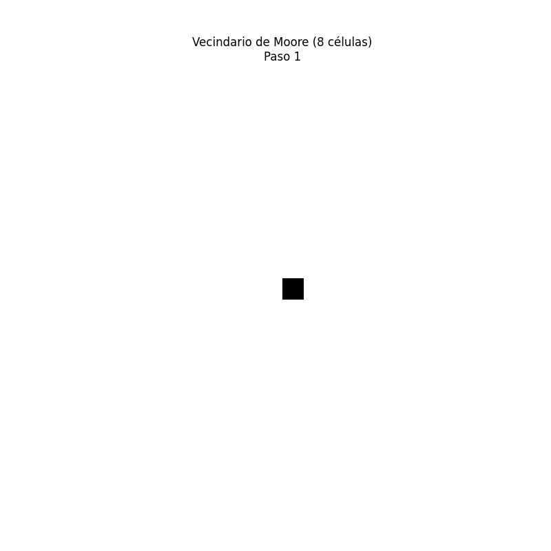

2. **Vecindario de Von Neumann** (4 células):
   - Solo incluye las 4 células ortogonales
   - Más simple y eficiente computacionalmente
   - Útil en ciertos modelos físicos

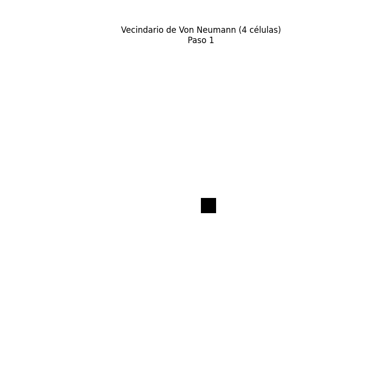

### 2.3 Propiedades Fundamentales

1. **Discretización**:
   - Espacio discreto
   - Tiempo discreto
   - Estados discretos

2. **Localidad**:
   - Cada célula solo interactúa con su vecindario
   - No hay acción a distancia

3. **Homogeneidad**:
   - Las mismas reglas se aplican en todo el espacio
   - No hay preferencias espaciales

## 3. El Juego de la Vida de Conway

### 3.1 Reglas Básicas

1. Una célula muerta con exactamente 3 vecinos vivos "nace"
2. Una célula viva con 2 o 3 vecinos vivos sobrevive
3. En cualquier otro caso, la célula muere o permanece muerta

### 3.2 Patrones Básicos

#### 3.2.1 Patrones Estables
- **Bloque**: El patrón más simple, permanece inmutable
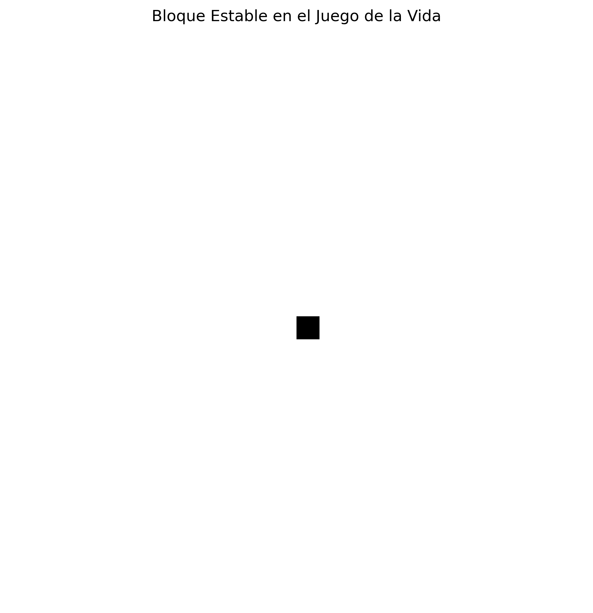

#### 3.2.2 Osciladores
- **Parpadeador**: Alterna entre dos estados
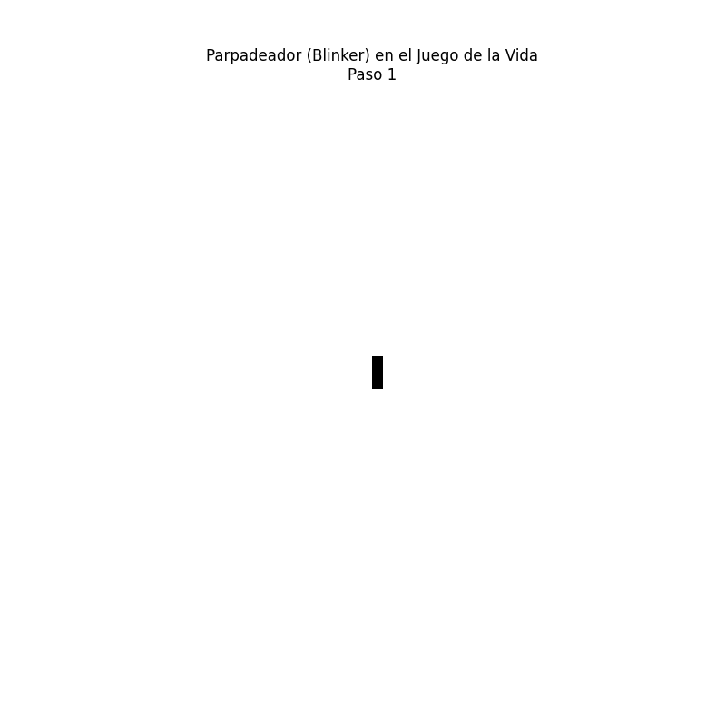

- **Pulsar**: Oscilador de período 3, uno de los más complejos
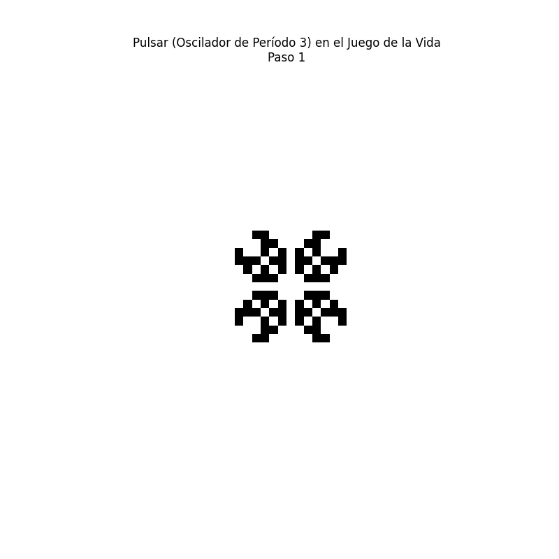

#### 3.2.3 Naves
- **Planeador**: Se mueve diagonalmente
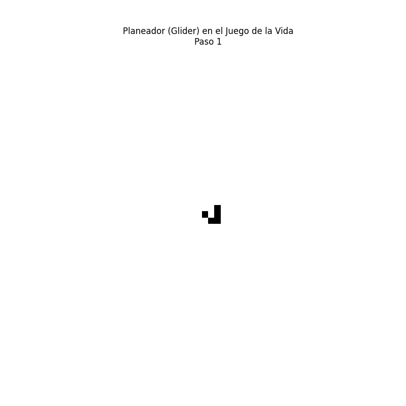

### 3.3 Patrones Complejos

#### 3.3.1 Cañón de Planeadores
- Patrón que genera planeadores indefinidamente
- Demuestra la capacidad de los autómatas celulares para la computación
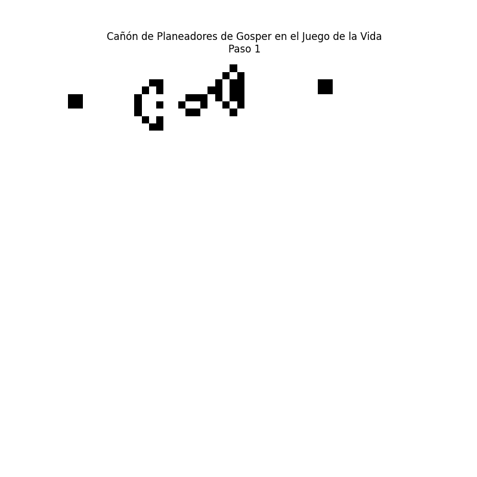

#### 3.3.2 Patrones Aleatorios
- Evolución de patrones aleatorios
- Muestra la emergencia de estructuras estables
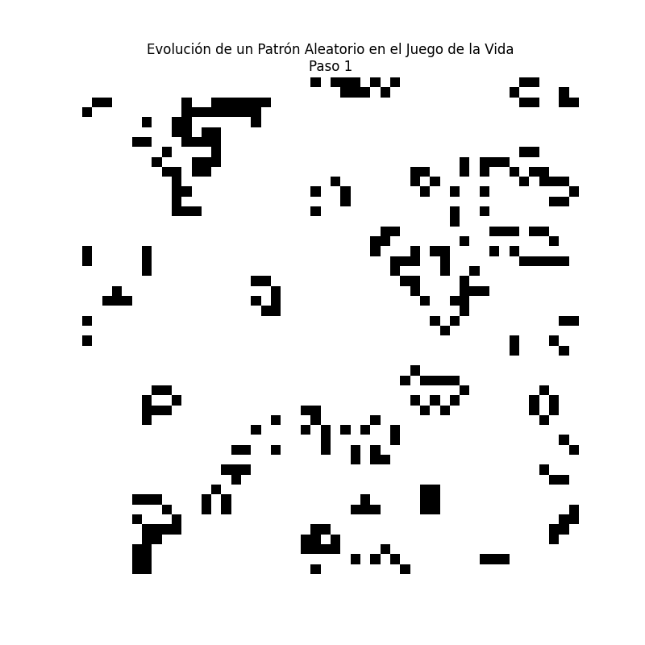

- Comparación de múltiples patrones aleatorios
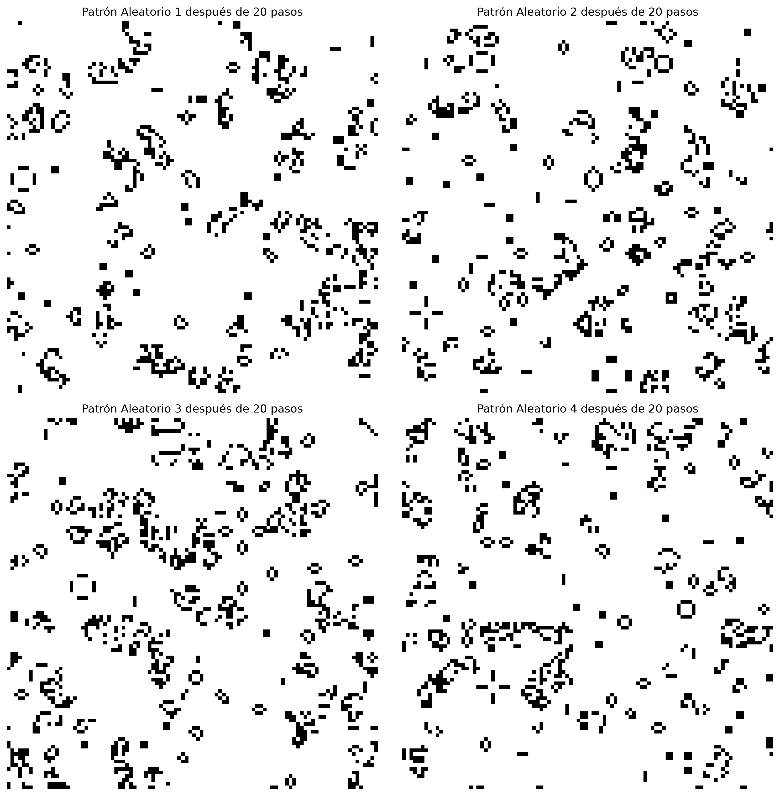

## 4. La Regla 30 de Wolfram

### 4.1 Definición y Numeración de Reglas
Los autómatas celulares elementales de Wolfram son reglas unidimensionales que dependen de 3 células (izquierda, centro, derecha). El número de la regla se determina de la siguiente manera:

1. **Codificación Binaria**: 
   - Hay 8 posibles configuraciones de 3 células (2³ = 8)
   - Cada configuración puede resultar en 0 o 1
   - El número de la regla es el número decimal que representa esta secuencia de 8 bits

2. **Entendiendo las Reglas de Forma Intuitiva**:
   Imagina una línea de células, donde cada célula puede estar viva (1) o muerta (0). En cada paso, el estado de cada célula depende de su propio estado y el de sus dos vecinos inmediatos. Es como si cada célula "mirara" a su izquierda, a sí misma, y a su derecha para decidir si vivirá o morirá en el siguiente paso.

   Por ejemplo, si tenemos esta configuración:
   ```
   ... 0 1 0 ...  (izquierda, centro, derecha)
   ```
   La célula central (1) debe decidir si vivirá o morirá basándose en:
   - Su vecino izquierdo (0)
   - Su propio estado (1)
   - Su vecino derecho (0)

   Esta decisión se toma según una "tabla de reglas" que define qué hacer en cada posible situación. El número de la regla (como 30, 90, 110, etc.) es simplemente una forma compacta de escribir esta tabla de reglas.

3. **Ejemplo de la Regla 30**:
   ```
   Configuración:  111  110  101  100  011  010  001  000
   Resultado:      0    0    0    1    1    1    1    0
   Binario:        0    0    0    1    1    1    1    0
   Decimal:        30 (00011110 en binario)
   ```

4. **Interpretación**:
   - La Regla 30 genera patrones caóticos
   - La Regla 90 genera patrones fractales (triángulo de Sierpinski)
   - La Regla 110 es universalmente computacional
   - La Regla 184 modela el tráfico vehicular

### 4.1.1 Explicación Detallada de la Numeración de Reglas

Para entender completamente cómo se generan las reglas, vamos a desglosar el proceso paso a paso:

1. **Configuraciones Posibles**:
   Para cada regla, consideramos todas las posibles combinaciones de 3 células adyacentes:
   ```
   111 (7 en decimal) - Todas las células están vivas
   110 (6 en decimal) - Izquierda y centro vivas, derecha muerta
   101 (5 en decimal) - Izquierda y derecha vivas, centro muerto
   100 (4 en decimal) - Solo izquierda viva
   011 (3 en decimal) - Solo derecha muerta
   010 (2 en decimal) - Solo centro viva
   001 (1 en decimal) - Solo derecha viva
   000 (0 en decimal) - Todas las células están muertas
   ```

2. **Generación de la Regla**:
   Para cada configuración, decidimos si la célula central en el siguiente paso estará viva (1) o muerta (0).
   Por ejemplo, para la Regla 30:
   ```
   Configuración 111 → 0 (muere)
   Configuración 110 → 0 (muere)
   Configuración 101 → 0 (muere)
   Configuración 100 → 1 (nace)
   Configuración 011 → 1 (nace)
   Configuración 010 → 1 (nace)
   Configuración 001 → 1 (nace)
   Configuración 000 → 0 (muere)
   ```

3. **Conversión a Número**:
   - Tomamos la secuencia de resultados (0s y 1s)
   - La leemos de izquierda a derecha (de 111 a 000)
   - Convertimos el número binario a decimal
   ```
   Para la Regla 30:
   00011110 (binario) = 30 (decimal)
   ```

4. **Implementación en Código**:
   ```python
   def rule_30_1d(current: int, left: int, center: int, right: int) -> int:
       pattern = (left, center, right)
       # Implementación de la tabla de reglas
       if pattern in [(1,0,0), (0,1,1), (0,1,0), (0,0,1)]:
           return 1  # La célula nace o sobrevive
       return 0  # La célula muere o permanece muerta
   ```

5. **Ejemplos de Otras Reglas**:
   - **Regla 90** (Triángulo de Sierpinski):
     ```
     Configuración:  111  110  101  100  011  010  001  000
     Resultado:      0    1    0    1    1    0    1    0
     Binario:        0    1    0    1    1    0    1    0
     Decimal:        90 (01011010 en binario)
     ```
     Esta regla implementa un XOR entre las células izquierda y derecha, ignorando el centro.

   - **Regla 110** (Universal):
     ```
     Configuración:  111  110  101  100  011  010  001  000
     Resultado:      0    1    1    1    0    1    1    0
     Binario:        0    1    1    1    0    1    1    0
     Decimal:        110 (01101110 en binario)
     ```
     Esta regla es universalmente computacional, lo que significa que puede simular cualquier computadora.

   - **Regla 184** (Tráfico):
     ```
     Configuración:  111  110  101  100  011  010  001  000
     Resultado:      0    0    0    1    1    1    0    0
     Binario:        0    0    0    1    1    1    0    0
     Decimal:        184 (10111000 en binario)
     ```
     Esta regla modela el flujo de tráfico, donde 1 representa un coche y 0 un espacio vacío.

6. **Visualización de la Evolución**:
   - Comenzamos con una sola célula viva en el centro
   - Aplicamos la regla a cada célula en cada paso
   - Cada fila representa un paso en el tiempo
   - El patrón resultante muestra la evolución del sistema

Esta numeración sistemática permite catalogar todas las posibles reglas de autómatas celulares elementales (256 en total, ya que hay 2⁸ posibles combinaciones de resultados). Cada número de regla representa un conjunto único de comportamientos y patrones emergentes.

### 4.2 Propiedades
- Genera patrones caóticos
- Usado en el generador de números aleatorios de Mathematica
- Exhibe comportamiento complejo a partir de reglas simples

### 4.3 Visualización
- Patrón completo
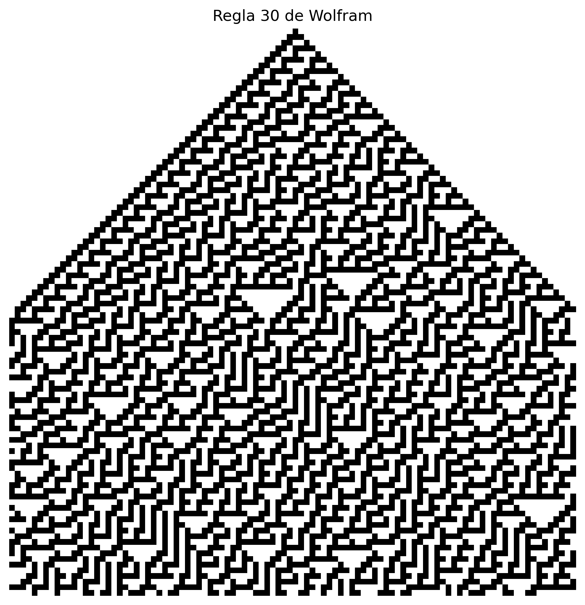

- Evolución paso a paso
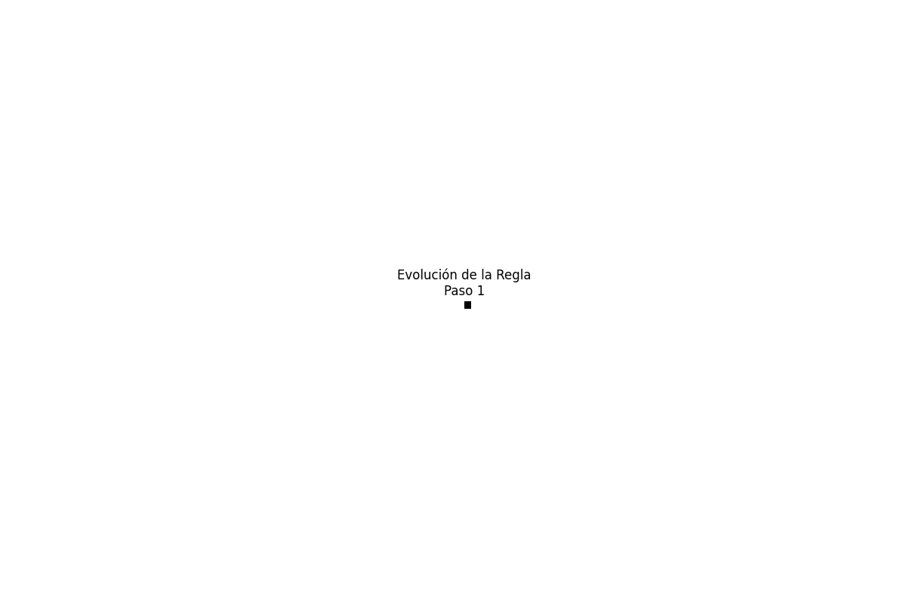

### 4.4 Otras Reglas Interesantes

#### Regla 90 (Fractal)
- Genera el triángulo de Sierpinski
- Patrón autosimilar
- Comportamiento predecible y estructurado


#### Regla 110 (Universal)
- Capaz de computación universal
- Patrones complejos y estructurados
- Importante en teoría de la computación


#### Regla 184 (Tráfico)
- Modela el flujo de tráfico
- Muestra la formación de atascos
- Útil en simulación de sistemas de transporte


#### Regla 250 (Estable)
- Evoluciona a un estado estable
- Patrones simples y predecibles
- Útil para entender la estabilidad


## 5. Aplicaciones

### 5.1 Física
- Modelado de fluidos
- Simulación de fenómenos de propagación
- Estudio de transiciones de fase

### 5.2 Biología
- Modelado de crecimiento de poblaciones
- Simulación de sistemas inmunológicos
- Estudio de patrones de desarrollo

### 5.3 Computación
- Generación de números aleatorios
- Criptografía
- Computación paralela

## 6. Implementación y Visualización

### 6.1 Consideraciones Técnicas
- Uso de matrices para representar el estado
- Optimización de cálculos de vecindario
- Manejo de condiciones de frontera

### 6.2 Visualización
- Uso de colores para representar estados
- Animaciones para mostrar evolución
- Herramientas interactivas

## 7. Conexiones con Otros Campos

### 7.1 Teoría de la Computación
- Autómatas celulares como modelos de computación
- Relación con máquinas de Turing
- Complejidad computacional

### 7.2 Física
- Analogías con sistemas físicos
- Conservación de energía
- Entropía y termodinámica

### 7.3 Biología
- Auto-organización
- Emergencia de patrones
- Evolución y adaptación

## 8. Perspectivas Futuras

### 8.1 Investigación Actual
- Autómatas celulares cuánticos
- Aplicaciones en inteligencia artificial
- Modelado de sistemas complejos

### 8.2 Desafíos
- Escalabilidad computacional
- Generalización a dimensiones superiores
- Integración con otros modelos

## 9. Recursos Adicionales

### 9.1 Software
- Golly (simulador de autómatas celulares)
- Mathematica (implementaciones de Wolfram)
- Bibliotecas Python (numpy, matplotlib)

### 9.2 Referencias
- "A New Kind of Science" (Stephen Wolfram)
- "Cellular Automata: A Discrete Universe" (Andrew Ilachinski)
- Artículos científicos sobre aplicaciones específicas

## 10. Conclusión

Los autómatas celulares representan un puente fascinante entre la simplicidad matemática y la complejidad emergente. Su estudio nos ayuda a entender cómo sistemas simples pueden generar comportamientos complejos, un principio fundamental en la naturaleza y la ciencia de la computación. 