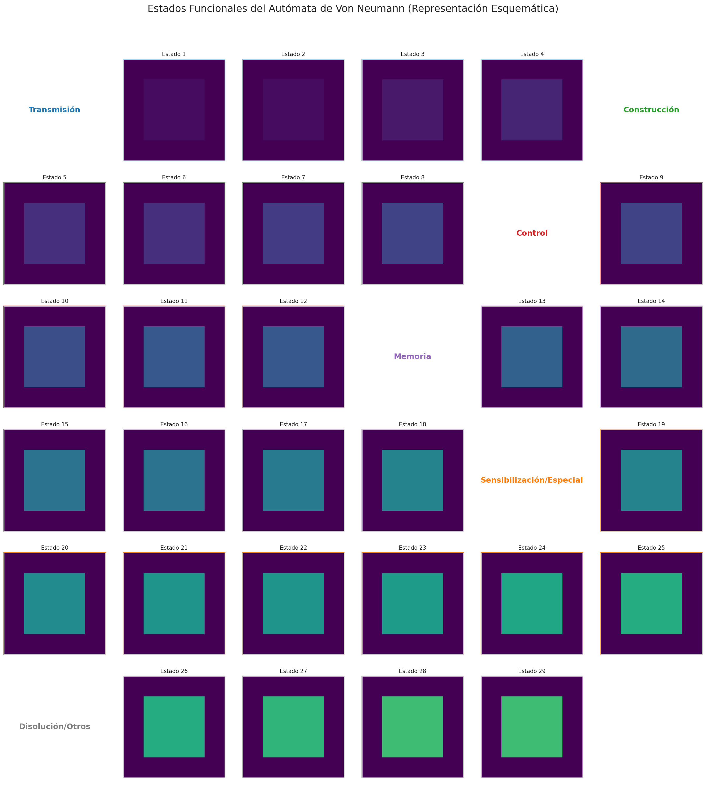
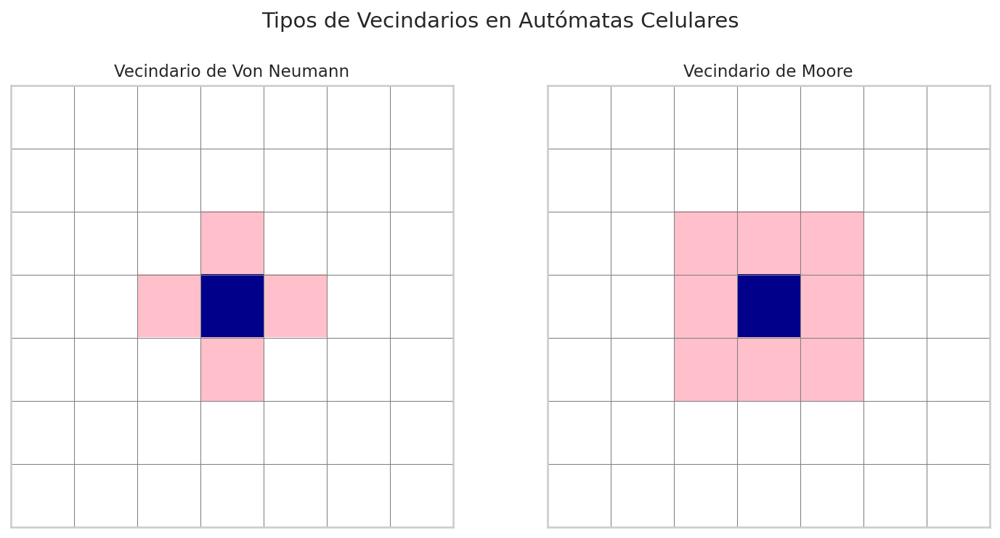
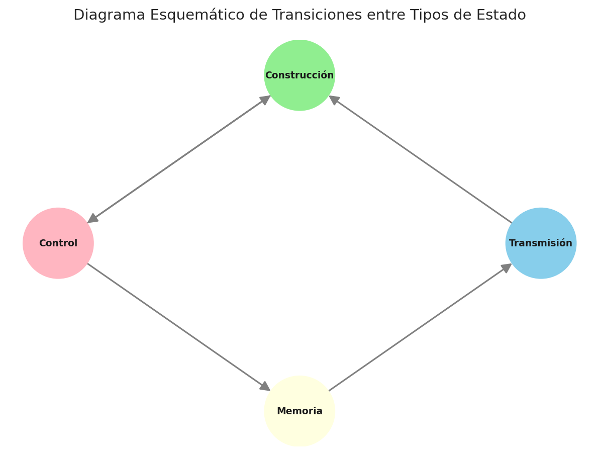
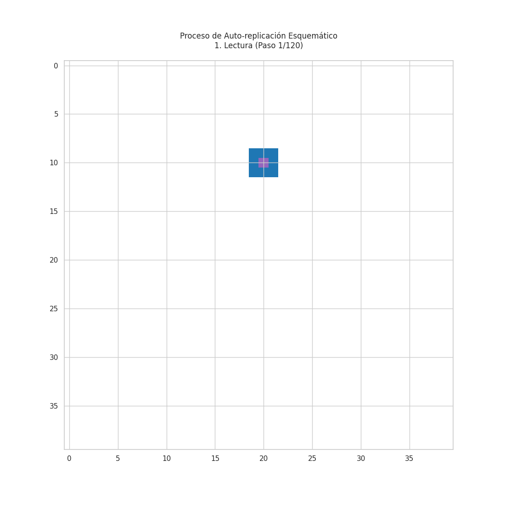
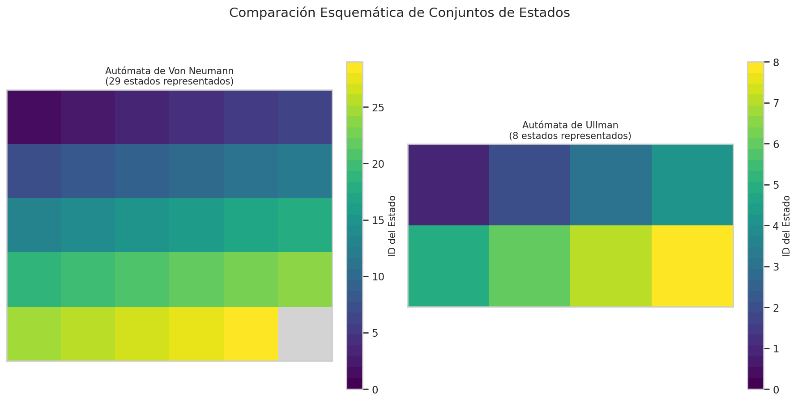
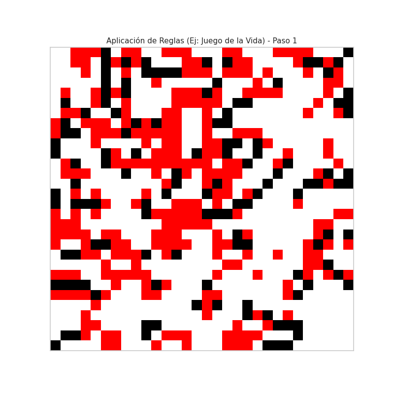
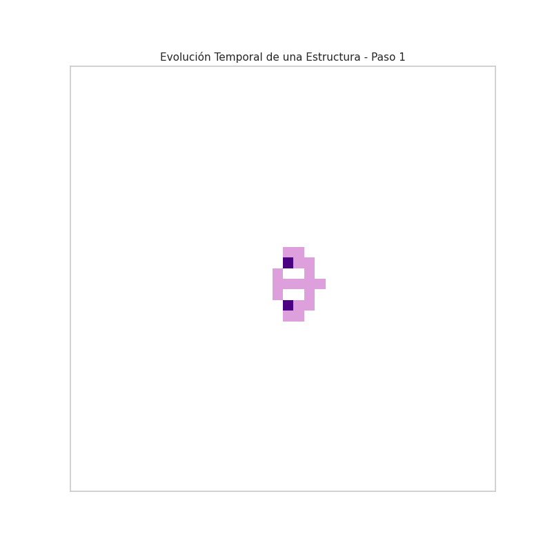
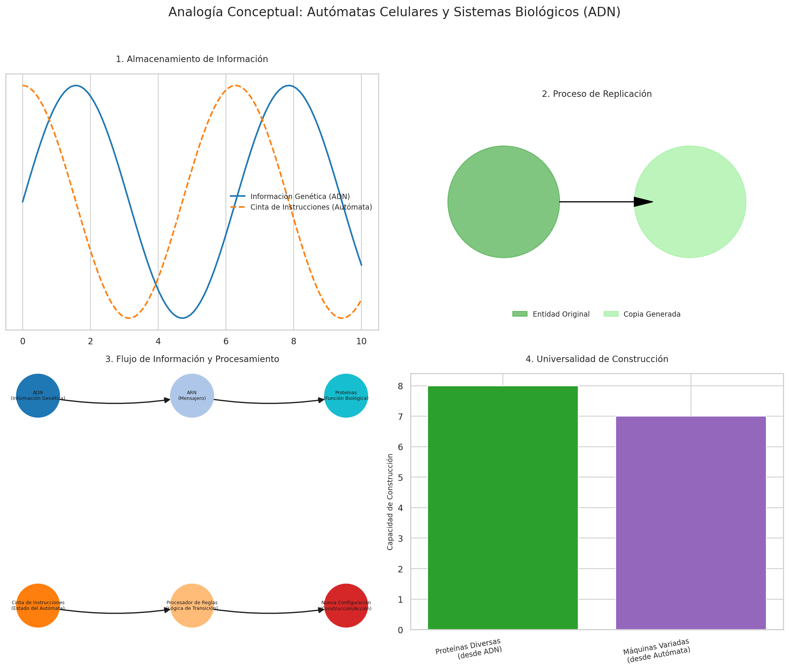
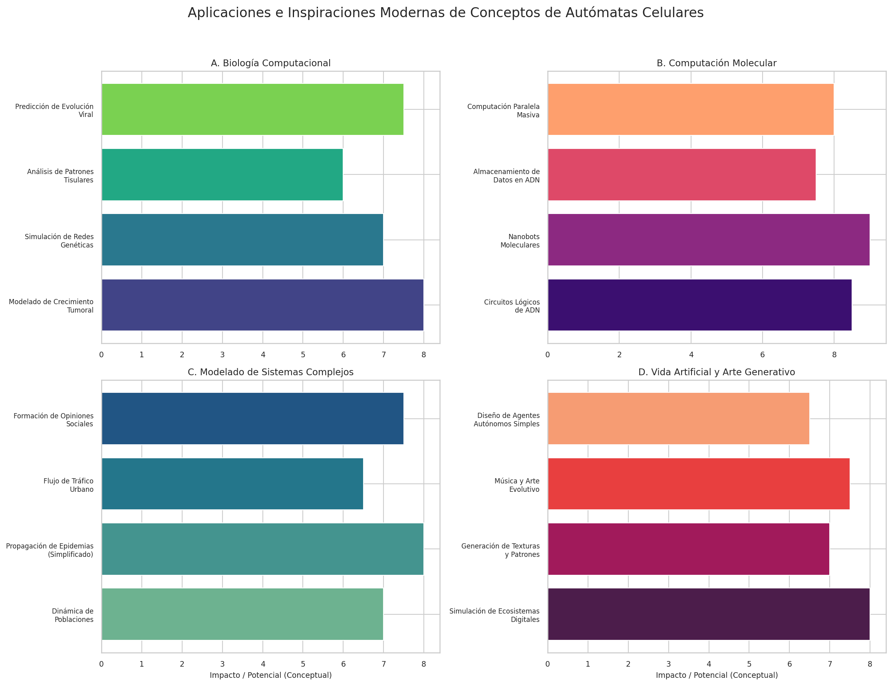
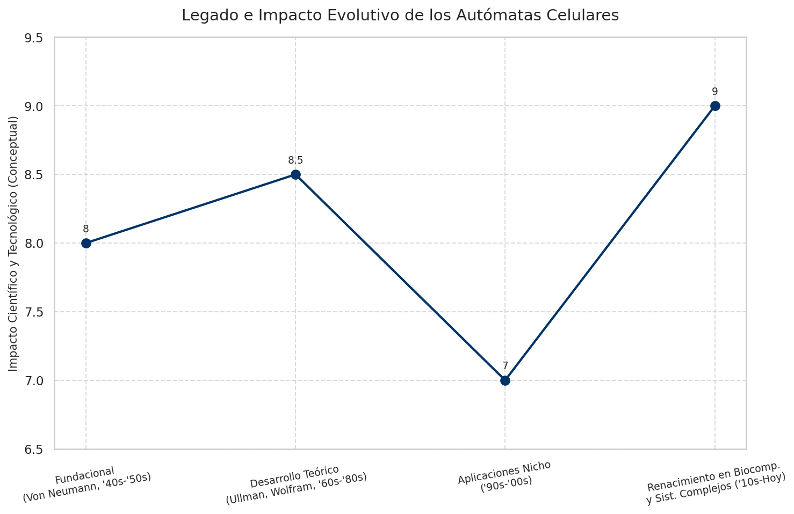

# Autómatas Celulares: Fundamentos y las Contribuciones de Von Neumann y Ullman

## Introducción: El Nacimiento de la Vida Artificial

Los autómatas celulares (AC) representan un fascinante paradigma computacional donde reglas locales simples dan lugar a comportamientos globales complejos y a menudo impredecibles. Son sistemas discretos, tanto en el espacio (una cuadrícula o retículo) como en el tiempo (pasos discretos), donde cada celda o autómata individual actualiza su estado basándose únicamente en los estados de sus celdas vecinas en el paso de tiempo anterior. Esta simplicidad subyacente contrasta con la riqueza de patrones y estructuras que pueden emerger, desde osciladores estables y ondas propagantes hasta comportamientos caóticos y estructuras auto-organizadoras.

El interés en estos sistemas se disparó a mediados del siglo XX, impulsado por preguntas fundamentales en la intersección de las matemáticas, la computación y la biología. ¿Puede una máquina crear una copia de sí misma? ¿Cuáles son los requisitos mínimos para la vida y la complejidad? Figuras pioneras como John von Neumann y Stanislaw Ulam sentaron las bases teóricas, buscando modelos matemáticos que pudieran capturar la esencia de la auto-replicación y la computación universal.

Este documento explora los conceptos fundamentales de los autómatas celulares, centrándose en las contribuciones seminales de John von Neumann y las posteriores simplificaciones y refinamientos propuestos por Arthur W. Burks y Robert F. Ullman. Analizaremos la estructura, las reglas y el comportamiento de estos autómatas, con especial énfasis en el autómata universal auto-replicante de von Neumann, y discutiremos sus profundas implicaciones teóricas y sus conexiones con el descubrimiento del ADN y las aplicaciones modernas en campos como la biología computacional y la computación molecular.

## 1. El Autómata Universal de Von Neumann: Una Máquina que se Construye a Sí Misma

### 1.1 Contexto Histórico y Motivación: La Búsqueda de la Auto-Replicación

La década de 1940 fue un período de efervescencia intelectual, marcado por avances revolucionarios en la teoría de la computación (con la máquina de Turing como modelo central) y una creciente comprensión de los mecanismos biológicos. En este contexto, John von Neumann, una figura polifacética cuyos intereses abarcaban desde la lógica matemática hasta la física cuántica y la economía, se planteó una pregunta que resonaba con las inquietudes de la época: ¿Es posible diseñar un sistema no biológico, una máquina, capaz de construir una copia funcional de sí misma a partir de componentes básicos?

Esta pregunta no era meramente un ejercicio teórico; buscaba desentrañar los principios lógicos fundamentales que subyacen a la auto-replicación observada en la naturaleza. Von Neumann no intentaba simular la química específica de la vida, sino abstraer la *lógica* del proceso. Se inspiró en dos pilares conceptuales:

1.  **La Máquina Universal de Turing**: Demostró que una máquina relativamente simple podía, en principio, simular cualquier otro proceso computable si se le proporcionaba la descripción adecuada (el "programa") en su cinta. Esto sugería la posibilidad de una máquina *constructora* universal.
2.  **La Auto-replicación Biológica**: Aunque los detalles moleculares eran desconocidos (el descubrimiento de la estructura del ADN llegaría una década después), era evidente que los organismos vivos poseían un mecanismo para reproducirse, transmitiendo fielmente la información necesaria para construir y operar una nueva instancia.

Von Neumann razonó que para que una máquina se auto-replicara, debía poseer dos componentes esenciales:
*   **Un Constructor Universal**: Una parte capaz de leer una descripción y construir la máquina descrita.
*   **Una Descripción (Cinta de Instrucciones)**: Un conjunto de instrucciones que detallan cómo construir la máquina, incluyendo al propio constructor y una copia de la descripción misma.

El desafío radicaba en evitar una regresión infinita (¿quién construye al constructor del constructor?). La solución elegante de von Neumann fue concebir una máquina que pudiera:
a) Interpretar una descripción y construir la máquina descrita (actuando como constructor).
b) Copiar cualquier descripción que se le presentara (actuando como copiadora).

Al proporcionarle su propia descripción, esta máquina primero construiría una nueva copia de sí misma (usando la descripción) y luego copiaría la descripción y la insertaría en la nueva máquina, completando el proceso de auto-replicación. Este concepto no solo demostró teóricamente la posibilidad de la auto-replicación artificial, sino que también *predijo* la necesidad de un mecanismo dual en la replicación biológica: un sistema de instrucciones (análogo al genotipo, el ADN) y un mecanismo para interpretar esas instrucciones y construir la estructura (análogo al fenotipo, la maquinaria celular).

### 1.2 El Modelo del Autómata Celular: Estructura y Funcionamiento

Para implementar estas ideas de manera formal, von Neumann, con la ayuda de Stanislaw Ulam, desarrolló el modelo de autómata celular. En lugar de componentes mecánicos complejos, imaginó una vasta cuadrícula bidimensional donde cada celda podía existir en uno de varios estados discretos. La dinámica del sistema estaría gobernada por reglas locales y uniformes: el estado futuro de una celda dependería exclusivamente de su estado actual y el de sus vecinas inmediatas.

#### 1.2.1 Los 29 Estados: Un Alfabeto para la Construcción

El autómata celular específico diseñado por von Neumann utilizaba un conjunto de 29 estados para cada celda. Este número, aunque parece grande, era necesario para codificar las distintas funciones requeridas para la computación universal y la construcción dentro del entorno celular. Estos estados se pueden agrupar funcionalmente:

*   **Estados Confluentes (Estado 0 y otros básicos)**: Representan el estado "quiescente" o de fondo, y estados básicos para iniciar señales.
*   **Estados de Transmisión Ordinaria (4 estados)**: Actúan como "cables" direccionales que propagan información (señales binarias) a través de la cuadrícula sin alterarla. Permiten la comunicación a distancia dentro del autómata.
*   **Estados de Transmisión Especial (4 estados)**: Similares a los anteriores, pero utilizados para la transmisión de señales de control específicas o en procesos de construcción.
*   **Estados Sensibilizados y de Construcción (Múltiples estados)**: Estos estados están involucrados directamente en el proceso de construcción. Incluyen estados que preparan una celda para ser transformada (sensibilizada) y estados que representan el "brazo constructor" que modifica las celdas vecinas, transformándolas de un estado quiescente a uno activo (por ejemplo, un estado de transmisión).
*   **Estados de Disolución**: Permiten la eliminación controlada de estructuras, revirtiendo celdas a un estado quiescente.
*   **Estados Transitorios**: Estados intermedios necesarios para la correcta secuenciación de las reglas de transición y para evitar conflictos.

La complejidad del conjunto de estados refleja la necesidad de manejar la propagación de señales, la construcción física de nuevas estructuras celulares, la copia de la cinta de instrucciones y el control general del proceso dentro de un marco puramente local y basado en reglas.

*Representación esquemática de los diferentes tipos de estados y su posible apariencia visual en una simulación.*

#### 1.2.2 Vecindario y Reglas de Transición

El comportamiento de cada celda está determinado por su **vecindario**. Von Neumann adoptó el vecindario que ahora lleva su nombre: la propia celda y sus cuatro vecinas adyacentes ortogonalmente (arriba, abajo, izquierda, derecha). El estado de estas cinco celdas en el instante *t* determina unívocamente el estado de la celda central en el instante *t+1*.

*Comparación del vecindario de Von Neumann (izquierda) con el vecindario de Moore (derecha), que incluye también las diagonales.*

Las **reglas de transición** forman el "programa" fundamental del universo del autómata. Son una tabla o función que mapea cada posible configuración de estados del vecindario a un único estado resultante para la celda central. Dado el número de estados (29) y el tamaño del vecindario (5), el número total de reglas posibles es astronómico (29^(29^5)), pero solo un subconjunto cuidadosamente diseñado es necesario para lograr la funcionalidad deseada. Las características clave de estas reglas son:

*   **Determinismo**: La misma configuración del vecindario siempre produce el mismo resultado.
*   **Localidad**: Solo dependen del vecindario inmediato.
*   **Homogeneidad**: Las mismas reglas se aplican a todas las celdas de la cuadrícula.

El diseño específico de las ~200,000 reglas de transición de von Neumann (detallado posteriormente por Burks) fue una hazaña de ingeniería lógica, asegurando que las señales se propagaran correctamente, que las estructuras pudieran construirse sin interferencias y que la computación universal fuera posible.

*Diagrama conceptual que ilustra cómo los diferentes tipos de estados (Transmisión, Construcción, Control, Memoria) pueden interactuar y transicionar entre sí según las reglas locales.*

### 1.3 El Proceso de Auto-replicación Detallado

Utilizando los 29 estados y las reglas de transición, von Neumann diseñó una configuración inicial específica – una "máquina" dentro de la cuadrícula – que contenía tanto el constructor universal como una larga "cinta" de instrucciones codificada en los estados de las celdas. Esta cinta contenía la descripción completa de la propia máquina. El proceso de replicación se desarrollaba esquemáticamente en las siguientes fases:

1.  **Fase de Lectura e Interpretación**: El constructor de la máquina inicial comienza a leer las instrucciones de su propia cinta.
2.  **Fase de Construcción**: Siguiendo las instrucciones leídas, el constructor utiliza su "brazo" (secuencias de estados de construcción) para modificar celdas quiescentes vecinas, construyendo gradualmente una nueva copia de la estructura de la máquina (excluyendo la cinta) en una región adyacente de la cuadrícula.
3.  **Fase de Copia de la Cinta**: Una vez completada la estructura física de la nueva máquina, el constructor original cambia de modo y comienza a copiar el contenido de su propia cinta de instrucciones, transmitiendo la secuencia de estados a la cinta vacía de la máquina recién construida.
4.  **Fase de Activación**: Al finalizar la copia de la cinta, la máquina original envía una señal de activación a la nueva máquina. Esta señal inicia el funcionamiento de la copia, que ahora es independiente y posee toda la información necesaria para comenzar su propio ciclo de replicación.

*Animación conceptual que ilustra las fases de lectura, construcción, copia y activación en el proceso de auto-replicación.*

Este complejo ballet de estados celulares, gobernado enteramente por reglas locales, demostró de manera concluyente que la auto-replicación no requería principios vitales misteriosos, sino que podía surgir de la lógica computacional y la interacción local.

### 1.4 Implicaciones Teóricas y Legado

El trabajo de von Neumann sobre autómatas celulares y auto-replicación tuvo implicaciones profundas y duraderas:

*   **Prueba de Concepto**: Demostró formalmente la posibilidad lógica de la auto-replicación mecánica y computacional.
*   **Computación Universal en AC**: Estableció que los autómatas celulares podían ser computacionalmente universales, equivalentes a las máquinas de Turing.
*   **Complejidad desde la Simplicidad**: Mostró cómo reglas locales muy simples podían generar comportamientos globales extremadamente complejos y organizados.
*   **Predicción Biológica**: Como se mencionó, anticipó la dualidad instrucción/construcción fundamental para la replicación molecular descubierta más tarde en el ADN.
*   **Fundamentos de la Vida Artificial**: Sentó las bases para el campo emergente de la Vida Artificial (ALife), que utiliza modelos computacionales para estudiar los principios de los sistemas vivos.
*   **Inspiración Tecnológica**: Aunque construir un autómata físico de von Neumann sigue siendo un desafío formidable, los principios inspiraron ideas en áreas como la computación paralela, la nanotecnología autoensamblante y la computación molecular.

## 2. Simplificaciones Posteriores: El Autómata de Ullman

Si bien el autómata de 29 estados de von Neumann fue una demostración teórica monumental, su complejidad lo hacía difícil de analizar y simular exhaustivamente. Investigadores posteriores buscaron simplificaciones que preservaran la capacidad de auto-replicación y computación universal pero con un número menor de estados y reglas más manejables.

Arthur Burks, quien editó y completó el trabajo póstumo de von Neumann, junto con sus estudiantes, incluyendo a John Holland (pionero de los algoritmos genéticos) y E.F. Codd, exploraron estas simplificaciones. Codd, en particular, logró diseñar un autómata universal auto-replicante con solo 8 estados en 1968.

Robert F. Ullman, trabajando en la misma línea, también contribuyó a la comprensión y simplificación de estos sistemas, a menudo en el contexto de la teoría de autómatas y lenguajes formales. Aunque a veces se le asocia directamente con un autómata específico de 8 estados (posiblemente refiriéndose al trabajo de Codd o desarrollos similares), su contribución se enmarca en el esfuerzo general por refinar y entender las propiedades fundamentales de los AC capaces de computación y construcción complejas.

### 2.1 Reducción de Estados y Eficiencia

La reducción del número de estados (de 29 a 8, por ejemplo, en el modelo de Codd) representó un avance significativo. Lograr la misma funcionalidad con menos estados implicaba un diseño de reglas más ingenioso y eficiente, donde cada estado debía asumir múltiples roles o donde las secuencias de estados codificaban funciones de manera más compacta.

*Ilustración conceptual comparando la mayor cantidad de estados en el modelo original de von Neumann con el conjunto reducido en modelos posteriores como el de Codd/Ullman.*

Las ventajas de esta simplificación eran claras:

*   **Mayor Simplicidad Conceptual**: Facilitaba la comprensión de los mecanismos subyacentes.
*   **Facilidad de Análisis**: Permitía un análisis matemático más tractable de las propiedades del autómata.
*   **Eficiencia Computacional**: Las simulaciones requerían menos memoria y podían ejecutarse más rápidamente, permitiendo explorar configuraciones iniciales más grandes o evoluciones más largas.
*   **Menor Complejidad de Reglas**: Aunque el diseño de las reglas podía ser más sutil, el número total de reglas a considerar era drásticamente menor.

### 2.2 Las Reglas de Transición en Modelos Simplificados

Las reglas de transición en autómatas como el de Codd (a menudo asociado con Ullman en discusiones generales) seguían los mismos principios de localidad, determinismo y homogeneidad. Sin embargo, debían ser cuidadosamente elaboradas para empaquetar las funcionalidades de transmisión, construcción y control en solo 8 estados. Esto a menudo implicaba un uso más intensivo de patrones espaciotemporales de estados para representar información y operaciones complejas. La lógica subyacente, aunque implementada de forma diferente, seguía reflejando los requisitos identificados por von Neumann para la auto-replicación y la computación universal.

*Animación genérica que ilustra cómo el estado de cada celda cambia en función de sus vecinos según un conjunto de reglas locales (ejemplo usando reglas similares a Conway's Game of Life).*

Estos modelos simplificados reforzaron la idea de que la complejidad funcional no requería necesariamente una complejidad abrumadora en los componentes básicos, sino más bien una organización inteligente y reglas de interacción bien diseñadas.

## 3. Patrones Emergentes y Comportamientos Complejos

Una de las características más cautivadoras de los autómatas celulares, tanto los de von Neumann/Ullman como otros más simples como el Juego de la Vida de Conway, es la **emergencia** de patrones y comportamientos complejos a partir de reglas locales simples y configuraciones iniciales.

### 3.1 Tipos de Patrones Observados

Al simular la evolución de un AC, se pueden observar diversos fenómenos:

1.  **Estructuras Estables (Naturaleza Muerta)**: Configuraciones que permanecen inalteradas a lo largo del tiempo.
2.  **Osciladores**: Patrones que retornan a su estado original después de un número finito de pasos, repitiendo un ciclo.
3.  **Naves Espaciales (Spaceships)**: Patrones que se trasladan a través de la cuadrícula, manteniendo su forma (o ciclando a través de un conjunto de formas) mientras se mueven. El "planeador" (glider) en el Juego de la Vida es el ejemplo más famoso.
4.  **Caos y Complejidad**: Configuraciones que evolucionan de manera aparentemente aleatoria o impredecible, sin patrones periódicos o estables evidentes a corto plazo. A menudo muestran sensibilidad a las condiciones iniciales.
5.  **Patrones de Crecimiento**: Configuraciones que se expanden indefinidamente, a veces formando estructuras fractales o auto-similares.
6.  **Auto-replicación**: Como se vio en los autómatas de von Neumann y Codd, patrones específicos capaces de generar copias de sí mismos.

*Animación que muestra un patrón simple (un "planeador") moviéndose a través de la cuadrícula, un ejemplo clásico de estructura emergente en un AC.*

### 3.2 Evolución Temporal y Auto-Organización

La evolución temporal de un AC puede verse como un proceso de **auto-organización**. A partir de un estado inicial (a menudo aleatorio o simple), las reglas locales interactúan para formar estructuras coherentes y comportamientos globales. La información se propaga localmente, las estructuras interactúan, compiten por el espacio o colaboran para formar entidades más grandes.

*Animación que muestra cómo una estructura simple puede crecer o cambiar con el tiempo según las reglas del autómata.*

El estudio de estos patrones emergentes es crucial para entender cómo puede surgir el orden y la complejidad en sistemas descentralizados, un tema relevante no solo en computación sino también en física, biología (morfogénesis, dinámica de poblaciones) y ciencias sociales.

## 4. Conexión con el ADN y la Biología Molecular

El trabajo teórico de von Neumann resultó ser profético. Sus ideas sobre una cinta de instrucciones que es copiada y utilizada por un constructor universal encontraron un sorprendente paralelo biológico con el descubrimiento de la estructura de doble hélice del ADN por Watson y Crick en 1953 y la posterior elucidación del dogma central de la biología molecular.

### 4.1 Las Predicciones Visionarias de Von Neumann

1.  **Código de Instrucciones (Genotipo)**: Von Neumann postuló la necesidad de una descripción explícita y copiable. El ADN cumple precisamente esta función, almacenando la información genética en forma de secuencia de nucleótidos. Esta secuencia actúa como la "cinta de instrucciones".
2.  **Constructor Universal (Fenotipo)**: Argumentó que se necesitaba un mecanismo para leer la cinta y construir la máquina. La maquinaria celular (ribosomas, enzimas, etc.) actúa como este constructor, traduciendo la información del ADN (a través del ARN mensajero) en proteínas, que a su vez construyen y operan la célula.
3.  **Proceso de Copia**: El modelo requería un mecanismo para duplicar la cinta de instrucciones. La replicación del ADN, donde la doble hélice se desenrolla y cada hebra sirve como molde para una nueva, es el análogo biológico directo.
4.  **Universalidad**: Así como el autómata universal podía construir cualquier máquina descrita en su cinta, el sistema genético es (casi) universal; el mismo código genético es utilizado por la mayoría de los organismos para especificar la secuencia de aminoácidos de las proteínas.

*Diagrama conceptual que ilustra los paralelismos entre el almacenamiento y procesamiento de información en los AC de von Neumann y el flujo de información genética en la biología (ADN -> ARN -> Proteína).*

### 4.2 Implicaciones para la Comprensión de la Vida

Esta convergencia entre la teoría abstracta de la computación y la realidad molecular de la biología fue revolucionaria. Sugirió que los procesos fundamentales de la vida, como la replicación y el metabolismo, podían entenderse en términos de procesamiento de información y computación. Reforzó la idea de que la vida no es una sustancia mágica, sino un fenómeno emergente de interacciones complejas basadas en reglas físico-químicas, susceptibles de ser modeladas y comprendidas mediante enfoques computacionales. Los autómatas celulares proporcionaron uno de los primeros marcos formales para explorar esta "lógica de la vida".

## 5. Aplicaciones Modernas e Inspiración

Aunque la construcción física de autómatas auto-replicantes a escala macroscópica sigue siendo ciencia ficción, los principios y el marco de los autómatas celulares continúan inspirando y encontrando aplicaciones en diversas áreas científicas y tecnológicas modernas.

### 5.1 Biología Computacional y Modelado de Sistemas Complejos

Los AC son herramientas valiosas para modelar sistemas donde las interacciones locales entre muchos componentes dan lugar a un comportamiento global complejo:

*   **Morfogénesis y Desarrollo**: Simulación del crecimiento de tejidos, formación de patrones (como las manchas de un leopardo) y desarrollo embrionario.
*   **Dinámica de Ecosistemas y Poblaciones**: Modelado de interacciones depredador-presa, propagación de especies o dinámica forestal.
*   **Epidemiología**: Simulación de la propagación de enfermedades infecciosas en poblaciones espacialmente distribuidas.
*   **Inmunología Computacional**: Modelado de la interacción entre células inmunes y patógenos.
*   **Crecimiento Tumoral**: Simulación de la proliferación e invasión de células cancerosas.
*   **Flujo de Tráfico y Urbanismo**: Modelado del comportamiento del tráfico vehicular o la expansión urbana.
*   **Ciencias Sociales**: Simulación de la difusión de opiniones, segregación residencial o comportamiento de multitudes.

### 5.2 Computación Molecular y Nanotecnología

Las ideas de von Neumann sobre construcción y procesamiento de información a nivel molecular resuenan fuertemente con los objetivos de la computación molecular y la nanotecnología:

*   **Computación con ADN**: Utilización de moléculas de ADN para realizar cálculos, aprovechando su capacidad de almacenamiento de información y las reacciones moleculares específicas como operaciones lógicas.
*   **Autoensamblaje Molecular**: Diseño de moléculas que se ensamblan espontáneamente en estructuras funcionales predefinidas, imitando la construcción "programada" de los AC.
*   **Nanobots y Máquinas Moleculares**: El objetivo a largo plazo de crear dispositivos a nanoescala capaces de realizar tareas como la reparación de tejidos o la administración dirigida de fármacos se inspira en la idea del constructor universal.

### 5.3 Vida Artificial y Arte Generativo

El campo de la Vida Artificial utiliza extensivamente los AC para explorar los principios fundamentales de la vida, la evolución y la inteligencia en sistemas artificiales. Además, la capacidad de los AC para generar patrones visualmente complejos y orgánicos a partir de reglas simples los ha convertido en una herramienta popular en el **arte generativo** y el diseño computacional para crear texturas, animaciones y música.

*Gráfico conceptual que muestra diversas áreas donde los principios de los autómatas celulares encuentran aplicación o sirven de inspiración.*

## 6. Conclusiones: El Legado Perdurable de Von Neumann y Ullman

El trabajo pionero de John von Neumann, Stanislaw Ulam, Arthur Burks, E.F. Codd y Robert Ullman en el campo de los autómatas celulares marcó un hito en nuestra comprensión de la computación, la complejidad y la lógica fundamental de la auto-replicación. Demostraron que comportamientos increíblemente complejos, incluyendo la capacidad de una máquina para construir una copia de sí misma, podían surgir de la interacción de componentes simples gobernados por reglas puramente locales y deterministas.

Sus contribuciones establecieron las bases teóricas para la vida artificial, predijeron aspectos clave de la biología molecular antes de su descubrimiento experimental y proporcionaron un nuevo paradigma computacional – la computación masivamente paralela basada en interacciones locales – que sigue siendo relevante hoy en día.

Aunque los detalles específicos de los autómatas de 29 u 8 estados puedan parecer arcanos, los principios subyacentes – la emergencia de complejidad, la computación distribuida, la codificación de instrucciones y la posibilidad de auto-replicación basada en reglas – continúan resonando en la vanguardia de la ciencia y la tecnología, desde el modelado de sistemas biológicos hasta el diseño de nanomáquinas y la exploración de nuevas formas de computación. El legado de von Neumann y sus sucesores en este campo es un testimonio del poder de la abstracción matemática para iluminar los mecanismos más profundos tanto del mundo artificial como del natural.

*Visualización conceptual del impacto creciente de las ideas de los autómatas celulares a lo largo del tiempo.* 