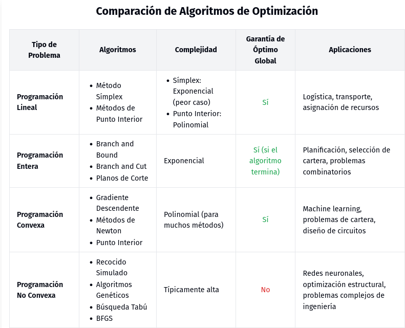
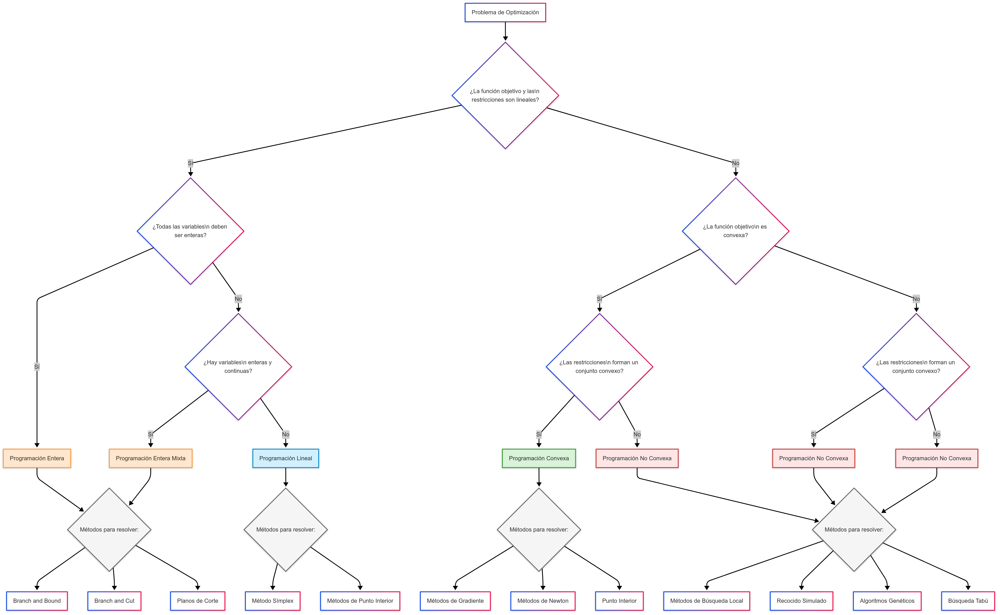

# Introducción a los problemas de optimización

A continuación, se presenta una nota introductoria sobre problemas de optimización, abarcando desde la programación lineal e entera hasta la convexa y no convexa. Incluimos además una breve explicación sobre el Lagrangiano, las restricciones de igualdad y desigualdad, así como los algoritmos más empleados para cada tipo de problema, su complejidad y los casos en que se utilizan.

---

## 1. Introducción a los problemas de optimización

Los problemas de optimización consisten en encontrar la mejor solución (mínimo o máximo) de una función objetivo $f(x)$ sujeta a un conjunto de restricciones (igualdades y/o desigualdades). Estos problemas aparecen en una gran variedad de campos: economía, logística, ingeniería, ciencia de datos, entre otros.

En términos generales, la forma canónica de un problema de optimización puede expresarse como:

$
\begin{aligned}
& \min_{x \in \mathbb{R}^n} \quad f(x) \\
& \text{sujeto a} \\
& \quad g_i(x) \leq 0, \quad i = 1,\dots,m, \\
& \quad h_j(x) = 0, \quad j = 1,\dots,p.
\end{aligned}
$

- **$f(x)$**: función objetivo que se desea optimizar (minimizar o maximizar).
- **$g_i(x)$**: restricciones de desigualdad.
- **$h_j(x)$**: restricciones de igualdad.

Dependiendo de la naturaleza de la función objetivo y de las restricciones, así como del dominio de las variables (continuas, enteras, mixtas, etc.), se tienen distintas ramas de la optimización.

---

## 2. El Lagrangiano y el uso de restricciones

Para manejar las restricciones de manera sistemática, se introduce el concepto de **Lagrangiano**. Dado un problema con restricciones de igualdad y desigualdad, el Lagrangiano se define como:

$
\mathcal{L}(x, \lambda, \mu) \;=\; f(x) \;+\; \sum_{j=1}^{p} \lambda_j\,h_j(x) \;+\; \sum_{i=1}^{m} \mu_i\,g_i(x),
$

donde:
- $\lambda_j$ son los multiplicadores de Lagrange asociados a las restricciones de igualdad $h_j(x)=0$.
- $\mu_i$ son los multiplicadores de Lagrange asociados a las restricciones de desigualdad $g_i(x)\le 0$.  
  En problemas con condiciones de optimalidad de tipo KKT (Karush-Kuhn-Tucker), además se requiere $\mu_i \ge 0$.

El Lagrangiano permite reformular un problema con restricciones explícitas en uno (bajo ciertas condiciones) donde se manejan estas restricciones a través de los multiplicadores $\lambda$ y $\mu$.

---

## 3. Programación Lineal

### 3.1 Definición
La **Programación Lineal (PL)** se refiere a los problemas donde tanto la función objetivo como las restricciones son lineales. Se puede expresar de la forma:

$
\begin{aligned}
&\min_{x \in \mathbb{R}^n} \quad c^T x \\
&\text{sujeto a} \\
&\quad Ax \le b, \\
&\quad x \ge 0,
\end{aligned}
$

donde $c$ es un vector de coeficientes, $A$ es una matriz y $b$ es un vector.

### 3.2 Algoritmos más usados
1. **Método Símplex**  
   - **Idea general**: recorre los vértices (soluciones básicas factibles) del poliedro definido por las restricciones.  
   - **Complejidad**: en el peor caso, la complejidad puede ser exponencial, pero en la práctica suele ser muy eficiente y rápido para muchos problemas reales.
   - **Casos de uso**: ampliamente aplicado en logística, transporte, asignación de recursos y muchos otros problemas industriales.

2. **Métodos de Punto Interior**  
   - **Idea general**: se basan en la optimización en el interior de la región factible, guiando la solución hacia la óptima sin "viajar" necesariamente por los bordes del poliedro.  
   - **Complejidad**: tienen complejidad polinomial en el peor caso.  
   - **Casos de uso**: muy útiles en problemas grandes y dispersos, o cuando se necesita un método con garantía de convergencia polinomial.

---

## 4. Programación Entera

### 4.1 Definición
La **Programación Entera (PE)** se diferencia de la lineal en que impone que algunas o todas las variables sean enteras (0, 1, o cualquier número entero). Por ejemplo:

$
\begin{aligned}
&\min_{x \in \mathbb{Z}^n} \quad c^T x \\
&\text{sujeto a} \\
&\quad Ax \le b, \\
&\quad x \ge 0.
\end{aligned}
$

Cuando únicamente se exige que las variables sean binarias (0 ó 1), se denomina **Programación Entera Binaria**. Cuando se combina con variables continuas, el problema se llama **Programación Entera Mixta**.

### 4.2 Algoritmos más usados
1. **Branch and Bound (Ramificación y Acotación)**  
   - **Idea general**: divide el espacio de soluciones en subproblemas (ramificación) y calcula cotas inferiores o superiores para descartar regiones que no puedan contener la solución óptima (acotación).  
   - **Complejidad**: en el peor caso, es exponencial (los problemas de PE son en general NP-completos).  
   - **Casos de uso**: problemas de planificación, diseño de redes, selección de carteras de inversión, problemas combinatorios, etc.

2. **Branch and Cut**  
   - **Idea general**: combina el método de Branch and Bound con la generación de **planos de corte** (inecuaciones adicionales) que reducen la factibilidad del poliedro para forzar soluciones más cercanas a la integeridad.  
   - **Complejidad**: también es exponencial en el peor caso, pero más eficiente que Branch and Bound puro para muchos problemas prácticos.  
   - **Casos de uso**: problemas grandes de optimización combinatoria con gran cantidad de variables y restricciones.

---

## 5. Programación Convexa

### 5.1 Definición
La **Programación Convexa** se enfoca en problemas donde:
- La función objetivo $f(x)$ es convexa (en minimización) o cóncava (en maximización).
- Las restricciones forman un conjunto convexo.

Un problema convexo puede expresarse de manera genérica como:

$
\begin{aligned}
&\min_{x \in C} \quad f(x), \\
\end{aligned}
$

donde $C$ es un conjunto convexo (por ejemplo, definido por restricciones lineales o convexas). La convexidad asegura que cualquier mínimo local sea también mínimo global.

### 5.2 Algoritmos más usados
1. **Métodos de Gradiente (Descent, Conjugado, etc.)**  
   - **Idea general**: a partir de una solución inicial, se avanza en la dirección del gradiente negativo (minimización) o en direcciones derivadas de él (gradiente conjugado) para reducir iterativamente el valor de la función.  
   - **Complejidad**: Depende fuertemente de la condición del problema y de la dimensión. Muchos métodos tienen complejidad polinomial si la función es fuertemente convexa.  
   - **Casos de uso**: problemas de gran dimensión, especialmente en machine learning y estadística (regresión, clasificación, redes neuronales con funciones convexas).

2. **Métodos de Punto Interior (para problemas convexos más generales)**  
   - **Idea general**: se basan en reformular las restricciones para "penalizar" la proximidad a la frontera de la región factible, resolviendo iterativamente.  
   - **Complejidad**: polinomial en el número de variables y restricciones, para la clase de problemas convexos.  
   - **Casos de uso**: optimización convexa general, diseño de circuitos, problemas de cartera (Markowitz), etc.

3. **Métodos de Newton**  
   - **Idea general**: utilizan información de la matriz Hessiana (segunda derivada) para converger en pocas iteraciones a la solución óptima.  
   - **Complejidad**: cada iteración puede ser costosa (se requiere inversión de la Hessiana), pero la convergencia es cuadrática cerca del óptimo.  
   - **Casos de uso**: problemas con dimensión media/baja y con funciones suaves y bien condicionadas.

---

## 6. Programación No Convexa

### 6.1 Definición
La **Programación No Convexa** abarca todos los problemas donde:
- La función objetivo no es convexa (o cóncava).
- Las restricciones no forman un conjunto convexo.
  
Esto implica que pueden existir múltiples óptimos locales, y encontrar el óptimo global suele ser mucho más difícil.

### 6.2 Algoritmos más usados
1. **Métodos de Búsqueda Local (Gradiente Descendente, BFGS, etc.)**  
   - **Idea general**: se busca iterativamente mejorar la solución moviéndose en la dirección de mayor descenso (o usando aproximaciones de la Hessiana como BFGS).  
   - **Complejidad**: no hay garantía de encontrar el óptimo global, y la complejidad puede ser muy alta; típicamente se conforman con óptimos locales.  
   - **Casos de uso**: problemas de entrenamiento de redes neuronales profundas, optimización con funciones fuertemente no convexas (químicos, ingeniería, etc.).

2. **Métodos Globales (Branch and Bound global, recocido simulado, algoritmos genéticos, etc.)**  
   - **Idea general**: implementar estrategias que exploren de forma más amplia el espacio de soluciones, evitando caer en un solo óptimo local. Ejemplos:
     - **Recocido simulado**: probabilidad de aceptar peores soluciones temporales para escapar de mínimos locales.
     - **Algoritmos genéticos**: explotación de operadores evolutivos (cruce, mutación) para explorar globalmente.  
   - **Complejidad**: típicamente alta; en general, hallar el óptimo global en problemas no convexos suele ser NP-duro.  
   - **Casos de uso**: problemas con funciones muy complejas, discontinuidades, o paisajes con múltiples valles y picos.

---

## 7. Relación de las restricciones con la formulación del Lagrangiano en cada tipo de problema

- En **Programación Lineal**, las restricciones son lineales. El Lagrangiano linealiza las restricciones (cada restricción se multiplica por un multiplicador) y se estudia la dualidad lineal.
- En **Programación Entera**, además de las restricciones lineales, se tiene la restricción de que las variables deben ser enteras. El Lagrangiano puede utilizarse para relajar estas restricciones (por ejemplo, relajación lagrangiana), aunque la integeridad no se maneja directamente con un multiplicador, sino que se suele convertir el problema en uno continuo relajado y luego se aplican técnicas de branch and bound.
- En **Programación Convexa**, las restricciones convexas se incorporan en el Lagrangiano (con multiplicadores no negativos para las desigualdades) y se aplican los criterios de optimalidad KKT, garantizando que todo mínimo local es global.
- En **Programación No Convexa**, el Lagrangiano se define de manera similar, pero no existe la garantía de que un punto que satisface condiciones KKT sea mínimo global. Aun así, el formalismo de multiplicadores de Lagrange sigue siendo una herramienta fundamental para estudiar la estructura del problema.

---

## 8. Conclusión

La optimización es un área amplia que agrupa múltiples tipos de problemas, cada uno con sus particularidades en la función objetivo, restricciones y dominio de las variables. El Lagrangiano, junto con las condiciones de optimalidad (KKT), proporciona una forma sistemática de manejar restricciones.

- **Programación Lineal**: problemas lineales resueltos típicamente con Símplex o Métodos de Punto Interior.  
- **Programación Entera**: problemas lineales con variables enteras (NP-completos en general), resueltos con Branch and Bound, Branch and Cut, etc.  
- **Programación Convexa**: problemas con garantías de unicidad de la solución óptima (métodos de gradiente, punto interior, Newton).  
- **Programación No Convexa**: problemas más generales y difíciles, donde se usan métodos globales o heurísticos (recocido simulado, algoritmos genéticos) y métodos de búsqueda local (descenso por gradiente, BFGS), aunque sin garantía de encontrar el óptimo global en la mayoría de los casos.

Conocer la naturaleza del problema (lineal, convexo, entero, no convexo) y la estructura de las restricciones permite elegir la herramienta adecuada y estimar tanto la complejidad como la fiabilidad del método para llegar a la solución deseada.

